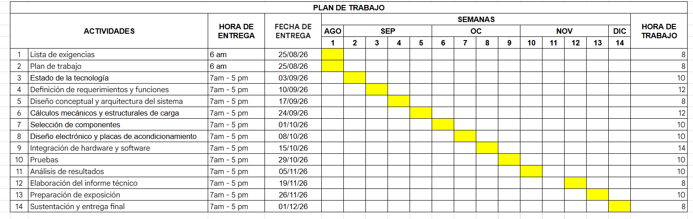

# **1\. Lista de Exigencias** 

**Tabla 1: Lista de Exigencias**

| LISTA DE EXIGENCIAS |  |  | Páginas: 5 |
| ----- | :---: | ----- | ----- |
|  |  |  | **Edición: Rev. 2** |
| **PROYECTO:** |  | **SISTEMA DE APUNTALAMIENTO INTELIGENTE PARA ESTRUCTURAS DAÑADAS**  | **Fecha: 20/08/2026** |
|  |  |  | **Revisado:** |
| **CLIENTE:**  |  | **UNIVERSIDAD PERUANA CAYETANO HEREDIA** | **Elaborado:  P.C, J.B, C.A, A.M** |
| Fecha (cambios) | Deseo o Exigencia | **Descripción** | **Responsable** |
| **20/08/26** | E | **Función principal:** Medir en tiempo real la fuerza axial de tres puntales mecánicos y realizar microajustes automáticos para disminuir la desigualdad de carga entre ellos. El sistema debe funcionar como demostrador de laboratorio y registrar F1, F2 y F3 durante cada ensayo. La necesidad de transferir cargas de elementos dañados a apoyos estables es consistente con las prácticas de apuntalamiento de FEMA \[1\]. | P.C C.A A.M |
| **20/08/26** | E | **Geometría:** El sistema estará compuesto por puntales telescópicos ajustables de 0.8 a 1.5 m de altura, con un diámetro exterior aproximado de 40–50 mm y bases de apoyo de 20 × 20 cm. Cada unidad integrará sensores, actuadores y un mecanismo de bloqueo, manteniendo una configuración estable según lineamientos de diseño \[2\]. | C.A |
| **20/08/26** | E | **Cinemática:** El movimiento del puntal será lineal,  telescópico, axial y reversible. La velocidad de ajuste será de 2 a 5 mm/s para evitar desplazamientos bruscos, valor que será validado experimentalmente durante las pruebas de integración. El sistema deberá detener el movimiento al alcanzar límites de recorrido o condiciones de seguridad \[3\]. | C.A |
| **20/08/26** | E | **Fuerzas**: Cada puntal deberá soportar y medir la carga axial aplicada sin comprometer su estabilidad ni sufrir deformaciones permanentes. La capacidad máxima del prototipo será determinada mediante cálculos considerando márgenes de seguridad para no superar la carga admisible de sus componentes \[2\]. |              A.M |
| **20/08/26** | E | **Energía:** La potencia eléctrica del sistema deberá ser dimensionada de acuerdo con los actuadores, sensores y componentes electrónicos seleccionados, procurando un consumo eficiente y seguro. Alimentación eléctrica necesaria para el sistema: 220 VAC/60 Hz, de acuerdo con el Código Nacional de Electricidad del Perú \[4\]. Mediante fuentes de alimentación se obtendrán los niveles de corriente continua requeridos por sensores, controlador y actuadores. La energía eléctrica será utilizada principalmente para el accionamiento electromecánico de los puntales, adquisición de datos mediante sensores y funcionamiento del sistema de control. Ante una interrupción de la energía eléctrica, el puntal deberá conservar su posición mediante un mecanismo de bloqueo mecánico, evitando movimientos involuntarios y manteniendo la estabilidad del prototipo \[2\].  | C.A |
| **20/08/26** | E | **Materia:** El material de ingreso será el elemento estructural dañado que requiera estabilización temporal, principalmente elementos de concreto armado o mampostería, sobre los cuales los puntales se acoplarán a este mediante placas de apoyo, permitiendo recibir, medir y redistribuir las cargas sin dañar la superficie. La materia de salida será la misma estructura estabilizada temporalmente, sin alteraciones físicas ni químicas en su composición.  | J.B |
| **20/08/26** | E | **Señales de entrada: Señal de encendido:** Permite energizar los sensores, controlador, actuadores y demás componentes electrónicos del sistema. **Señal de inicio:** Activa el funcionamiento coordinado de los puntales y el monitoreo de las cargas. **Señal de parada:** Detiene los movimientos de los actuadores en cualquier etapa del funcionamiento. **Señal de carga:** Proveniente de las celdas de carga instaladas en cada puntal para conocer la fuerza soportada. **Señal de posición:** Permite conocer el desplazamiento o longitud actual de cada puntal. **Señal de inclinación:** Permite detectar cambios de orientación o condiciones potencialmente inestables del puntal. **Señales de salida: Señal de Stand-by:** Indica que los sensores, actuadores y mecanismos de control se encuentran listos para operar. **Señales de estado:** Informan la carga, posición, inclinación y estado de funcionamiento de cada puntal. **Señal de ajuste:** Activa el actuador correspondiente para realizar una corrección controlada de la posición del puntal. **Señal de emergencia:** Informa al operario cuando se detecta una sobrecarga, inclinación excesiva, falla de comunicación u otra condición insegura. **Señal de estabilización:** Indica que las cargas se encuentran dentro de los límites establecidos y que el proceso de ajuste ha finalizado. | A.M |
| **20/08/26** | E | **Control:** El sistema de control deberá permanecer estable durante todas las etapas de funcionamiento. Se deberá monitorear continuamente la carga, posición e inclinación de cada puntal y coordinar el accionamiento de los actuadores para realizar ajustes progresivos cuando se detecten desbalances de carga. Ante una condición insegura, sobrecarga o pérdida de comunicación, el sistema deberá detener automáticamente los movimientos y mantener el bloqueo mecánico.  | P.C |
| **20/08/26** | E | **Electrónico (hardware):** Se utilizará el hardware necesario para adquirir y procesar la información proveniente de las celdas de carga, sensores de posición e inclinación instalados en los puntales. Un microcontrolador central coordinará el sistema, utilizando módulos de acondicionamiento de señal para los sensores y etapas de electrónica de potencia para accionar de forma segura los actuadores electromecánicos.  | A.M |
| **20/08/26** | E | **Software:** Se utilizará software de código abierto para adquirir, procesar y registrar las señales provenientes de los sensores, así como para ejecutar la lógica de control de los puntales y configurar el funcionamiento de los actuadores. El sistema contará con una interfaz que permita visualizar en tiempo real la carga, posición, inclinación, estado de los puntales y alarmas, facilitando su operación por parte del usuario.  | J.B C.A |
| **20/08/26** | E | **Comunicaciones:** El microcontrolador deberá comunicarse con los sensores y actuadores de cada puntal mediante un sistema de comunicación confiable, priorizando el cableado directo para el prototipo. La comunicación entre los módulos y el controlador central deberá permitir el intercambio continuo de información sin interferir con el funcionamiento de los demás subsistemas. Ante una pérdida de comunicación, el sistema deberá detener los ajustes electromecánicos y mantener el bloqueo mecánico.  | A.M |
| **20/08/26** | E | **Seguridad:** El sistema deberá diseñarse de manera que no comprometa la integridad del operario. Contará con parada de emergencia, límites de recorrido, protección contra sobrecarga, detección de fallas y bloqueo mecánico independiente de la alimentación eléctrica. Asimismo, se deberán evitar movimientos automáticos cuando exista pérdida de comunicación, lecturas fuera de rango o condiciones de inestabilidad. El diseño y las pruebas deberán considerar la Ley N.° 29783 de Seguridad y Salud en el Trabajo y criterios de gestión de seguridad establecidos en ISO 45001 \[5,6\].  | C.A  |
| **20/08/26** | E | **Ergonomía**: La disposición de los dispositivos de mando, indicadores y elementos de ajuste deberá permitir una operación cómoda y segura, evitando posturas forzadas durante el montaje y supervisión del sistema. La ubicación de controles y mecanismos de accionamiento se establecerá considerando criterios antropométricos de la norma ISO 7250-1 \[7\].  | P.C |
| **20/08/26** | E | **Fabricación:** El prototipo deberá fabricarse utilizando materiales y componentes, como: sensores, actuadores, microcontroladores, con alta disponibilidad en el mercado local, buscando tiempos de importación no mayores a 15 días en caso de componentes especializados. El diseño modular debe permitir un ensamblaje sencillo en talleres convencionales o laboratorios  | P.C |
| **20/08/26** | E | **Control de calidad:** El prototipo ensamblado deberá cumplir con todas las especificaciones de diseño. Los componentes estructurales del puntal se someterán a inspecciones visuales y pruebas de esfuerzo preliminares para garantizar que no existan fallas de mecanizado antes de los ensayos con carga real.  | C.A |
| **20/08/26** | E | **Montaje:** El diseño facilitará la instalación del sistema dentro de un banco de pruebas de laboratorio. Las bases de apoyo de 20 x 20 cm estarán habilitadas para fijarse de manera estable al piso o marco de reacción para evitar desplazamientos laterales durante los ajustes axiales bajo carga.  | C.A |
| **20/08/26** | E | **Transporte:** Deberá contar con un peso adecuado para ser transportado de forma terrestre o marítima (por ejemplo, camión o barco de carga, respectivamente). En caso de transporte o reubicación en interior, el peso será el adecuado para su transporte dentro de planta, tanto por grúas o trolleys. | J.B |
| **20/08/26** | D | **Uso:** Dado que el sistema funcionará como un demostrador de laboratorio, operará bajo condiciones ambientales estándar de interiores. La selección de componentes electrónicos, actuadores y sensores deberá poseer un grado de protección, como IP54, para prever futuras iteraciones en condiciones reales de polvo o humedad en escenarios de desastre.  | C.A |
| **20/08/26** | E | **Mantenimiento:** El diseño estructural debe garantizar un acceso ergonómico y directo a los componentes mecánicos y eléctricos para facilitar inspecciones, limpieza, lubricación y ajustes. La arquitectura electrónica permitirá el reemplazo rápido de módulos, placas o sensores en caso de falla o término de su vida útil, minimizando el tiempo de inactividad.  | P.C |
| **20/08/26** | E | **Costos:** El presupuesto se estructurará sumando el costo de diseño (horas-hombre según el cronograma) y el costo de materiales. Se cotizará la adquisición de: tres puntales mecánicos (aprox. 1 m), celdas de carga con módulos de adquisición, un microcontrolador, sensores de inclinación y posición, actuadores, fuentes y componentes estructurales, priorizando proveedores en el mercado local de Lima.  | P.C |
| **20/08/26** | E | **Plazos:** El proyecto se desarrollará durante el semestre académico 2026-2 y comprenderá las etapas de investigación, elaboración de la lista de exigencias, desarrollo de conceptos de solución, cálculos mecánicos y estructurales, selección de componentes, diseño electrónico, programación del ESP32, fabricación del prototipo, integración de los tres puntales, calibración de sensores, pruebas experimentales y elaboración de la documentación final. Se elaborará un diagrama de Gantt para organizar las actividades, establecer su duración y controlar el avance del proyecto, incluyendo las entregas y sustentaciones principales como hitos del cronograma \[1\]. Las fechas específicas de inicio, finalización y el número total de horas de trabajo se establecerán de acuerdo con el plan de trabajo y el calendario académico correspondiente al semestre 2026-2 \[2\].  | J.B |

# **2. Plan de Trabajo**

**Figura 1: Plan de Trabajo**

# **Bibliografía**

\[1\] Federal Emergency Management Agency (FEMA), National Urban Search & Rescue (US\&R) Response System Field Operations Guide. Washington D.C., USA: FEMA, 2017\.

\[2\]. European Committee for Standardization. *EN 1065:1998 Adjustable telescopic steel props—Product specifications, design and assessment by calculation and tests*. Brussels: CEN; 1998\.

\[3\]. International Organization for Standardization. *ISO 12100:2010 Safety of machinery—General principles for design—Risk assessment and risk reduction*. Geneva: ISO; 2010\.

\[4\] Ministerio de Energía y Minas. *Código Nacional de Electricidad – Utilización*. Lima: MINEM; 2006\.

\[5\] Perú. Congreso de la República. *Ley N.° 29783, Ley de Seguridad y Salud en el Trabajo*. Lima: Congreso de la República; 2011\.

\[6\] International Organization for Standardization. *ISO 45001:2018 Occupational health and safety management systems—Requirements with guidance for use*. Geneva: ISO; 2018\.

\[7\] International Organization for Standardization. *ISO 7250-1:2017 Basic human body measurements for technological design—Part 1: Body measurement definitions and landmarks*. Geneva: ISO; 2017\.
