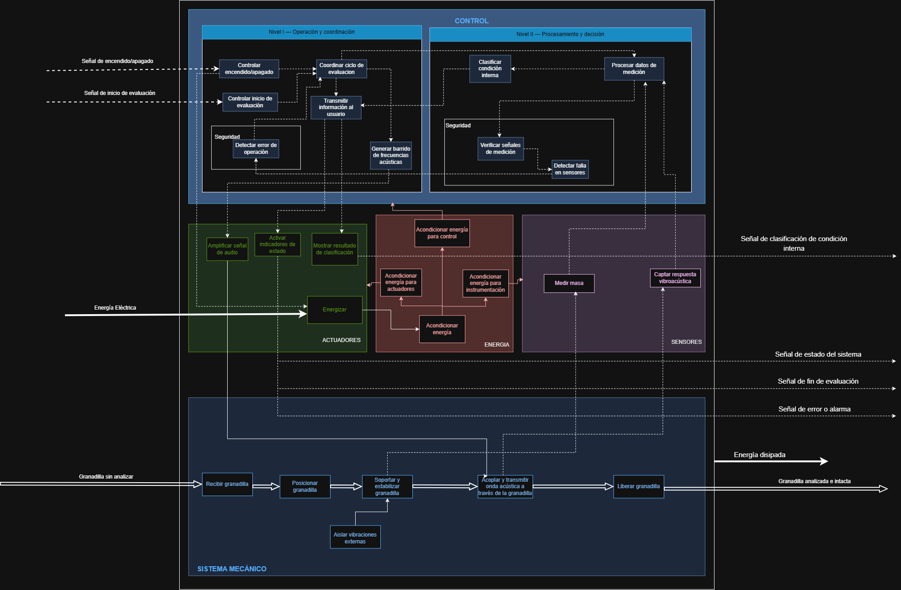
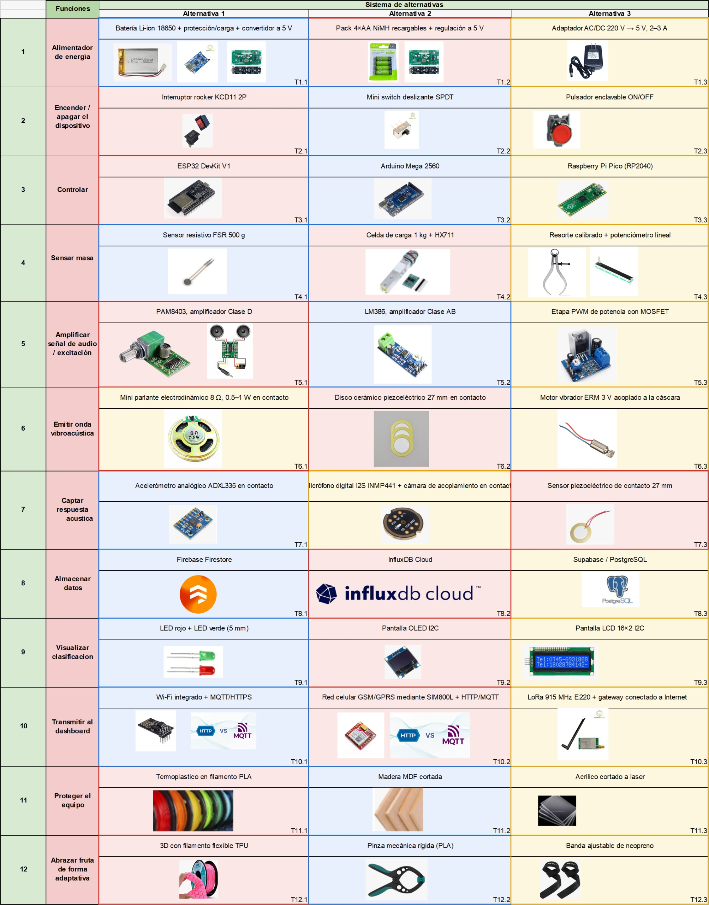
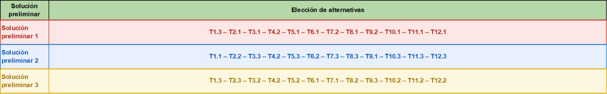
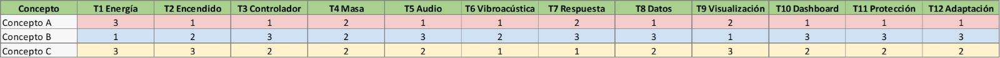
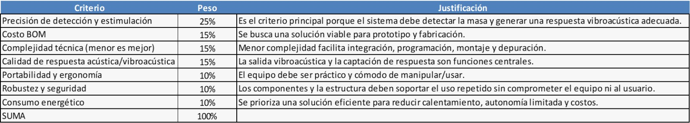
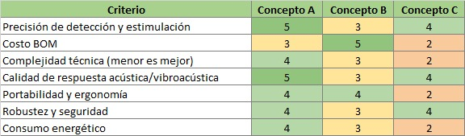
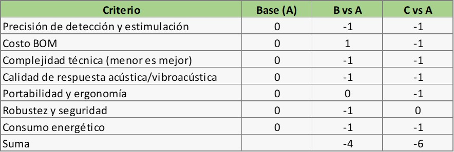
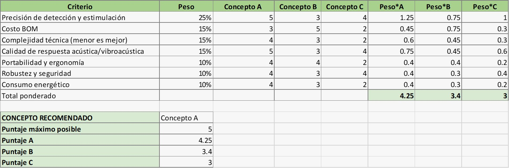

# 2. Diseño funcional del sistema

En esta sección se presentan las principales herramientas utilizadas para definir la arquitectura funcional y evaluar alternativas de solución del **sistema mecatrónico no destructivo para la evaluación de la condición interna de granadilla mediante excitación vibratoria controlada y análisis de su respuesta vibroacústica**.

---

  <strong>Figura 1. Caja Negra del sistema</strong>
    
  

---

## 2.2. Esquemático de funciones

El esquemático de funciones muestra la descomposición funcional del sistema y la relación entre los módulos de **control, sensores, actuadores, energía y sistema mecánico**.

  <strong>Figura 2. Esquemático de funciones del sistema</strong>
    
  

---

## 2.3. Matriz Morfológica

La **matriz morfológica** permite identificar y comparar diferentes alternativas tecnológicas para cada una de las funciones que debe cumplir el sistema. A partir de estas opciones se construyen soluciones preliminares completas, las cuales posteriormente son evaluadas mediante criterios técnicos, económicos y funcionales.

Para el sistema mecatrónico de evaluación de granadillas se definieron **12 funciones principales**, relacionadas con la alimentación, control, sensado, excitación vibroacústica, adquisición de señales, almacenamiento, visualización, comunicación y estructura mecánica.

---

### 2.3.1. Sistema de alternativas

Para cada función se plantearon **tres alternativas tecnológicas**, denominadas Alternativa 1, Alternativa 2 y Alternativa 3.

Cada opción fue identificada mediante la nomenclatura **Tn.m**, donde:

- **T** representa la alternativa tecnológica.
- **n** representa el número de la función.
- **m** representa la alternativa correspondiente dentro de dicha función.

Por ejemplo, **T4.2** corresponde a la segunda alternativa propuesta para la función 4, relacionada con el sensado de masa.

Debido a la extensión de la matriz, esta se presenta dividida en dos partes para facilitar su visualización y lectura.

  <strong>Figura 3a. Matriz morfológica – alternativas tecnológicas del sistema</strong>
    
  

  <strong>Figura 3b. Matriz morfológica – soluciones preliminares obtenidas</strong>
    
  

La primera parte presenta las diferentes tecnologías disponibles para ejecutar cada función del sistema, mientras que la segunda muestra la combinación de estas alternativas para formar las **tres soluciones preliminares**.

Las combinaciones obtenidas fueron:

- **Solución preliminar 1:** T1.3 – T2.1 – T3.1 – T4.2 – T5.1 – T6.1 – T7.2 – T8.1 – T9.2 – T10.1 – T11.1 – T12.1.
- **Solución preliminar 2:** T1.1 – T2.2 – T3.3 – T4.2 – T5.3 – T6.2 – T7.3 – T8.3 – T9.1 – T10.3 – T11.3 – T12.3.
- **Solución preliminar 3:** T1.3 – T2.3 – T3.2 – T4.2 – T5.2 – T6.1 – T7.1 – T8.2 – T9.3 – T10.2 – T11.2 – T12.2.

Estas combinaciones permiten pasar de componentes individuales a **conceptos completos de solución**, capaces de cumplir todas las funciones requeridas por el sistema.

---

### 2.3.2. Configuración de los conceptos de solución

Las tres soluciones preliminares se reorganizaron como **Concepto A, Concepto B y Concepto C**, permitiendo visualizar de manera resumida qué alternativa utiliza cada concepto para cada función.

  <strong>Figura 4. Configuración tecnológica de los conceptos A, B y C</strong>
    
  

Esta representación permite comparar directamente las arquitecturas planteadas e identificar las principales diferencias tecnológicas existentes entre ellas antes de realizar la evaluación cuantitativa.

---

### 2.3.3. Criterios de evaluación

Para determinar cuál de los tres conceptos presenta mejores condiciones para el desarrollo del prototipo, se establecieron diferentes **criterios de evaluación**.

Cada criterio posee un peso porcentual de acuerdo con su importancia dentro del funcionamiento global del sistema.

  <strong>Figura 5. Criterios, ponderaciones y justificación de la evaluación</strong>
    
  

Los criterios considerados fueron:

- **Precisión de detección y estimulación:** evalúa la capacidad del sistema para realizar mediciones confiables y generar una excitación adecuada.
- **Costo BOM:** considera el costo total aproximado de los componentes necesarios para construir el prototipo.
- **Complejidad técnica:** evalúa la dificultad de integración, programación, montaje y mantenimiento.
- **Calidad de respuesta acústica/vibroacústica:** determina qué tan adecuada es la generación y adquisición de las señales utilizadas para evaluar la fruta.
- **Portabilidad y ergonomía:** considera la facilidad de transporte, manipulación y utilización del equipo.
- **Robustez y seguridad:** evalúa la resistencia de los componentes y la seguridad durante el funcionamiento.
- **Consumo energético:** considera la eficiencia energética de la solución propuesta.

La **precisión de detección y estimulación** recibe el mayor peso, con un **25 %**, debido a que se encuentra directamente relacionada con la función principal del sistema.

---

### 2.3.4. Valoración de los conceptos

Una vez definidos los criterios, cada concepto fue calificado utilizando una escala de **1 a 5 puntos**.

| Puntaje | Interpretación |
|:---:|---|
| **1** | Muy desfavorable |
| **2** | Desfavorable |
| **3** | Aceptable |
| **4** | Bueno |
| **5** | Muy bueno |

  <strong>Figura 6. Valoración de los conceptos según los criterios establecidos</strong>
    
  

La evaluación permite observar las fortalezas y limitaciones de cada propuesta. El **Concepto A** presenta puntuaciones elevadas principalmente en precisión, respuesta vibroacústica, robustez y eficiencia energética, mientras que el **Concepto B** destaca principalmente en costo.

---

### 2.3.5. Comparación relativa de alternativas

Además de la evaluación mediante puntuaciones, se realizó una comparación relativa tomando al **Concepto A como referencia o solución base**.

Para esta comparación se utilizó la siguiente escala:

- **+1:** mejor que el concepto de referencia.
- **0:** desempeño equivalente.
- **−1:** inferior al concepto de referencia.

  <strong>Figura 7. Comparación relativa de los conceptos respecto al Concepto A</strong>
    
  

El resultado muestra una suma de **−4 para el Concepto B** y **−6 para el Concepto C**, indicando que ambos presentan, en términos generales, un desempeño menor respecto al Concepto A.

Esta comparación constituye una comprobación adicional de la conveniencia de utilizar el Concepto A como base para el desarrollo del sistema.

---

### 2.3.6. Evaluación ponderada y selección final

Finalmente, se realizó la **evaluación ponderada**, combinando la importancia de cada criterio con la puntuación obtenida por cada concepto.

Para ello, cada puntuación fue multiplicada por el peso correspondiente del criterio:

**Puntaje ponderado = Peso del criterio × Puntuación del concepto**

Posteriormente, los resultados de todos los criterios fueron sumados para obtener la valoración global de cada alternativa.

  <strong>Figura 8. Evaluación ponderada y selección del concepto final</strong>
    
  

Los resultados finales obtenidos fueron:

| Concepto | Puntaje final |
|:---:|:---:|
| **Concepto A** | **4.25 / 5** |
| Concepto B | 3.40 / 5 |
| Concepto C | 3.00 / 5 |

> ### ✅ Concepto seleccionado: Concepto A
>
> El **Concepto A**, correspondiente a la **Solución preliminar 1**, obtuvo el mayor puntaje ponderado con **4.25 de 5 puntos**.
>
> Esta alternativa presenta el mejor equilibrio entre **precisión de detección, calidad de respuesta vibroacústica, robustez, consumo energético, portabilidad y viabilidad técnica**, por lo que será utilizada como base para el desarrollo e integración del prototipo.

---

### 2.3.7. Resultado del proceso de selección

El desarrollo de la matriz morfológica permitió pasar de un conjunto amplio de tecnologías individuales a una **arquitectura de solución técnicamente justificada**.

El proceso seguido puede resumirse de la siguiente manera:

**Funciones del sistema → Alternativas tecnológicas → Soluciones preliminares → Criterios de evaluación → Comparación → Evaluación ponderada → Selección del Concepto A**

De esta manera, la selección del concepto final no depende únicamente de una elección subjetiva de componentes, sino de un proceso estructurado de comparación y evaluación que considera los principales requerimientos del sistema.
