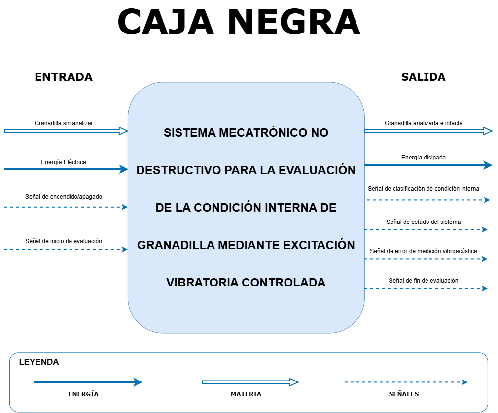

# 2. Diseño funcional del sistema

En esta sección se presentan las herramientas utilizadas para definir la arquitectura funcional y evaluar las alternativas de solución del **sistema mecatrónico no destructivo para la evaluación de la condición interna de granadilla mediante excitación vibratoria controlada y análisis de su respuesta vibroacústica**.

---

  <strong>Figura 1. Caja Negra del sistema</strong>
    
  

---

## 2.2. Esquemático de funciones

El esquemático de funciones representa la descomposición funcional del sistema y la interacción entre sus principales módulos de control, sensores, actuadores, energía y estructura mecánica.

  <strong>Figura 2. Esquemático de funciones del sistema</strong>
    
  

---

## 2.3. Matriz morfológica

La matriz morfológica permite establecer diferentes alternativas tecnológicas para cada función del sistema y, a partir de ellas, construir diferentes soluciones preliminares.

Para el sistema propuesto se definieron **15 funciones**, agrupadas en los subsistemas de energía, control, sensores, actuadores, visualización y sistema mecánico.

### 2.3.1. Alternativas tecnológicas

Cada función cuenta con alternativas identificadas mediante la nomenclatura **Tn.m**, donde `n` corresponde a la función y `m` a la alternativa tecnológica.

  <strong>Figura 3. Matriz morfológica y alternativas tecnológicas</strong>
    
  

---

### 2.3.2. Soluciones preliminares

A partir de las alternativas tecnológicas identificadas en la matriz morfológica se establecieron tres combinaciones de solución, denominadas **Solución preliminar 1, Solución preliminar 2 y Solución preliminar 3**. Cada combinación representa una configuración diferente de los componentes y tecnologías propuestas para cumplir las funciones del sistema.

  <strong>Figura 4. Soluciones preliminares obtenidas a partir de la matriz morfológica</strong>
    
  

Las soluciones preliminares permiten visualizar las diferentes configuraciones propuestas antes de realizar la evaluación mediante los criterios de selección. Posteriormente, estas alternativas fueron evaluadas de acuerdo con los criterios establecidos para determinar la solución más conveniente.

---

### 2.3.3. Conceptos de solución

Para facilitar la evaluación y comparación de las soluciones preliminares, estas fueron denominadas como **Concepto A, Concepto B y Concepto C**, respectivamente.

Cada concepto representa una combinación específica de las alternativas tecnológicas definidas en la matriz morfológica y constituye una propuesta de configuración integral del sistema.

---

### 2.3.4. Criterios de evaluación

Para seleccionar la alternativa más conveniente se establecieron siete criterios de evaluación, considerando su importancia dentro del sistema.

  <strong>Figura 5. Criterios, ponderaciones y justificación</strong>
    
  

Los criterios considerados son:

- **Precisión de detección:** 25 %
- **Costo BOM:** 15 %
- **Complejidad técnica:** 15 %
- **Calidad de respuesta:** 15 %
- **Portabilidad y ergonomía:** 10 %
- **Robustez y seguridad:** 10 %
- **Consumo energético:** 10 %

La **precisión de detección** presenta el mayor peso debido a su relación directa con la función principal del sistema.

---

### 2.3.5. Valoración de los conceptos

Cada concepto fue evaluado mediante una escala de **1 a 5**, donde 1 representa el desempeño menos favorable y 5 el más favorable.

  <strong>Figura 6. Puntaje de los conceptos según los criterios establecidos</strong>
    
  

La valoración permite comparar el desempeño de los tres conceptos respecto a los criterios establecidos.

---

### 2.3.6. Evaluación ponderada

La selección final se realizó mediante la ponderación de cada criterio según su importancia.

La evaluación se obtiene mediante la siguiente expresión:

**Puntaje ponderado = Peso × Puntaje**

  <strong>Figura 7. Evaluación ponderada y resultado final</strong>
    
  

  <strong>Material complementario</strong>
    
  <a href="https://canva.link/dss4xqwgdwpdqhs">
    🔗 Consultar matriz morfológica y evaluación completa en Canva
  </a>

Los resultados obtenidos fueron:

| Concepto | Puntaje final |
|:---:|:---:|
| **Concepto A** | **3.75 / 5** |
| Concepto B | 3.40 / 5 |
| Concepto C | 3.00 / 5 |

---

### 2.3.7. Resultado del proceso de selección

El **Concepto A** obtuvo el mayor puntaje ponderado con **3.75/5**, superando al Concepto B y al Concepto C. Por ello, esta configuración será utilizada como base para el desarrollo del prototipo.

El proceso de selección puede resumirse de la siguiente manera:

**Funciones → Alternativas tecnológicas → Soluciones preliminares → Conceptos → Criterios de evaluación → Puntajes → Ponderación → Concepto A**

De esta manera, la solución seleccionada se obtiene mediante una comparación estructurada de las diferentes alternativas tecnológicas consideradas para el sistema.
