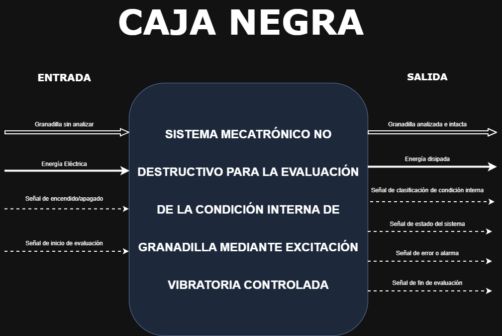
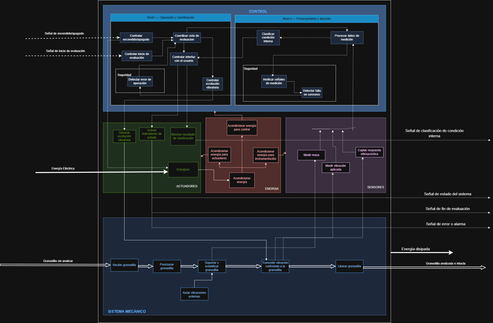

# 2. Diseño funcional del sistema

En esta sección se presentan las principales herramientas utilizadas para definir la arquitectura funcional y evaluar alternativas de solución del **sistema mecatrónico no destructivo para la evaluación de la condición interna de granadilla mediante excitación vibratoria controlada y análisis de su respuesta vibroacústica**.

---

  <strong>Figura 1. Caja Negra del sistema</strong>
    
  

---

## 2.2. Esquemático de funciones

El esquemático de funciones muestra la descomposición funcional del sistema y la relación entre los módulos de **control, sensores, actuadores, energía y sistema mecánico**.

  <strong>Figura 2. Esquemático de funciones del sistema</strong>
    
  

---

## 2.3. Matriz Morfológica

La matriz morfológica presenta diferentes alternativas tecnológicas para cada función del sistema, permitiendo comparar opciones y establecer soluciones preliminares para el desarrollo del prototipo.

  <strong>Figura 3. Matriz Morfológica</strong>
    
  

