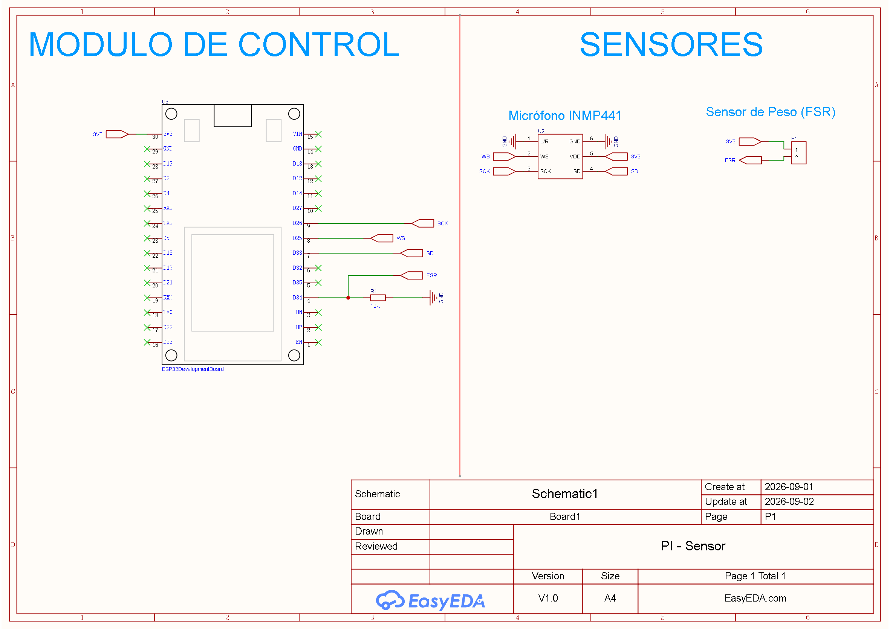
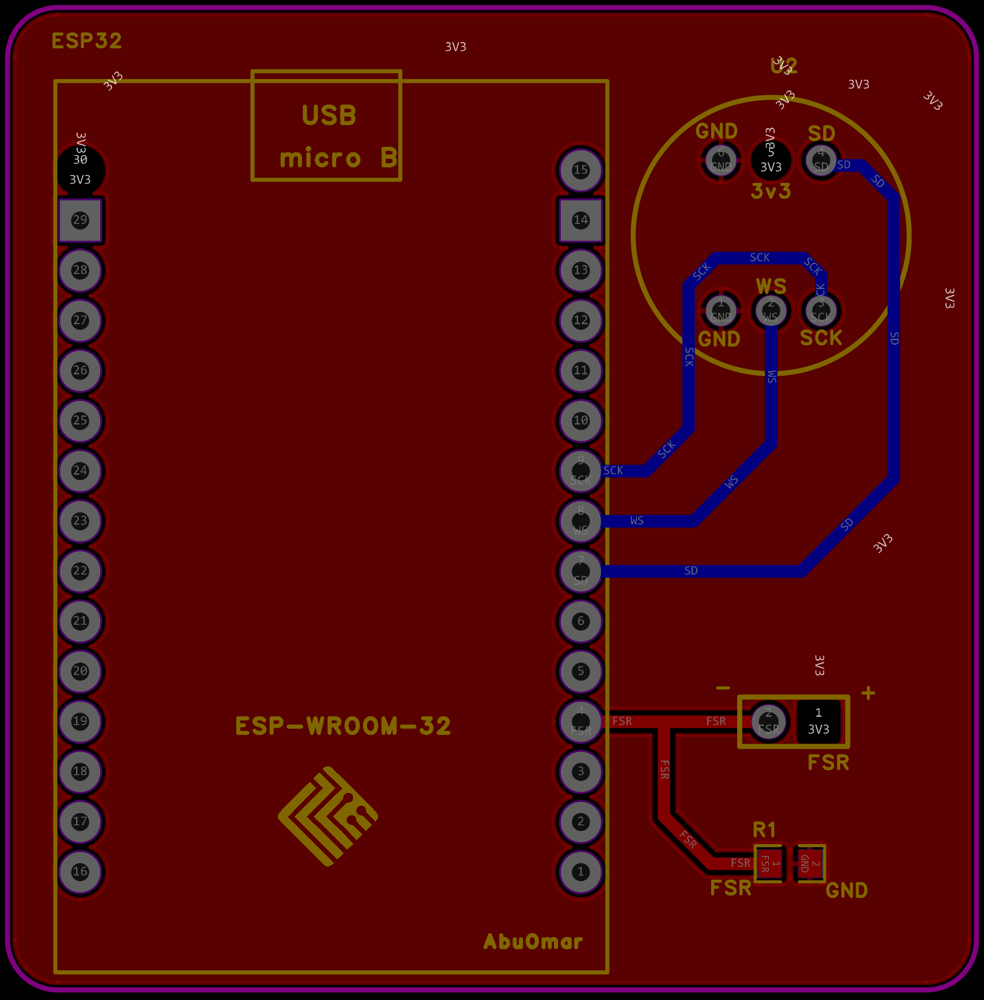
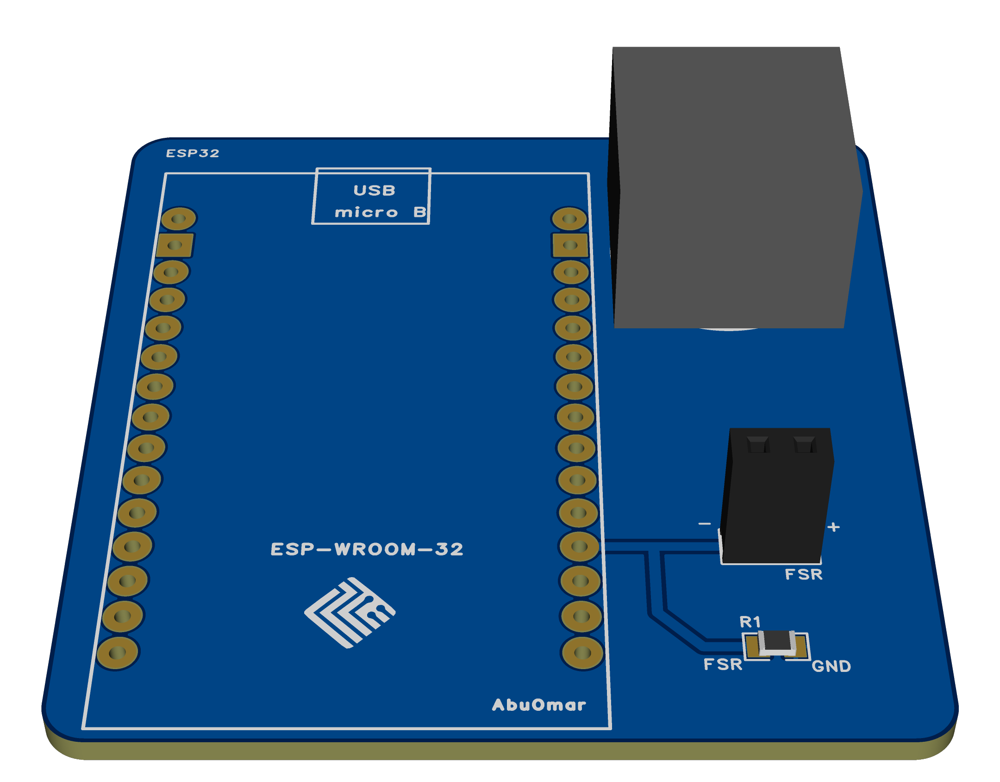
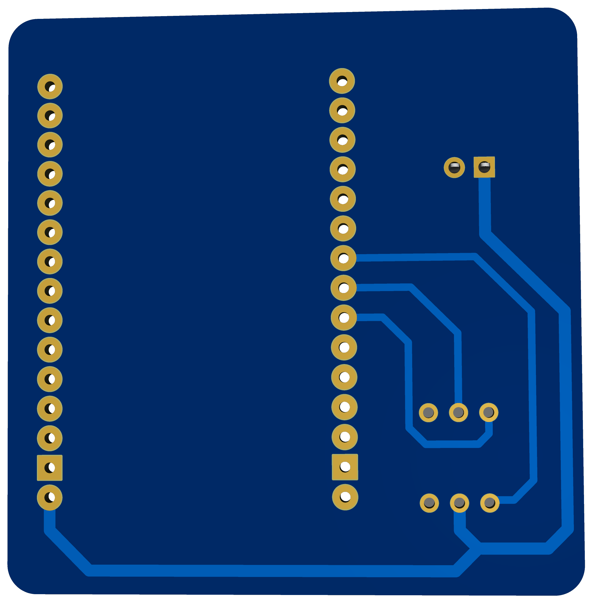

## 🔌 1. Esquemático electrónico

El siguiente esquemático representa la organización y conexión de los componentes electrónicos utilizados en el diseño.

  

  <em>Figura 1. Esquemático electrónico desarrollado en EasyEDA.</em>

---

## 🧩 2. Diseño PCB

A partir del esquemático se realizó el diseño de la **placa de circuito impreso (PCB)**, distribuyendo los componentes y las pistas de conexión dentro del área de trabajo definida.

  

  <em>Figura 2. Diseño de la placa PCB en EasyEDA.</em>

### 📦 Archivo del proyecto

El archivo comprimido correspondiente al proyecto de PCB puede descargarse desde el siguiente enlace:

  <a href="./PCB_archivo.zip"><strong>⬇️ Descargar PCB_archivo.zip</strong></a>

---

## 🖥️ 3. Vistas 3D de la PCB

EasyEDA permite visualizar el diseño final de la placa en tres dimensiones, facilitando la revisión de la distribución y ubicación de los componentes.

### Vista 3D — Perspectiva 1

  

  <em>Figura 3. Primera vista 3D de la PCB.</em>

### Vista 3D — Perspectiva 2

  

  <em>Figura 4. Segunda vista 3D de la PCB.</em>

---

## 📁 Archivos de la entrega

| Archivo | Descripción |
|---|---|
| `Esquematico.png` | Imagen del esquemático electrónico elaborado en EasyEDA. |
| `PCB.png` | Imagen del diseño y distribución de la placa de circuito impreso. |
| `3D_1.png` | Primera vista tridimensional del diseño de la PCB. |
| `3D_2.png` | Segunda vista tridimensional del diseño de la PCB. |
| [`PCB_archivo.zip`](./PCB_archivo.zip) | Archivo comprimido que contiene los archivos correspondientes al proyecto de PCB. |
| `README.md` | Documento descriptivo de la entrega y guía de visualización de los archivos. |

