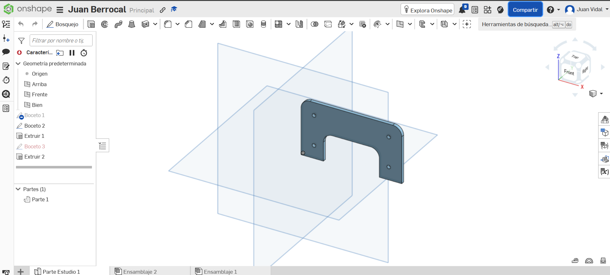
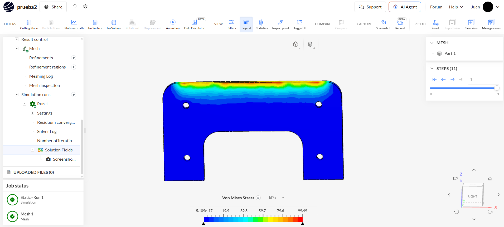
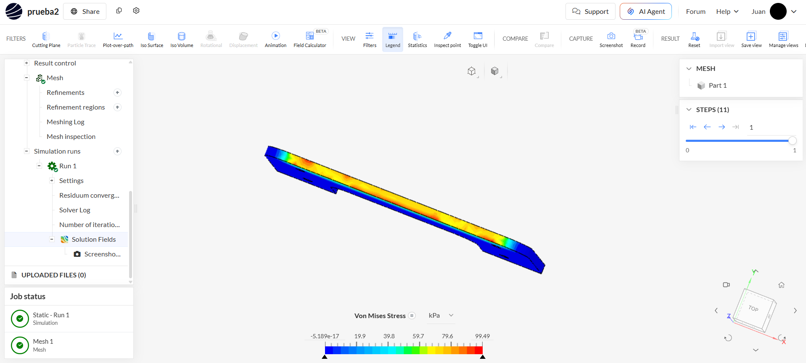

# Modelado y simulación del cuerpo

## Herramientas utilizadas

El cuerpo del prototipo fue diseñado en **Onshape**, considerando sus dimensiones, abertura central y cuatro puntos de fijación. Posteriormente, el modelo fue analizado en **SimScale** mediante una simulación estructural estática.

**Modelo en Onshape:**
[Modelo del cuerpo](https://cad.onshape.com/documents/8faf323b3ad277acf5680e67/w/7f5d397c40762628c5e2da28/e/1d246344b054494bdf4784c7?renderMode=0&uiState=6a90ae6b04acdaf3b43cb3cc)

**Simulación en SimScale:**
[Simulación estructural](https://www.simscale.com/workbench/?pid=9096215687583154772)

---

# Modelo del cuerpo

El cuerpo sirve como soporte para los componentes internos y las demás piezas del prototipo. Cuenta con una abertura central y cuatro puntos de fijación. Su fabricación está planteada mediante **impresión 3D en PLA**.

---

# Simulación estructural

Se realizó un análisis estático para evaluar el esfuerzo y desplazamiento de la pieza.

* **Material:** PLA
* **Fuerza aplicada:** 20 N
* **Dirección:** eje Z negativo
* **Componente:** Fz = -20 N
* **Fijaciones:** 4 puntos de montaje
* **Resultados:** Von Mises y desplazamiento

La fuerza aplicada corresponde aproximadamente al peso de una masa de **2.04 kg**:

**m = F/g = 20/9.81 ≈ 2.04 kg**

Esta equivalencia solo permite interpretar la magnitud de la carga utilizada en la simulación.

---

# Esfuerzo de Von Mises

### Vista frontal

El mayor esfuerzo se concentra principalmente en la **zona superior del cuerpo**.

**Esfuerzo máximo:**

**σVM,max = 99.49 kPa = 0.09949 MPa**

Las zonas de colores cálidos representan los mayores niveles de esfuerzo.

### Vista superior

La vista superior confirma que la mayor concentración de esfuerzo se encuentra en la región superior de la pieza.

---

# Desplazamiento

El desplazamiento máximo obtenido fue:

**Dz,max = 0.00767 mm**

El valor indica una deformación pequeña respecto a las dimensiones generales del cuerpo bajo la carga aplicada.

---

# Resultados

| Parámetro             |   Resultado |
| --------------------- | ----------: |
| Fuerza aplicada       |        20 N |
| Material              |         PLA |
| Esfuerzo máximo       |   99.49 kPa |
| Esfuerzo máximo       | 0.09949 MPa |
| Desplazamiento máximo |  0.00767 mm |
| Masa equivalente      |     2.04 kg |

---

# Conclusión

La simulación permitió evaluar el comportamiento del cuerpo ante una carga de **20 N**. El esfuerzo máximo fue de **0.09949 MPa** y se concentró principalmente en la zona superior. El desplazamiento máximo fue de **0.00767 mm**, mostrando una deformación reducida bajo las condiciones analizadas.

Los resultados sirven como referencia para validar la geometría y realizar futuras mejoras en el diseño.
