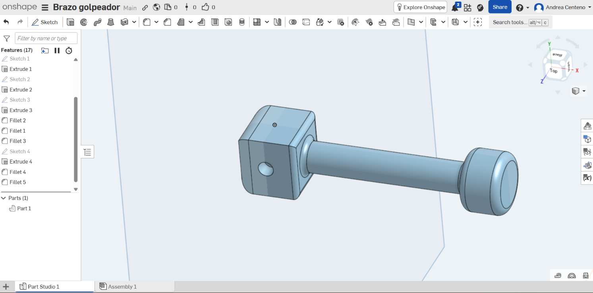
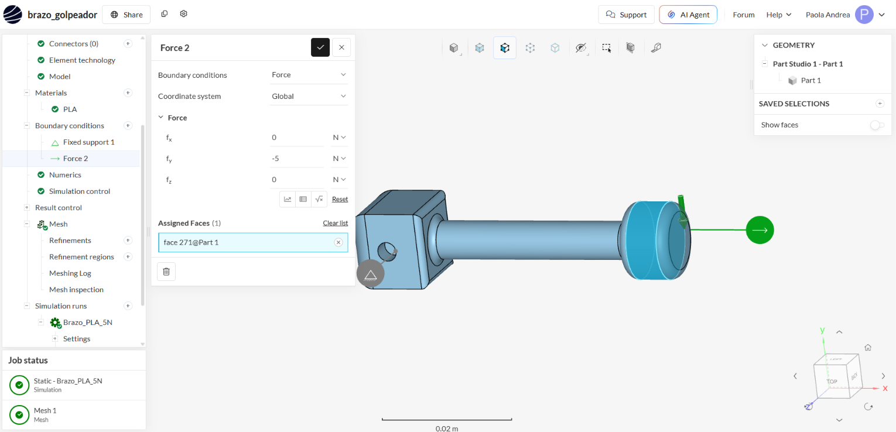
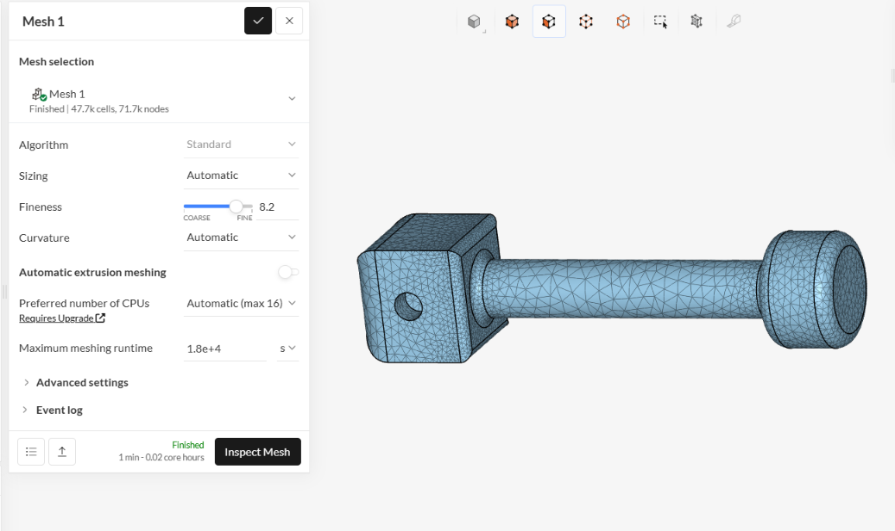
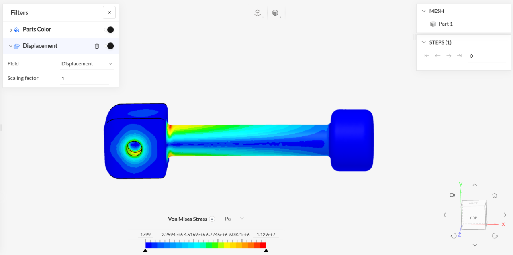

# Análisis del brazo golpeador en SimScale

**Estudiante:** Paola Andrea Centeno Bazán

## 1. Pieza analizada

La pieza analizada corresponde al **brazo golpeador** del sistema. Su función es transmitir el movimiento generado por el servomotor y realizar un golpe controlado sobre la superficie de la granadilla.

El brazo está formado por una zona de unión con el mecanismo del servomotor, una barra cilíndrica y una cabeza golpeadora ubicada en el extremo.

El agujero ubicado en uno de los extremos permite unir la pieza con el mecanismo que genera el movimiento de giro.

**Figura 1. Modelo 3D del brazo golpeador realizado en Onshape.**

---

## 2. Tipo de análisis

Para comprobar el comportamiento de la pieza se realizó una simulación estructural estática en **SimScale**.

Se utilizó **PLA** como material, ya que el brazo será fabricado mediante impresión 3D.

Aunque en el funcionamiento real el brazo realiza un movimiento rotacional, en esta primera simulación se consideró el instante en el que la cabeza golpeadora entra en contacto con la granadilla.

De esta manera se puede observar cómo responde la pieza ante la fuerza generada durante el contacto.

---

## 3. Condiciones de la simulación

Para representar de forma simplificada el funcionamiento del brazo se utilizaron dos condiciones principales.

En la superficie interna del agujero se colocó un **Fixed Support**, representando la zona donde el brazo estará unido al mecanismo accionado por el servomotor.

En el extremo opuesto se aplicó una fuerza de **5 N** sobre la superficie lateral de la cabeza golpeadora.

La fuerza se aplicó perpendicularmente al brazo porque esta dirección representa mejor la reacción que se genera cuando la cabeza entra en contacto con la granadilla durante el movimiento de giro.

**Figura 2. Condiciones utilizadas en SimScale: soporte fijo y aplicación de una fuerza de 5 N.**

---

## 4. ¿Por qué se utilizaron 5 N?

Para esta primera simulación se utilizaron **5 N como una fuerza inicial de prueba**.

El objetivo fue observar cómo responde la geometría del brazo ante una carga de baja magnitud y comprobar si se generan esfuerzos elevados en alguna parte de la pieza.

Este valor todavía no representa exactamente la fuerza real que se aplicará sobre la granadilla.

Posteriormente se podrá obtener un valor más preciso utilizando el torque del servomotor mediante:

$$
F = \frac{\tau}{r}
$$

donde:

- $F$ es la fuerza aplicada.
- $\tau$ es el torque del servomotor.
- $r$ es la distancia desde el eje de giro hasta la zona de impacto.

También se podrá comprobar mediante pruebas experimentales cuando se construya el prototipo.

Por esta razón, los **5 N se consideran una carga preliminar de evaluación**.

---

## 5. Mallado

Antes de ejecutar la simulación se generó una malla sobre toda la geometría del brazo.

La malla permite dividir la pieza en pequeños elementos sobre los cuales SimScale realiza los cálculos.

Para este análisis se obtuvo aproximadamente:

- **47.7 mil celdas**
- **71.7 mil nodos**

Se observa un mayor detalle en las zonas donde existen cambios en la geometría, principalmente cerca de las uniones de la pieza.

**Figura 3. Mallado utilizado para el análisis estructural del brazo golpeador.**

---

## 6. Resultados

Después de ejecutar la simulación se analizó el esfuerzo equivalente de **Von Mises**.

El valor máximo obtenido fue aproximadamente:

$$
\sigma_{VM,max} = 1.129 \times 10^7 \text{ Pa}
$$

Al convertirlo a MPa:

$$
\sigma_{VM,max} \approx 11.29 \text{ MPa}
$$

Por lo tanto, para una carga de **5 N**, el esfuerzo máximo obtenido en la pieza fue de aproximadamente **11.29 MPa**.

**Figura 4. Distribución del esfuerzo de Von Mises para una carga de 5 N.**

---

## 7. Análisis de los resultados

En la Figura 4 se observa que el esfuerzo no se distribuye de la misma manera en toda la pieza.

Las zonas azules presentan menores esfuerzos, mientras que los colores verde, amarillo y rojo muestran zonas donde el esfuerzo aumenta.

La mayor concentración aparece principalmente cerca de la unión entre el bloque de fijación y la barra cilíndrica.

Esto tiene sentido debido a que esta zona se encuentra cerca del punto de sujeción y recibe un mayor efecto de flexión cuando se aplica la fuerza en el extremo contrario.

Este comportamiento puede relacionarse con el momento generado por la fuerza:

$$
M = F \cdot L
$$

donde:

- $M$ representa el momento generado.
- $F$ representa la fuerza aplicada.
- $L$ representa la distancia entre el punto de fijación y la zona donde se aplica la fuerza.

Debido a esto, la unión entre el bloque y la barra se puede considerar una de las zonas más importantes a revisar en el diseño.

---

## 8. Factor de seguridad preliminar

Como referencia inicial, si se considera una resistencia del PLA cercana a:

$$
\sigma_{material} = 52 \text{ MPa}
$$

el factor de seguridad se puede estimar mediante:

$$
FS = \frac{\sigma_{material}}{\sigma_{VM,max}}
$$

Reemplazando los valores:

$$
FS = \frac{52}{11.29}
$$

se obtiene:

$$
FS \approx 4.6
$$

Este resultado indica que, para la condición evaluada de **5 N**, existe un margen entre el esfuerzo obtenido y la resistencia tomada como referencia para el PLA.

Sin embargo, este valor todavía es preliminar, ya que la resistencia final de una pieza impresa también depende de factores como la orientación de impresión, el porcentaje de relleno y las características del filamento utilizado.

---

## 9. Conclusión

La simulación permitió realizar una primera evaluación del comportamiento estructural del brazo golpeador.

Para una carga transversal de **5 N**, se obtuvo un esfuerzo máximo de Von Mises de aproximadamente **11.29 MPa**.

La zona con mayor concentración de esfuerzo se encuentra principalmente en la unión entre el bloque de fijación y la barra cilíndrica.

Los resultados permiten identificar la parte más crítica de la pieza antes de realizar su fabricación.

Como siguientes pasos se deberá calcular la fuerza real generada por el servomotor y realizar pruebas experimentales con el prototipo.
