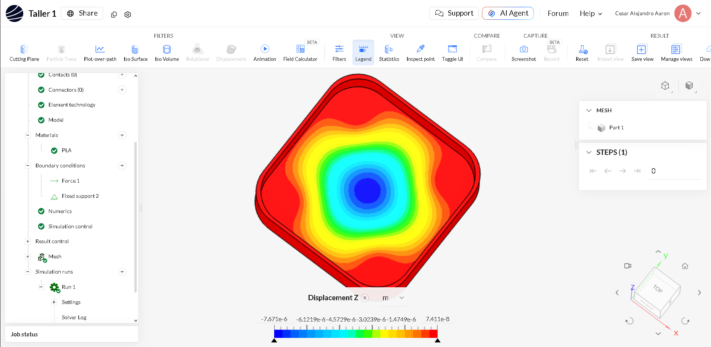
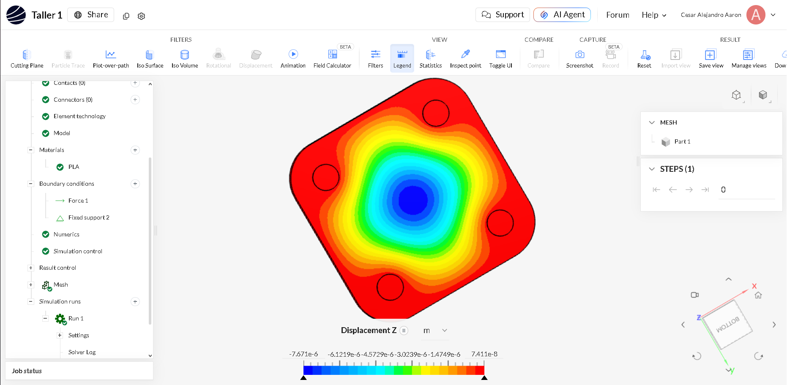
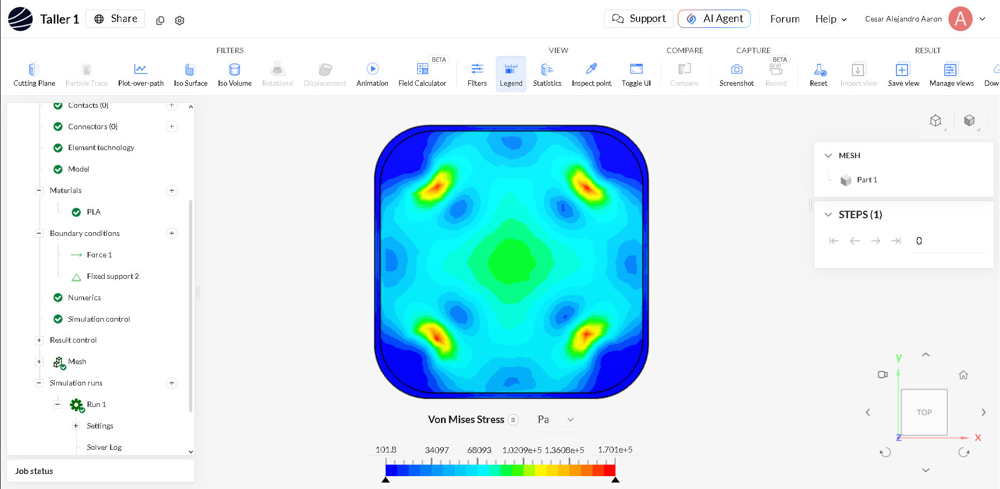
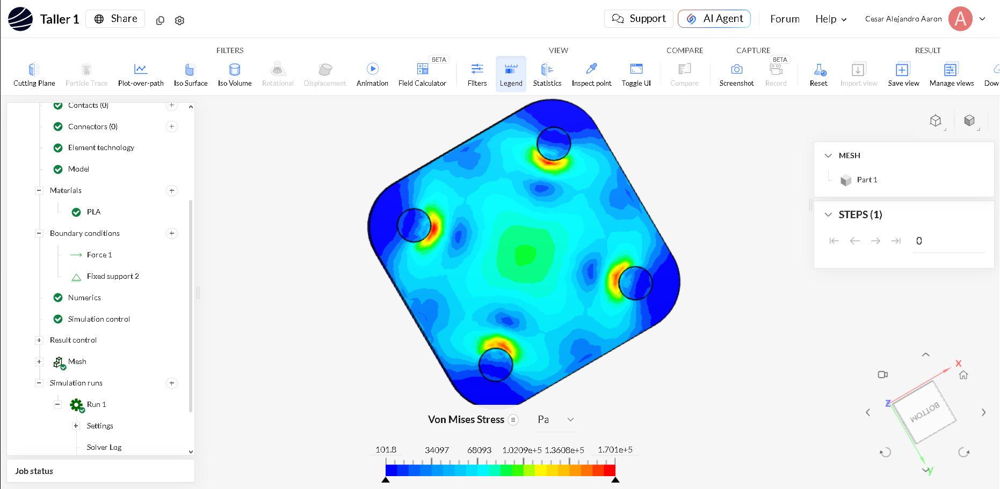

# Estructura trabajada
En este taller se realizó la simulación estructural de la base de nuestro modelado 3D. Para el análisis se aplicó una fuerza vertical de 20 N hacia abajo, correspondiente aproximadamente al peso de una masa de 2 kg, considerando una aceleración de la gravedad de 10 m/s². Este valor se tomó de manera ligeramente conservadora respecto a la gravedad real, con el fin de evaluar el comportamiento del diseño bajo condiciones exigentes y contar con un margen de seguridad. El material asignado en la simulación fue PLA.

link de la SimScale: https://tinyurl.com/2vawbesr

link de OneShape: https://tinyurl.com/2uep4wz8
---
# Interpretación de resultados de la simulación

> **Nota:** La interpretación inicial de los resultados fue elaborada con apoyo de un modelo de lenguaje de inteligencia artificial (LLM) y posteriormente revisada y validada por una persona responsable del análisis.

## Desplazamiento en Z

### Vista superior

### Vista inferior

El mayor desplazamiento se presenta en la zona central del soporte, con un valor aproximado de **0.00767 mm**. Este valor es muy pequeño, por lo que la deformación del centro es reducida bajo las condiciones simuladas.

## Esfuerzo de Von Mises

### Vista superior

### Vista inferior

El esfuerzo máximo obtenido es aproximadamente **0.1701 MPa** y se concentra principalmente alrededor de la unión de las cuatro patas con la placa. Esto indica que dichas uniones son las zonas más exigidas del diseño.

## Conclusión

Los resultados muestran que el soporte con cuatro patas presenta un comportamiento adecuado en la simulación. La deformación central es mínima y, bajo las condiciones simuladas, **no se observa una necesidad evidente de agregar una pata adicional en el centro**. Sin embargo, la validación final debe considerar el material utilizado y la carga real aplicada.
