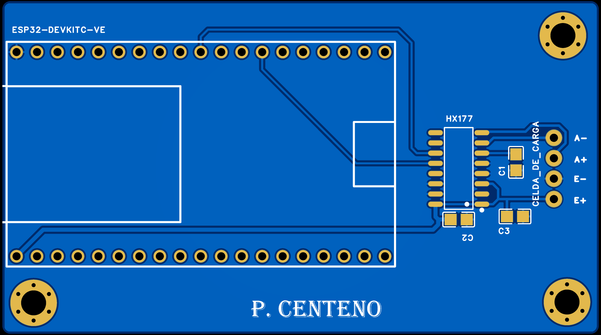
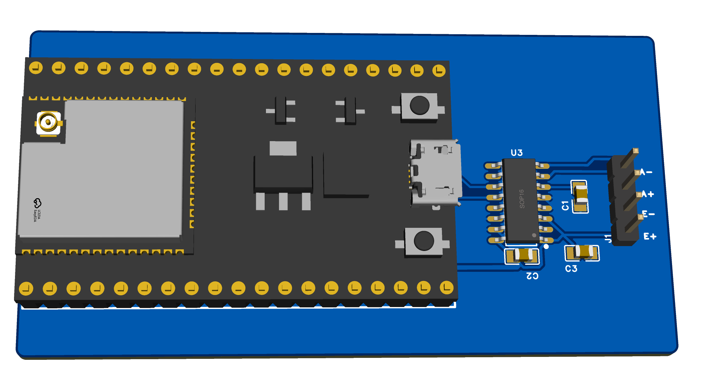

# Sistema de Sensado de Masa

## Taller 2 - EasyEDA

Diseño de un sistema electrónico para el **sensado de masa** utilizando una **celda de carga**, el convertidor analógico-digital **HX711** y un **ESP32 DevKitC**.

**Autora:** Paola Centeno  
**Curso:** Proyecto Integrador  
**Fecha:** 03/09/2026  

---

## 1. Descripción

El sistema utiliza una **celda de carga** para detectar la fuerza producida por el peso de un objeto.

La señal generada por la celda es de baja amplitud, por lo que se utiliza el **HX711** para amplificarla y convertirla a formato digital. Posteriormente, los datos son enviados al **ESP32** para su procesamiento.

### Flujo general

```text
Celda de carga
      │
      │ E+ / E- / A+ / A-
      ▼
    HX711
      │
      │ DATA / CLOCK
      ▼
    ESP32
      │
      ▼
Procesamiento
```

---

## 2. Componentes principales

| Componente | Función |
|---|---|
| **Celda de carga** | Medición de masa |
| **HX711** | Amplificación y conversión ADC de la señal |
| **ESP32 DevKitC** | Procesamiento de los datos |
| **C1, C2 y C3 - 100 nF** | Filtrado y desacoplo |
| **J1 - Header 1×4** | Conexión de la celda de carga |

El **HX711** utiliza un encapsulado **SOP-16 SMD**, mientras que los capacitores emplean encapsulados **0805 SMD**, permitiendo reducir el espacio ocupado en la PCB.

---

## 3. Esquemático electrónico

El circuito está organizado en dos bloques principales:

- **Módulo de procesamiento:** formado por el ESP32 DevKitC.
- **Módulo de sensado de masa:** formado por el HX711, los capacitores y el conector para la celda de carga.

La celda de carga utiliza cuatro conexiones principales:

| Señal | Función |
|---|---|
| **E+** | Excitación positiva |
| **E-** | Excitación negativa |
| **A+** | Señal diferencial positiva |
| **A-** | Señal diferencial negativa |

La comunicación entre el HX711 y el ESP32 se realiza mediante:

| HX711 | ESP32 |
|---|---|
| `DOUT` | `GPIO 4` |
| `PD_SCK` | `GPIO 5` |
| `DVDD` | `3.3 V` |
| `AGND` | `GND` |

<p align="center">
  
</p>

<p align="center">
  <strong>Figura 1. Esquemático electrónico del sistema de sensado de masa.</strong>
</p>

---

## 4. Diseño de la PCB

A partir del esquemático se desarrolló la PCB considerando una distribución compacta y ordenada.

Durante el diseño se tuvo en cuenta:

- HX711 y capacitores en montaje superficial **SMD**.
- Pistas cortas para las señales `A+` y `A-`.
- Capacitores ubicados cerca del HX711.
- Plano de cobre conectado a **GND**.
- Zona libre de cobre debajo de la antena del ESP32.
- Acceso al puerto USB del ESP32.
- Header J1 ubicado cerca del circuito de sensado.
- Separación adecuada entre pistas y pads.

### Vista 2D

<p align="center">
  
</p>

<p align="center">
  <strong>Figura 2. Diseño 2D de la PCB desarrollado en EasyEDA.</strong>
</p>

---

## 5. Vista 3D

La vista 3D permite comprobar la posición y orientación física de los componentes antes de fabricar la PCB.

Se verificó la ubicación del:

- ESP32 DevKitC.
- HX711.
- Capacitores C1, C2 y C3.
- Header J1 para la celda de carga.

<p align="center">
  
</p>

<p align="center">
  <strong>Figura 3. Vista 3D de la PCB.</strong>
</p>

---

## 6. Consideraciones de diseño

### Plano de tierra

Se implementó un **Copper Region conectado a GND** para establecer una tierra común en la PCB y reducir la necesidad de utilizar pistas largas de retorno.

### Antena del ESP32

Se creó una **Prohibited Region** en la zona correspondiente a la antena del ESP32 para evitar cobre, pistas y vías debajo de esta.

### Señales analógicas

Las pistas `A+` y `A-` fueron mantenidas cortas debido a que transportan la señal proveniente de la celda de carga.

### Capacitores de desacoplo

Los capacitores `C1`, `C2` y `C3` se ubicaron próximos al HX711 para contribuir al filtrado y estabilidad de la alimentación.

---

## 7. Ancho de pistas

Se utilizaron diferentes anchos según el tipo de conexión.

| Red | Ancho |
|---|:---:|
| `A+ / A-` | 12 mil |
| `HX_DATA / HX_CLK` | 10 - 12 mil |
| Conexiones de C1, C2 y C3 | 12 mil |
| `VCC_HX711` principal | 20 mil |
| `GND` | Plano de cobre |

---

## 8. Verificación del diseño

El diseño fue comprobado mediante la herramienta **DRC (Design Rule Check)** de EasyEDA.

Esta verificación permitió revisar:

- Separación entre pistas.
- Separación entre pistas y pads.
- Conexiones pendientes.
- Conflictos entre elementos de cobre.
- Reglas de diseño de la PCB.

### Resultado

**DRC: 0 errores ✅**

De esta manera se comprobó que el diseño cumple con las reglas configuradas en EasyEDA.

---

## 9. Archivos Gerber

Finalmente, se generaron los archivos **Gerber** necesarios para una futura fabricación de la PCB.

Los archivos contienen información relacionada con:

- Capas de cobre.
- Máscara de soldadura.
- Serigrafía.
- Perforaciones.
- Pads.
- Contorno de la PCB.

### [Descargar archivos Gerber](./Gerber_PCB1_2026-09-03.zip)

---

## 10. Proceso realizado

```text
Diseño del esquemático
        │
        ▼
Asignación de footprints
        │
        ▼
Conversión a PCB
        │
        ▼
Distribución de componentes
        │
        ▼
Enrutamiento de pistas
        │
        ▼
Creación del plano GND
        │
        ▼
Verificación mediante DRC
        │
        ▼
Vista 2D y 3D
        │
        ▼
Generación de archivos Gerber
```

---

## 11. Archivos del repositorio

| Archivo | Descripción |
|---|---|
| `README.md` | Documentación del Taller 2 |
| `SCH_Sensado de Masa HX711_1-P1_2026-09-03.png` | Esquemático electrónico |
| `2D_PCB1_2026-09-03.png` | Vista 2D de la PCB |
| `3D_PCB1_2026-09-03.png` | Vista 3D de la PCB |
| `Gerber_PCB1_2026-09-03.zip` | Archivos Gerber para fabricación |

---

## 12. Resultado final

Como resultado del taller se obtuvo el diseño de un sistema de **sensado de masa basado en una celda de carga, un HX711 y un ESP32**.

Se completaron las principales etapas del diseño electrónico:

- Esquemático.
- Selección de footprints.
- Diseño de PCB.
- Enrutamiento.
- Plano GND.
- Verificación DRC.
- Visualización 2D y 3D.
- Generación de archivos Gerber.

El diseño queda preparado para una futura etapa de **fabricación, ensamblaje y pruebas experimentales**.

---

<p align="center">
  <strong>Universidad Peruana Cayetano Heredia</strong>
  <br>
  Proyecto Integrador
  <br>
  Taller 2 - EasyEDA
  <br><br>
  <strong>Paola Centeno</strong>
</p>
