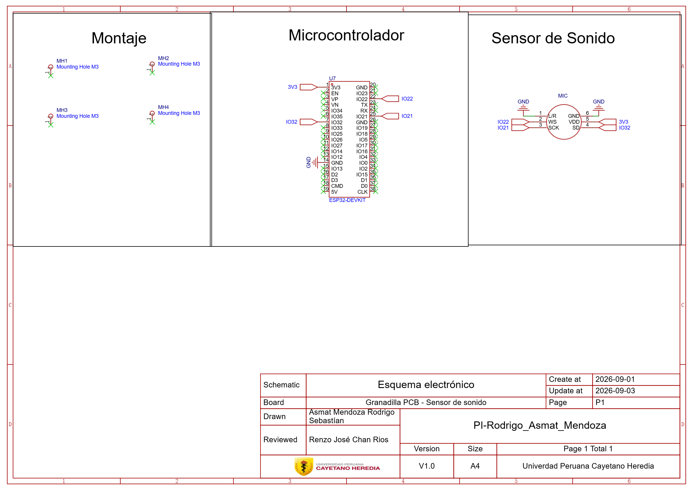
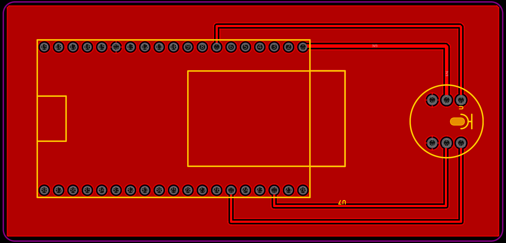
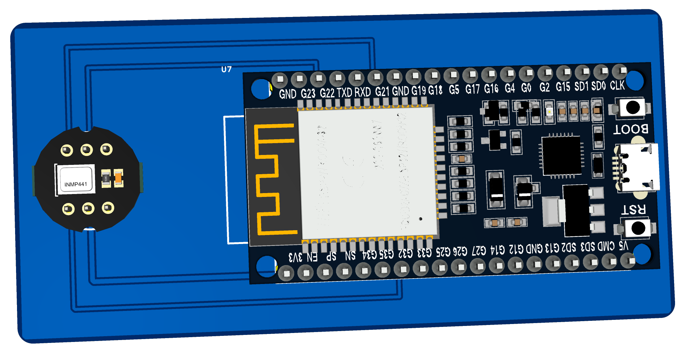
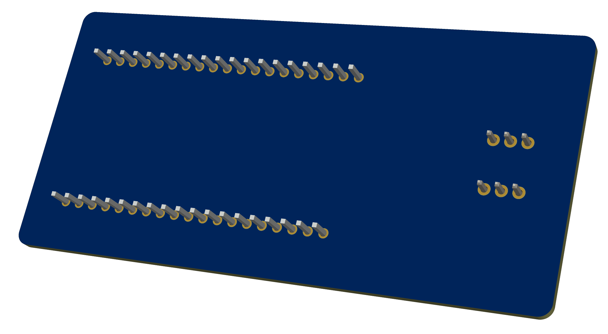

# Diseño de PCB: Microcontrolador ESP32 y Sensor INMP441

Esta carpeta contiene la documentación gráfica y los archivos de manufactura del diseño de una placa de circuito impreso para la integración de un microcontrolador ESP32 con un módulo de micrófono INMP441. El diseño asegura un ruteo optimizado con plano de masa para el bus de datos I2S.

**Nombre:** Rodrigo Asmat Mendoza 

## Archivos de Fabricación (Gerber)
Puedes descargar los archivos aquí:
* [Paquete Gerber (ZIP)](./Gerber_PCB1_1.zip)

### Esquemático en PDF
El esquemático también se encuentra disponible en formato PDF para su revisión.
* [Paquete PDF](./Esquema_electronico1.pdf)

## 1. Esquema Electrónico (Lógico)
Diagrama que detalla las conexiones de alimentación, la configuración de pines I2S (SCK, WS, SD) y la asignación del canal izquierdo mediante la conexión L/R a tierra.

## 2. Ruteo 2D de la Placa PCB
Plano de diseño físico que ilustra la distribución de componentes, las pistas de interconexión y el área de vertido de cobre (GND).

## 3. Vista 3D Superior
Renderizado del ensamblaje principal mostrando la ubicación de los puertos de acceso y los módulos montados en la cara superior.

## 4. Vista 3D Inferior

