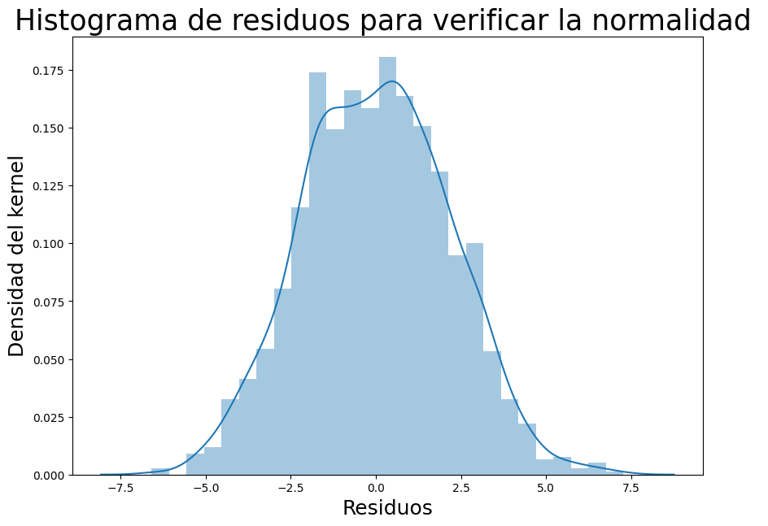
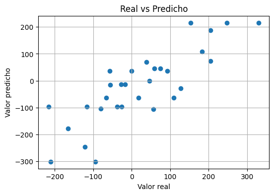

# Resumen de la sesión

En esta sesión trabajamos con **regresión y análisis de datos en Python**. La idea principal fue aprender cómo cargar datos, revisarlos, hacer un modelo y luego ver qué tan bien funcionaba.

## 1. Carga y revisión de los datos

Primero importamos librerías como `pandas`, `NumPy`, `Matplotlib` y `Seaborn`.

Después cargamos un archivo con datos de **consumo de energía** y usamos comandos como `head()`, `info()` y `describe()` para conocer mejor la información.

Esto nos sirvió para ver cómo estaban organizados los datos y revisar valores básicos como el promedio, mínimo, máximo y desviación estándar.

---

## 2. Relación entre las variables

Luego revisamos la relación entre las variables usando una **matriz de correlación**.

  

Con este gráfico pudimos observar de manera visual qué variables tenían más relación entre sí.

---

## 3. Modelo de regresión lineal

Después separamos los datos en variables de entrada y una variable que queríamos predecir, que en este caso fue `Consumo_Energia`.

También dividimos los datos en dos partes:

- una parte para **entrenar** el modelo;
- otra parte para **probarlo**.

Luego usamos `LinearRegression` para crear el modelo de regresión lineal.

El modelo obtiene coeficientes que usa para hacer sus predicciones.

---

## 4. Predicciones

Una vez entrenado el modelo, hicimos predicciones con los datos de prueba.

  

En este gráfico comparamos los valores reales con los valores que predijo el modelo.

La idea era ver si los puntos estaban relativamente cerca entre sí y si el modelo seguía una tendencia parecida a los datos reales.

---

## 5. Residuos

También revisamos los **residuos**, que son la diferencia entre el valor real y el valor predicho.

  

Este gráfico nos ayudó a observar cómo se distribuían los errores del modelo.

---

## 6. Datos artificiales

En otra parte de la sesión generamos datos artificiales con `make_regression`.

Esto nos permitió practicar con un conjunto de datos creado directamente en Python.

Se generaron varias variables y luego se usaron para probar otro modelo.

---

## 7. Árbol de decisión

Después usamos un **árbol de decisión para regresión**.

El procedimiento fue parecido al anterior: entrenamos el modelo y luego hicimos predicciones con los datos de prueba.

  

También calculamos el **MSE**, que sirve para medir el error de las predicciones.

---

## 8. Importancia de las variables

El árbol de decisión también nos permitió ver qué variables usó más para hacer sus predicciones.

  

Este gráfico sirvió para tener una idea de cuáles variables tuvieron más peso dentro del modelo.

---

## 9. Uso de statsmodels

Al final usamos la librería `statsmodels`.

Con esta librería pudimos obtener un resumen más completo del modelo de regresión.

En ese resumen aparecen datos como:

- coeficientes;
- error estándar;
- valor `t`;
- p-valor;
- R².

En esta parte la idea fue más que nada conocer cómo se ve un resumen estadístico de una regresión.

---

## Conclusión

En esta sesión aprendimos el proceso básico para trabajar con modelos de regresión.

Primero revisamos los datos, luego analizamos la relación entre las variables, entrenamos modelos, hicimos predicciones y observamos los errores.

También vimos que Python tiene diferentes herramientas para trabajar con regresión, como `scikit-learn` para crear modelos y `statsmodels` para obtener información estadística adicional.

En general, la sesión me ayudó a entender mejor cómo se puede usar Python para analizar datos y hacer predicciones de una manera práctica.
