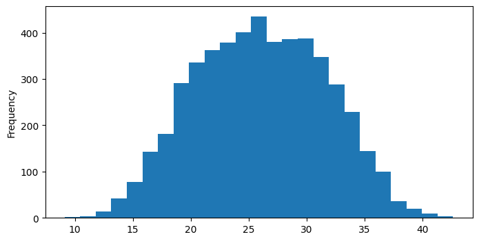
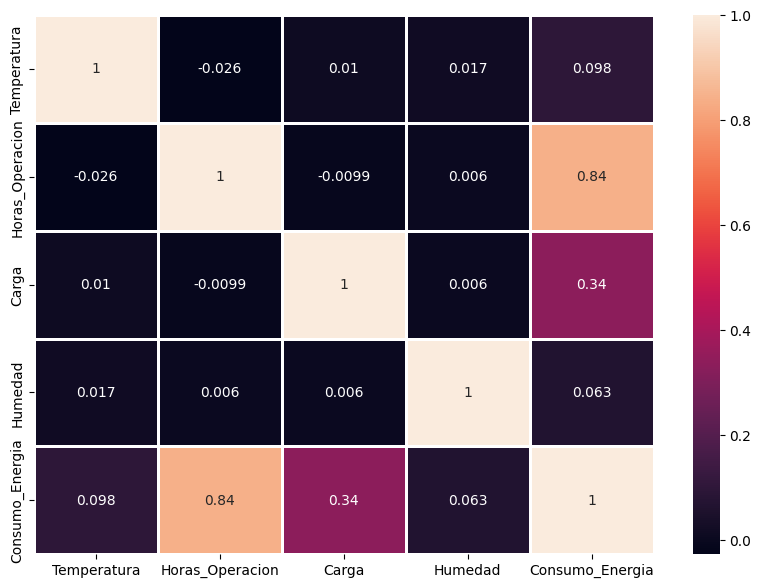
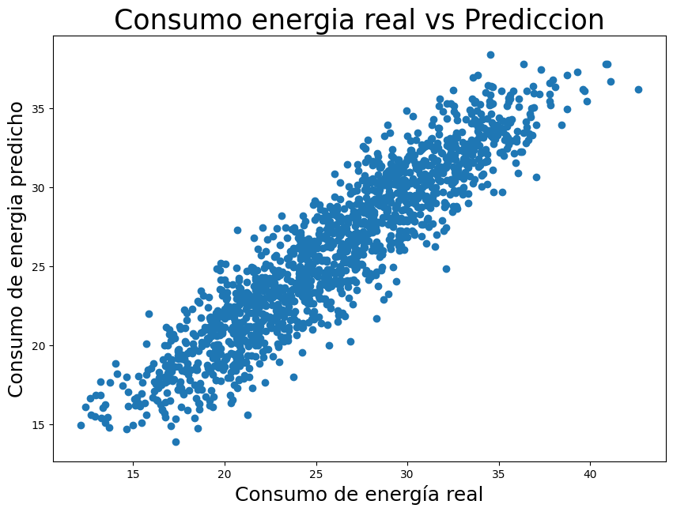
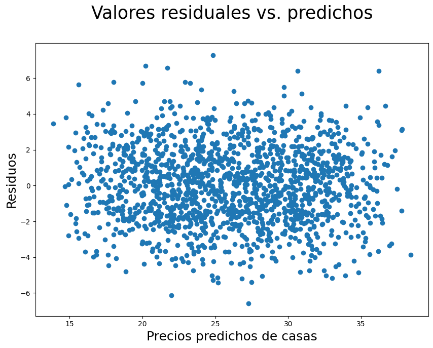
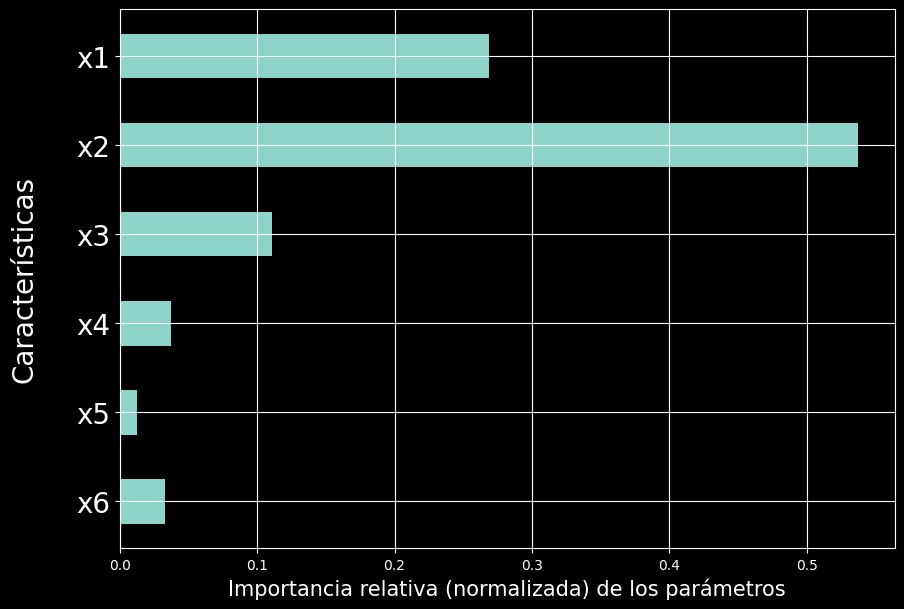

# Taller de Inteligencia Artificial

## Análisis de Datos y Modelos de Regresión

En este laboratorio se trabajó con un conjunto de datos relacionado con el **consumo de energía**, considerando variables como `Temperatura`, `Horas_Operacion`, `Carga` y `Humedad`.

El trabajo permitió desarrollar diferentes etapas del análisis de datos y del aprendizaje automático. Primero se exploró el comportamiento de los datos mediante gráficos, luego se analizaron las relaciones entre las variables y finalmente se implementó un modelo de **Regresión Lineal** para realizar predicciones.

El objetivo fue comprender cómo los datos pueden utilizarse para encontrar relaciones, generar predicciones y analizar los resultados obtenidos por un modelo.

---

# 1. Distribución del Consumo de Energía

### Histograma del Consumo de Energía

El primer paso fue analizar cómo se distribuyen los valores de la variable `Consumo_Energia`.

En el histograma se observa que la mayor cantidad de registros se concentra aproximadamente entre **20 y 32 unidades de consumo**. Los valores más bajos y más altos aparecen con una frecuencia menor.

La distribución presenta una concentración importante alrededor de los valores centrales y una forma aproximadamente simétrica. Esto permite conocer el comportamiento general de la variable antes de construir el modelo.

También podemos observar que los valores de consumo se encuentran aproximadamente entre **9 y 43 unidades**, mostrando el rango general de los datos analizados.

Este análisis inicial es importante porque permite conocer la variable que posteriormente será utilizada como objetivo del modelo.



---

# 2. Relación entre las Variables

### Matriz de Correlación

Después de analizar la distribución del consumo, se estudió la relación entre las diferentes variables mediante una **matriz de correlación**.

Los valores de correlación permiten conocer la intensidad y dirección de una relación lineal entre dos variables.

El resultado más destacado corresponde a:

**`Horas_Operacion` → `Consumo_Energia` = 0.84**

Este valor representa una relación lineal positiva fuerte dentro del conjunto de datos. Es decir, se observa una tendencia donde al aumentar las horas de operación también aumenta el consumo de energía.

También se observa una relación positiva entre:

**`Carga` → `Consumo_Energia` = 0.34**

Esta relación es positiva, pero considerablemente menor que la encontrada entre las horas de operación y el consumo.

En cambio:

- `Temperatura` → `Consumo_Energia` ≈ **0.098**
- `Humedad` → `Consumo_Energia` ≈ **0.063**

presentan relaciones lineales bajas con el consumo.

Por lo tanto, dentro de los datos analizados, `Horas_Operacion` es la variable que presenta la relación lineal más marcada con `Consumo_Energia`.

Es importante recordar que **correlación no significa causalidad**. La matriz permite identificar relaciones entre variables, pero no demuestra por sí sola que una variable sea la causa directa de otra.



---

# 3. Comparación de Valores Reales y Predichos

### Consumo de Energía Real vs. Predicción

Una vez entrenado el modelo de **Regresión Lineal**, se generaron predicciones utilizando los datos de prueba.

El gráfico permite comparar los valores reales de `Consumo_Energia` con los valores estimados por el modelo.

Cada punto representa una observación del conjunto de prueba.

Se observa una **tendencia creciente bastante clara**. Los puntos siguen una dirección aproximadamente lineal, lo que indica que las predicciones mantienen un comportamiento similar al de los valores reales.

También se puede observar cierta dispersión alrededor de la tendencia principal. Esta diferencia representa el error existente entre el consumo real y el consumo estimado.

En términos generales, el gráfico permite comprobar visualmente que el modelo consigue seguir el comportamiento de los datos y realizar estimaciones cercanas a los valores observados.



---

# 4. Análisis de los Residuos

### Residuos vs. Valores Predichos

Después de generar las predicciones, se analizaron los **residuos**, que representan la diferencia entre el valor real y el valor predicho por el modelo.

En la gráfica se observa que los residuos se distribuyen alrededor de la zona de **cero**, sin formar una tendencia claramente definida.

La mayoría de los puntos se encuentran aproximadamente entre **-4 y 4**, aunque también aparecen algunos valores más alejados, llegando aproximadamente hasta -6 y 7.

La distribución de los puntos permite observar cómo se comportan los errores para diferentes valores predichos.

Un aspecto importante es que los residuos no presentan una estructura lineal evidente. Esto permite realizar una primera revisión del comportamiento de los errores del modelo.

El análisis de residuos es importante porque no basta con conocer las predicciones. También es necesario estudiar **qué tan grandes son los errores y si existe algún patrón en ellos**.



---

# 5. Importancia de las Características

### Análisis mediante Árbol de Decisión

Como parte complementaria del laboratorio también se trabajó con un **Árbol de Decisión para regresión**, utilizando las características `x1`, `x2`, `x3`, `x4`, `x5` y `x6`.

El gráfico muestra la **importancia relativa de cada característica** dentro del modelo.

Se observa que `x2` presenta la mayor importancia, con un valor aproximado de **0.54**. En segundo lugar se encuentra `x1`, con aproximadamente **0.27**, seguido por `x3`, con aproximadamente **0.11**.

Las características restantes presentan una participación considerablemente menor:

- `x4` ≈ 0.04
- `x5` ≈ 0.01
- `x6` ≈ 0.03

Esto permite observar que el modelo no utiliza todas las características con la misma importancia. Algunas variables tienen una mayor participación en las decisiones realizadas por el árbol.

Esta parte corresponde a un **ejercicio complementario del laboratorio**, por lo que las variables `x1` a `x6` no deben confundirse con las variables del conjunto de datos de consumo de energía.



---

# Análisis Estadístico

Además de las visualizaciones, se realizó un análisis estadístico de los coeficientes obtenidos mediante la **Regresión Lineal**.

Los coeficientes obtenidos fueron aproximadamente:

| Variable | Coeficiente |
|----------|------------:|
| Temperatura | 0.137 |
| Horas_Operacion | 1.669 |
| Carga | 0.096 |
| Humedad | 0.027 |

El coeficiente de `Horas_Operacion` es el más alto, con un valor aproximado de **1.669**.

Esto significa que, manteniendo constantes las demás variables, un aumento de una unidad en `Horas_Operacion` está asociado con un incremento estimado de aproximadamente **1.669 unidades en el consumo de energía**, según el modelo.

También se calcularon el **error estándar** y la **estadística t**:

| Variable | Error estándar | Estadística t |
|----------|---------------:|--------------:|
| Temperatura | 0.0076 | 18.15 |
| Horas_Operacion | 0.0131 | 127.02 |
| Carga | 0.0019 | 51.83 |
| Humedad | 0.0026 | 10.26 |

La estadística t permite relacionar el valor estimado del coeficiente con su error estándar.

En los resultados, `Horas_Operacion` presenta la estadística t de mayor magnitud, lo cual coincide con la fuerte relación observada previamente en la matriz de correlación.

Este análisis permite complementar las gráficas y entender el modelo desde una perspectiva estadística.

---

# ¿Qué aprendí?

Durante el desarrollo del laboratorio aprendí que trabajar con Inteligencia Artificial no consiste solamente en ejecutar un algoritmo y obtener una predicción.

Primero es necesario **conocer y analizar los datos** para entender qué información contienen y qué relaciones pueden existir entre sus variables.

Entre los principales aprendizajes se encuentran:

- Aprendí a explorar un conjunto de datos utilizando Python.
- Aprendí a analizar la distribución de una variable mediante histogramas.
- Aprendí a utilizar una matriz de correlación.
- Comprendí cómo identificar relaciones positivas y negativas entre variables.
- Aprendí que una correlación alta no necesariamente significa causalidad.
- Aprendí a separar variables de entrada y una variable objetivo.
- Aprendí a construir un modelo de **Regresión Lineal**.
- Aprendí a interpretar los coeficientes obtenidos por el modelo.
- Comprendí qué representan el error estándar y la estadística t.
- Aprendí a comparar valores reales con valores predichos.
- Aprendí qué son los residuos y por qué es importante analizarlos.
- Aprendí a interpretar la importancia de las características en un Árbol de Decisión.

Uno de los puntos que considero más importantes fue entender que **la visualización y el análisis estadístico se complementan**. Por ejemplo, la matriz mostró una correlación de aproximadamente 0.84 entre `Horas_Operacion` y `Consumo_Energia`, mientras que el gráfico de valores reales y predichos permitió observar cómo el modelo representa ese comportamiento.

---

# ¿Cómo podría aplicarlo en mi vida?

Los conocimientos aprendidos en este laboratorio pueden aplicarse a diferentes situaciones de la vida diaria y también a mi formación profesional como estudiante de **Ingeniería Informática**.

Un ejemplo sencillo sería analizar el consumo eléctrico de los equipos que utilizo diariamente.

Podría registrar información como:

```text
Horas de uso
      +
Tipo de actividad
      +
Carga del equipo
      +
Temperatura
      ↓
Modelo de regresión
      ↓
Consumo de energía estimado
