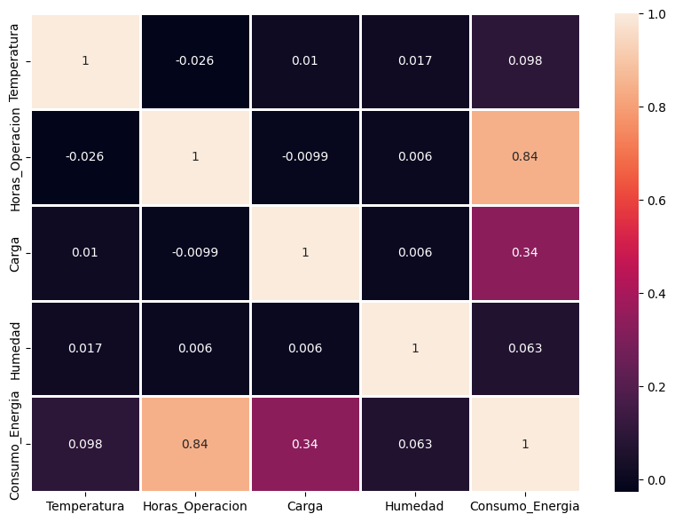
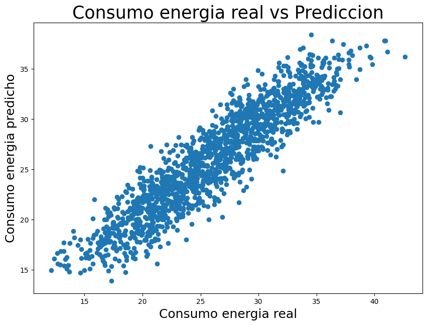
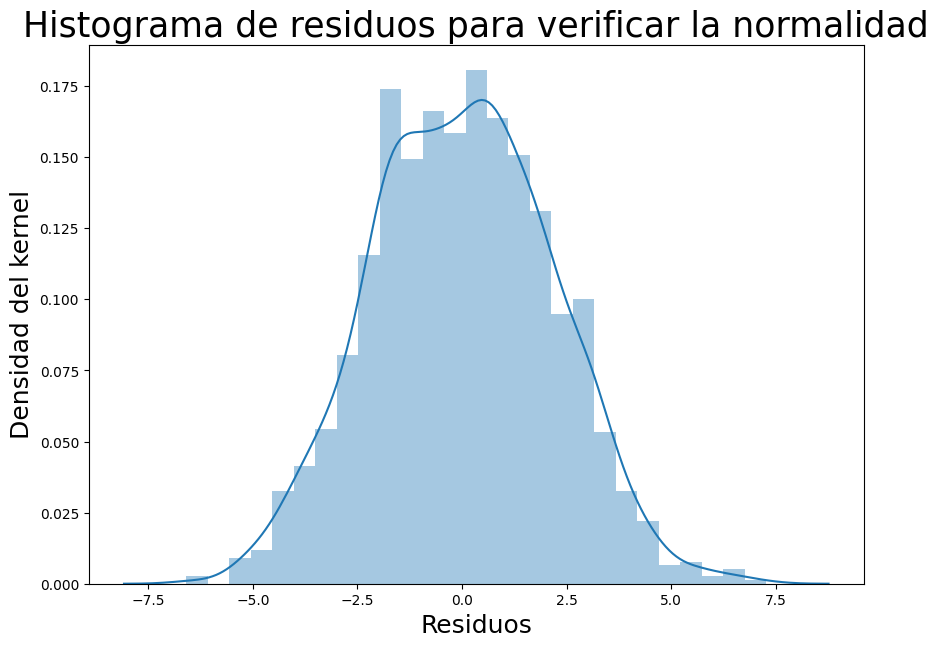
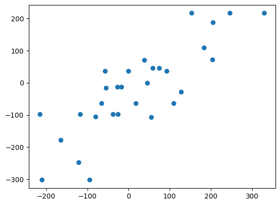
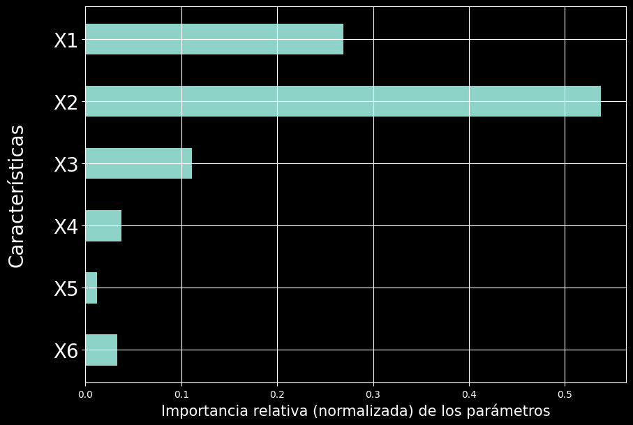

# Taller de Inteligencia Artificial
## Análisis de datos y modelos de regresión

En esta sesión trabajamos con **regresión y análisis de datos en Python**. El objetivo fue recorrer el proceso completo: explorar un conjunto de datos, identificar relaciones entre variables, entrenar modelos de regresión y evaluar qué tan bien realizan sus predicciones.

Durante el taller utilizamos principalmente `Pandas`, `NumPy`, `Matplotlib`, `Seaborn`, `Scikit-learn` y `Statsmodels`.

---

## 1. Exploración de los datos

Primero trabajamos con un conjunto de datos relacionado con el **consumo de energía**, compuesto por las siguientes variables:

- Temperatura
- Horas de operación
- Carga
- Humedad
- Consumo de energía

Antes de crear un modelo, revisamos la estructura del dataset con funciones como `head()`, `info()` y `describe()`.

Esto permitió conocer la cantidad de datos disponibles, los tipos de variables y algunos valores estadísticos como promedio, mínimo, máximo y desviación estándar.

---

## 2. Relación entre las variables

Luego analizamos qué variables estaban más relacionadas con el consumo de energía mediante gráficos y una **matriz de correlación**.

  

Uno de los resultados que más resaltó fue que **Horas_Operacion** presentó la mayor correlación con **Consumo_Energia**, con un valor aproximado de **0.84**.

La variable **Carga** también mostró cierta relación, con una correlación aproximada de **0.34**, mientras que Temperatura y Humedad presentaron una relación mucho menor.

Esto permitió identificar desde el análisis inicial que las horas de operación podían ser una de las variables más importantes para predecir el consumo de energía.

---

## 3. Regresión lineal

Después separamos las variables del problema en:

- **Variables de entrada:** Temperatura, Horas_Operacion, Carga y Humedad.
- **Variable objetivo:** Consumo_Energia.

Los datos fueron divididos en:

- **70 % para entrenamiento**
- **30 % para prueba**

Luego utilizamos `LinearRegression` para construir el modelo.

Al revisar los coeficientes obtenidos, nuevamente destacó **Horas_Operacion**, con un coeficiente aproximado de **1.67**, siendo la variable que tuvo mayor influencia dentro de la predicción.

---

## 4. Valores reales vs. valores predichos

Una vez entrenado el modelo, realizamos predicciones utilizando los datos que no habían sido utilizados durante el entrenamiento.

  

En este gráfico se comparan los valores reales de consumo de energía con los valores estimados por el modelo.

Se observa una tendencia clara entre ambos, lo que indica que el modelo logra representar de manera general el comportamiento de los datos.

---

## 5. Análisis de residuos

También analizamos los **residuos**, que representan la diferencia entre el valor real y el valor predicho por el modelo.

  

Esta parte fue importante porque permitió entender que no basta con obtener una predicción: también es necesario observar cómo se comportan los errores del modelo.

Además del histograma, se compararon los residuos con los valores predichos para analizar si los errores mantenían una dispersión relativamente constante.

---

## 6. Generación de datos artificiales

En la segunda parte del taller utilizamos `make_regression()` para crear un conjunto de datos artificial.

Se generaron:

- **100 muestras**
- **6 características**
- **3 características informativas**
- ruido adicional para hacer el problema más realista

Esto permitió trabajar con un conjunto de datos donde conocíamos previamente cuántas variables realmente aportaban información a la predicción.

---

## 7. Árbol de decisión para regresión

Con estos datos entrenamos un modelo `DecisionTreeRegressor`.

Luego realizamos predicciones y comparamos nuevamente los valores reales con los valores obtenidos por el modelo.

  

Para medir el error utilizamos el **Mean Squared Error (MSE)**.

El modelo obtuvo un MSE aproximado de:

### `7931.57`

Este valor representa el promedio de los errores al cuadrado entre los valores reales y las predicciones. Mientras menor sea este valor, mejor será el desempeño del modelo.

---

## 8. Importancia de las variables

Una de las ventajas del árbol de decisión es que permite conocer qué características tuvieron mayor importancia durante las predicciones.

  

Las variables que tuvieron mayor importancia fueron aproximadamente:

- **X2:** 0.54
- **X1:** 0.27
- **X3:** 0.11

Esto fue interesante porque al generar los datos se habían definido justamente **3 características informativas**, y el modelo logró identificar principalmente estas variables como las más relevantes.

---

## 9. Análisis estadístico con Statsmodels

Finalmente utilizamos la librería `Statsmodels` para realizar una regresión mediante **Mínimos Cuadrados Ordinarios (OLS)**.

A diferencia de `Scikit-learn`, esta librería nos permitió obtener información estadística más detallada, como:

- coeficientes;
- error estándar;
- estadístico `t`;
- p-valor;
- R²;
- R² ajustado.

En esta parte se obtuvo un:

### R² = 0.976

Esto indica que el modelo logró explicar aproximadamente el **97.6 % de la variabilidad de la variable objetivo** en los datos artificiales utilizados.

---

# Lo que más resaltó del taller

Lo que más me llamó la atención fue comprobar que **no todas las variables aportan la misma cantidad de información a un modelo**.

En el caso del consumo de energía, las **Horas_Operacion** destacaron desde el inicio: tuvieron la correlación más alta con Consumo_Energia y también el coeficiente más alto dentro de la regresión lineal.

También fue interesante observar que el árbol de decisión pudo identificar cuáles eran las características más importantes dentro de un conjunto de datos artificial.

Esto permitió ver que los gráficos, las correlaciones y los resultados de los modelos pueden complementarse para entender mejor un problema.

---

# ¿Qué aprendí?

Durante este taller aprendí que antes de entrenar un modelo es importante **conocer y explorar los datos**.

También aprendí a interpretar mejor conceptos como:

- correlación;
- coeficientes de regresión;
- predicciones;
- residuos;
- MSE;
- importancia de características;
- R².

Además, comprendí que evaluar un modelo no significa solamente obtener predicciones, sino también analizar sus errores y revisar qué variables están influyendo realmente en el resultado.

En general, el taller me permitió entender de una manera más práctica el flujo básico de un problema de regresión:

**Datos → Exploración → Entrenamiento → Predicción → Evaluación → Interpretación**
