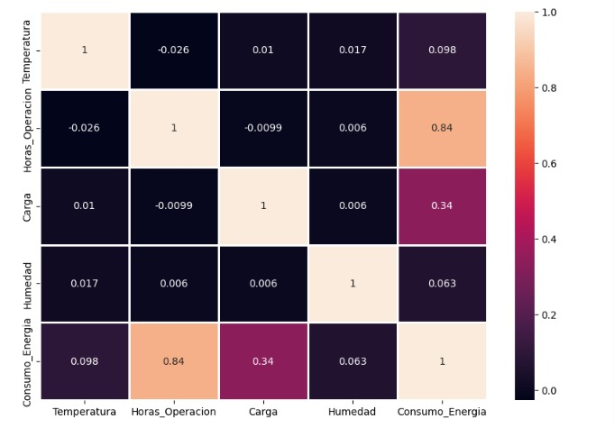
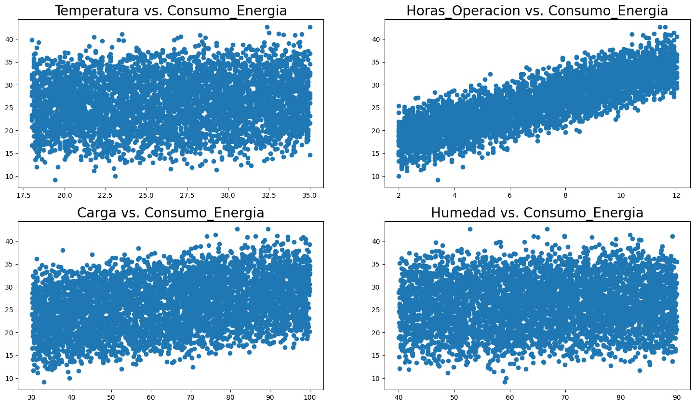
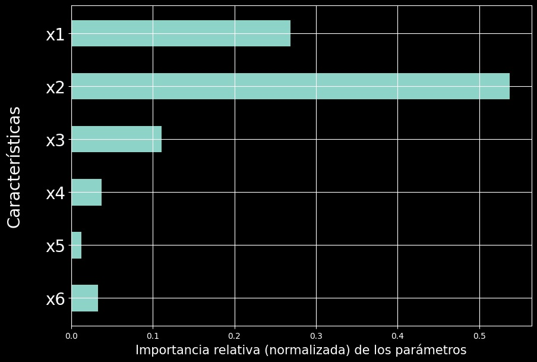
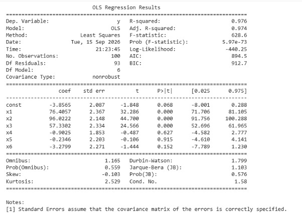

# Taller de Inteligencia Artificial

## Análisis de Datos y Modelos de Regresión

En este taller se trabajó con herramientas de análisis de datos y aprendizaje automático para estudiar la relación entre diferentes variables y una variable objetivo.

El trabajo incluye el análisis de un conjunto de datos relacionado con el **consumo de energía**, considerando variables como `Temperatura`, `Horas_Operacion`, `Carga` y `Humedad`. A partir de estos datos se realizaron diferentes visualizaciones y análisis estadísticos para identificar relaciones y tendencias.

También se trabajaron modelos de regresión y técnicas de análisis estadístico, incluyendo **Regresión Lineal, Árbol de Decisión y OLS**, con el objetivo de comprender cómo las variables pueden utilizarse para explicar y predecir una variable de interés.

---

## Matriz de correlación

### Relación entre las variables

La matriz de correlación permite analizar la relación lineal existente entre las variables del conjunto de datos.

Uno de los resultados más importantes se encuentra entre **`Horas_Operacion` y `Consumo_Energia`**, donde se obtiene una correlación aproximada de **0.84**. Esto representa una relación positiva fuerte dentro de los datos analizados, ya que al aumentar las horas de operación también se observa una tendencia a incrementar el consumo de energía.

También se observa una relación positiva entre **`Carga` y `Consumo_Energia`**, con un valor aproximado de **0.34**, aunque esta relación es menor.

Por otro lado, `Temperatura` y `Humedad` presentan correlaciones bajas con el consumo, aproximadamente **0.098** y **0.063**, respectivamente.

Este análisis permite identificar qué variables presentan una relación más importante con la variable objetivo antes de continuar con la construcción de los modelos.



---

## Relación entre variables

### Análisis mediante gráficos de dispersión

Los gráficos de dispersión permiten observar visualmente la relación entre las variables de entrada y `Consumo_Energia`.

En el gráfico de **`Horas_Operacion` frente a `Consumo_Energia`** se observa una tendencia creciente bastante clara. Los valores de consumo aumentan conforme aumentan las horas de operación, lo cual coincide con la correlación de aproximadamente **0.84** obtenida anteriormente.

En el caso de **`Carga`**, también se observa una tendencia positiva, aunque existe una mayor dispersión de los puntos.

En cambio, las gráficas correspondientes a **`Temperatura`** y **`Humedad`** presentan una distribución más dispersa y no muestran una tendencia lineal tan marcada.

Esta visualización permite complementar los resultados numéricos de la matriz de correlación y comprender mejor el comportamiento de las variables.



---

## Importancia de las características

### Análisis mediante Árbol de Decisión

En esta parte se trabajó con un **Árbol de Decisión para regresión**, utilizando las características `x1`, `x2`, `x3`, `x4`, `x5` y `x6`.

El gráfico muestra la importancia relativa de cada característica dentro del modelo.

Se observa que **`x2` presenta la mayor importancia**, con un valor aproximado de **0.54**, seguido de `x1`, con aproximadamente **0.27**.

Las características `x3`, `x4`, `x5` y `x6` presentan una importancia menor en comparación con las dos primeras.

Este análisis permite conocer qué características tienen mayor participación en las decisiones realizadas por el árbol. La importancia de variables resulta útil para interpretar el modelo y determinar qué entradas están teniendo mayor influencia en las predicciones.



---

## Resultados estadísticos mediante OLS

### Análisis del modelo de regresión

La última imagen presenta los resultados obtenidos mediante **OLS (Ordinary Least Squares)**, una técnica utilizada para estimar los coeficientes de un modelo de regresión.

Uno de los resultados principales es el **R-squared de 0.976**, acompañado de un **Adjusted R-squared de 0.974**. Estos valores muestran que el modelo explica una proporción elevada de la variabilidad de la variable objetivo `y` dentro del conjunto de datos analizado.

La tabla también presenta diferentes indicadores estadísticos, entre ellos:

- Coeficientes (`coef`)
- Error estándar (`std err`)
- Estadística `t`
- Valor `p`
- Intervalos de confianza

Entre los coeficientes obtenidos destaca `x2`, con un valor aproximado de **96.02**, seguido de `x1` con **76.41** y `x3` con **57.33**.

Los valores `p` permiten complementar la interpretación de los coeficientes y analizar su significancia estadística dentro del modelo.

De esta manera, OLS permite analizar el modelo no solamente desde sus predicciones, sino también desde una perspectiva estadística.



---

# ¿Qué aprendí?

Durante el desarrollo del taller aprendí que antes de construir un modelo de aprendizaje automático es necesario realizar un análisis previo de los datos.

Entre los principales aprendizajes se encuentran:

- Analizar la estructura y características de un conjunto de datos.
- Identificar variables de entrada y variables objetivo.
- Utilizar matrices de correlación para encontrar relaciones entre variables.
- Interpretar gráficos de dispersión.
- Identificar tendencias positivas y negativas entre variables.
- Comprender cómo funciona una **Regresión Lineal**.
- Interpretar los coeficientes de un modelo.
- Utilizar un **Árbol de Decisión para regresión**.
- Analizar la importancia relativa de las características.
- Comprender el significado del **R-squared** y **Adjusted R-squared**.
- Interpretar coeficientes, errores estándar, estadística `t` y valores `p`.
- Utilizar diferentes herramientas para evaluar e interpretar un modelo.

Uno de los puntos más importantes fue comprender que **obtener una predicción no es suficiente**. También es necesario analizar los datos y entender por qué el modelo produce determinados resultados.

---

# ¿Cómo podría aplicarlo?

Los conocimientos desarrollados en este taller pueden utilizarse en diferentes situaciones donde sea necesario realizar predicciones a partir de datos históricos.

Por ejemplo, para el caso del **consumo de energía**, se podrían utilizar variables como:

```text
Temperatura
      +
Horas de operación
      +
Carga
      +
Humedad
      ↓
Modelo de regresión
      ↓
Consumo de energía estimado
