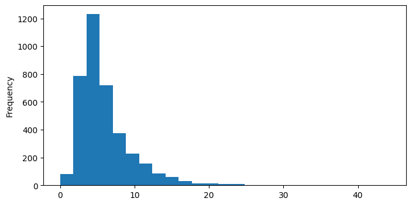
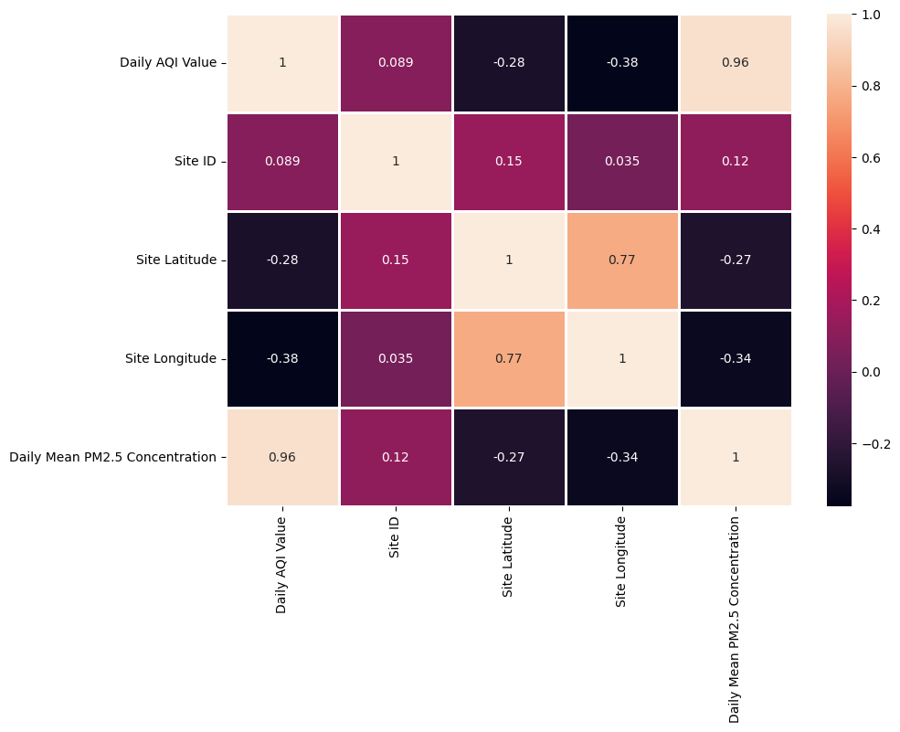
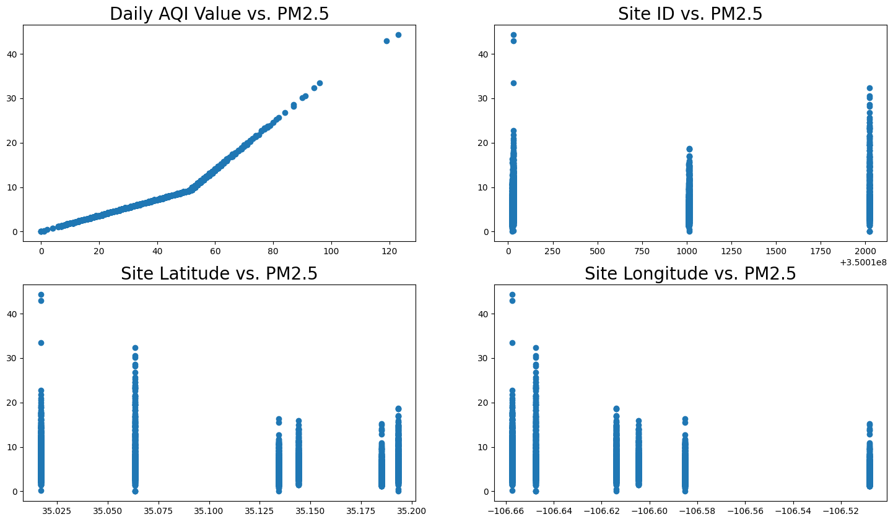
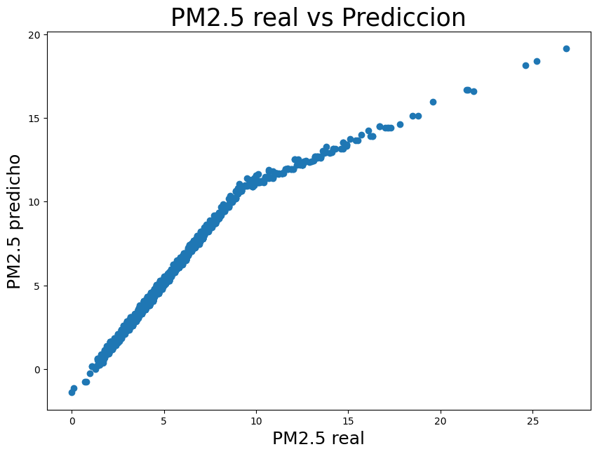
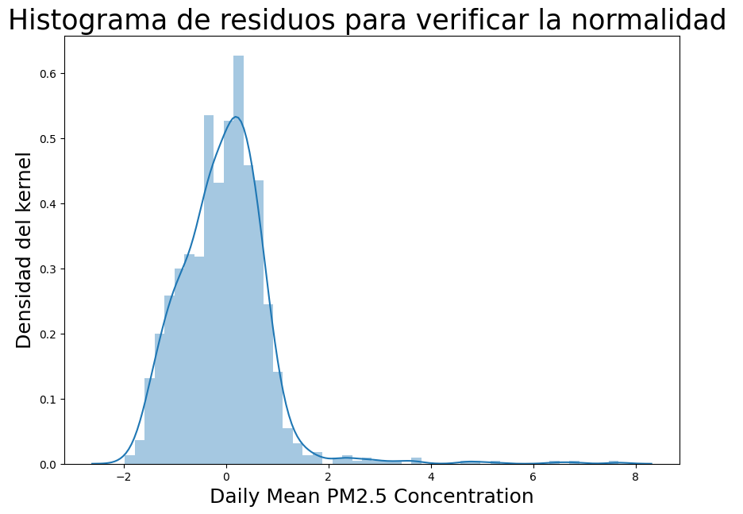
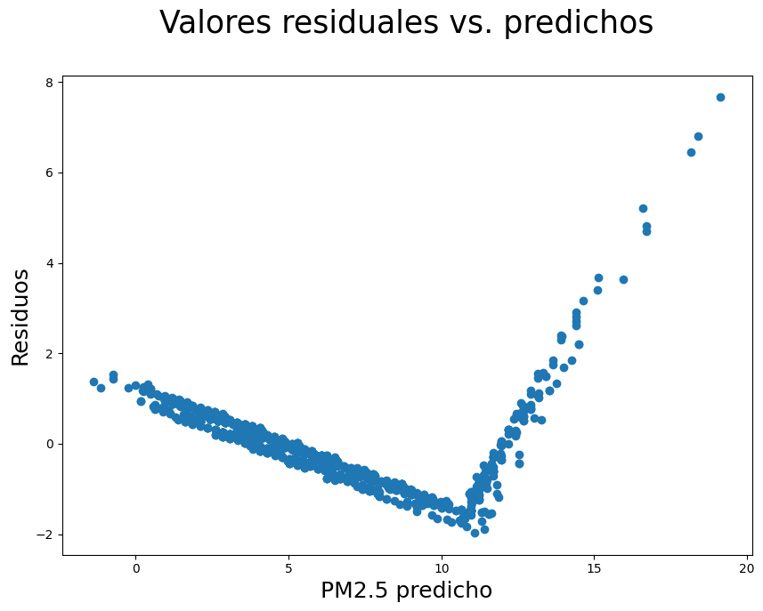

# Informe de regresión lineal: PM2.5 en Albuquerque, Nuevo México — 2023

## Introducción

En este trabajo se analizaron datos de calidad del aire correspondientes al **año 2023** en **Albuquerque, Nuevo México, Estados Unidos**. El componente estudiado fue **PM2.5**, representado en el archivo por la variable `Daily Mean PM2.5 Concentration`.

El archivo utilizado fue `ad_viz_plotval_data.csv`, el cual contiene **3,804 registros** obtenidos de información publicada por la **United States Environmental Protection Agency (EPA)**.

El objetivo fue aplicar una **regresión lineal múltiple** para observar la relación entre la concentración diaria de PM2.5 y algunas variables numéricas disponibles en el conjunto de datos.

Las variables utilizadas como predictoras fueron:

- `Daily AQI Value`
- `Site ID`
- `Site Latitude`
- `Site Longitude`

La variable que se desea predecir es:

- `Daily Mean PM2.5 Concentration`

---

## Metodología

### 1. Datos utilizados

Los datos analizados corresponden a:

- **Año:** 2023
- **Componente:** PM2.5
- **Lugar / geografía:** Albuquerque, Nuevo México, Estados Unidos
- **Cantidad de registros:** 3,804

Primero se cargó el archivo CSV y se revisaron las columnas, los tipos de datos y algunos valores estadísticos básicos. Luego se seleccionaron las variables numéricas que se utilizaron en la regresión.

### 2. Variables del modelo

La variable dependiente fue:

- **`Daily Mean PM2.5 Concentration`**: concentración media diaria de PM2.5.

Las variables independientes fueron:

1. **`Daily AQI Value`**: valor diario del índice de calidad del aire.
2. **`Site ID`**: identificador del sitio de monitoreo.
3. **`Site Latitude`**: latitud del sitio de monitoreo.
4. **`Site Longitude`**: longitud del sitio de monitoreo.

El modelo utilizado se puede representar de la siguiente manera:

$$
\mathrm{PM}_{2.5} = \beta_0 + \beta_1(\mathrm{AQI}) + \beta_2(\mathrm{Site\ ID}) + \beta_3(\mathrm{Latitud}) + \beta_4(\mathrm{Longitud})
$$

Donde $\beta_0$ es el intercepto y los demás coeficientes representan el aporte de cada variable al modelo.

### 3. Funciones principales utilizadas

Para mantener el análisis sencillo se utilizaron principalmente las siguientes funciones:

- **`train_test_split()`**: divide los datos en un grupo para entrenar el modelo y otro para probarlo.
- **`LinearRegression()`**: crea el modelo de regresión lineal.
- **`fit()`**: entrena el modelo usando los datos de entrenamiento.
- **`predict()`**: calcula los valores estimados de PM2.5 para los datos de prueba.
- **`mean_squared_error()`**: calcula el error cuadrático medio entre los valores reales y los valores predichos.

### 4. División de entrenamiento y prueba

Los datos fueron divididos con `train_test_split()` de la siguiente forma:

- **70 %** de los datos para entrenamiento.
- **30 %** de los datos para prueba.
- `random_state = 123` para mantener la misma división cada vez que se ejecuta el análisis.

El conjunto de prueba quedó formado por **1,142 observaciones**.

La idea de esta división es entrenar el modelo con una parte de los datos y luego comprobar su funcionamiento con datos que no fueron utilizados durante el entrenamiento.

### 5. Entrenamiento del modelo

Después de separar los datos se creó el modelo con `LinearRegression()` y se entrenó utilizando `fit()`.

Los coeficientes obtenidos fueron:

| Variable | Coeficiente |
|---|---:|
| Daily AQI Value | 0.244260 |
| Site ID | 0.000206 |
| Site Latitude | -2.263241 |
| Site Longitude | 3.987292 |

El término de intersección fue aproximadamente **-71,568.68**.

---

## Resultados

### 1. Distribución de PM2.5

**Figura 1. Histograma de PM2.5.**

**Interpretación:** La mayoría de los valores de PM2.5 se encuentran en concentraciones bajas. También se observan algunos valores altos, pero aparecen con menor frecuencia.

Los valores descriptivos principales fueron:

| Estadístico | PM2.5 |
|---|---:|
| Número de registros | 3804 |
| Media | 6.0 |
| Desviación estándar | 3.7 |
| Mínimo | 0.0 |
| Primer cuartil | 3.7 |
| Mediana | 5.0 |
| Tercer cuartil | 7.2 |
| Máximo | 44.3 |

### 2. Correlación entre variables

**Figura 2. Matriz de correlación.**

**Interpretación:** La variable que presenta la relación más fuerte con PM2.5 es `Daily AQI Value`. Su correlación es aproximadamente **0.9582**, por lo que ambas variables tienden a aumentar de manera similar.

### 3. Variables predictoras frente a PM2.5

**Figura 3. Variables predictoras frente a PM2.5.**

**Interpretación:** El gráfico de `Daily AQI Value` muestra la relación más clara con PM2.5. En las demás variables la relación visual es menos marcada.

### 4. Valores reales frente a valores predichos

Luego de entrenar el modelo se utilizó `predict()` con los datos de prueba.

**Figura 4. PM2.5 real frente a PM2.5 predicho.**

**Interpretación:** Muchos puntos se encuentran cerca de una tendencia diagonal. Esto indica que, en varios casos, los valores predichos son cercanos a los valores reales. Sin embargo, también existen algunas diferencias entre ambos valores.

### 5. Error cuadrático medio

Para medir el error de las predicciones se utilizó el **error cuadrático medio (MSE)**:

$$
\mathrm{MSE} = \frac{1}{n}\sum_{i=1}^{n}(y_i-\hat{y}_i)^2
$$

El resultado obtenido fue:

$$
\mathrm{MSE} = 0.7662
$$

**Interpretación:** El MSE resume qué tan alejadas están las predicciones de los valores reales. Al elevar los errores al cuadrado, los errores grandes tienen mayor peso en el resultado.

### 6. Coeficiente de determinación

El ajuste estadístico obtuvo un valor de:

$$
R^2 = 0.920
$$

**Interpretación:** El modelo explica aproximadamente el **92 % de la variación de PM2.5** presente en los datos utilizados. Esto indica que existe un ajuste alto para este conjunto de variables.

### 7. Histograma de residuos

**Figura 5. Histograma de residuos.**

**Interpretación:** La mayoría de los residuos se concentra cerca de cero. Esto significa que gran parte de las predicciones tiene errores pequeños, aunque también existen algunos errores mayores.

### 8. Residuos frente a valores predichos

**Figura 6. Residuos frente a valores predichos.**

**Interpretación:** Los residuos se encuentran alrededor de cero, aunque no están distribuidos de manera completamente uniforme. Esto muestra que el modelo funciona de manera aceptable, pero todavía presenta algunos errores en determinadas observaciones.

---

## Discusión

Los resultados muestran que `Daily AQI Value` es la variable que tiene una relación más clara con la concentración diaria de PM2.5. Esto se puede observar tanto en la matriz de correlación como en los gráficos de dispersión.

Para evaluar el modelo se dividieron los datos en **70 % para entrenamiento y 30 % para prueba**. Esta división permite entrenar el modelo con una parte de la información y después revisar cómo responde con datos diferentes.

El modelo obtuvo un **MSE de 0.7662** y un **$R^2$ de 0.920**. De manera general, estos resultados indican que el modelo logra representar bastante bien el comportamiento de PM2.5 dentro del conjunto de datos analizado.

Los gráficos de residuos muestran que la mayoría de los errores se encuentra cerca de cero, aunque también aparecen algunos valores más alejados. Por esta razón, el modelo presenta un buen ajuste, pero no realiza predicciones perfectas en todos los casos.

En conclusión, la regresión lineal permitió analizar de forma sencilla la relación entre las variables seleccionadas y la concentración de **PM2.5 en Albuquerque, Nuevo México, durante 2023**.

---

## Referencias

[1] United States Environmental Protection Agency, “Outdoor Air Quality Data,” EPA. [En línea]. Disponible en: https://www.epa.gov/outdoor-air-quality-data. [Accedido: 17-sep-2026].

[2] United States Environmental Protection Agency, “Data,” EPA. [En línea]. Disponible en: https://www.epa.gov/data. [Accedido: 17-sep-2026].

[3] United States Environmental Protection Agency, *ad_viz_plotval_data.csv*, datos diarios de calidad del aire para Albuquerque, Nuevo México, 2023.
