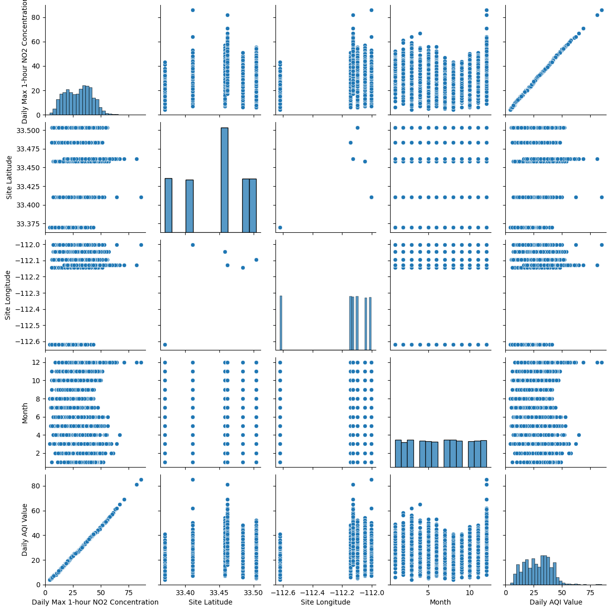
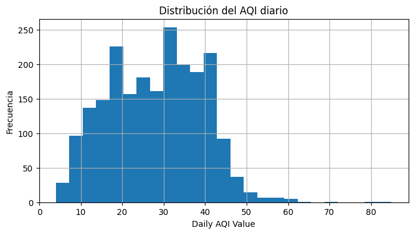
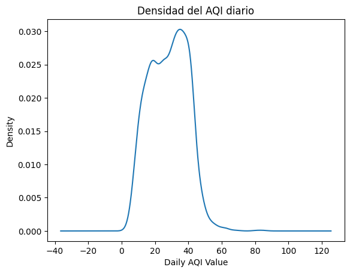
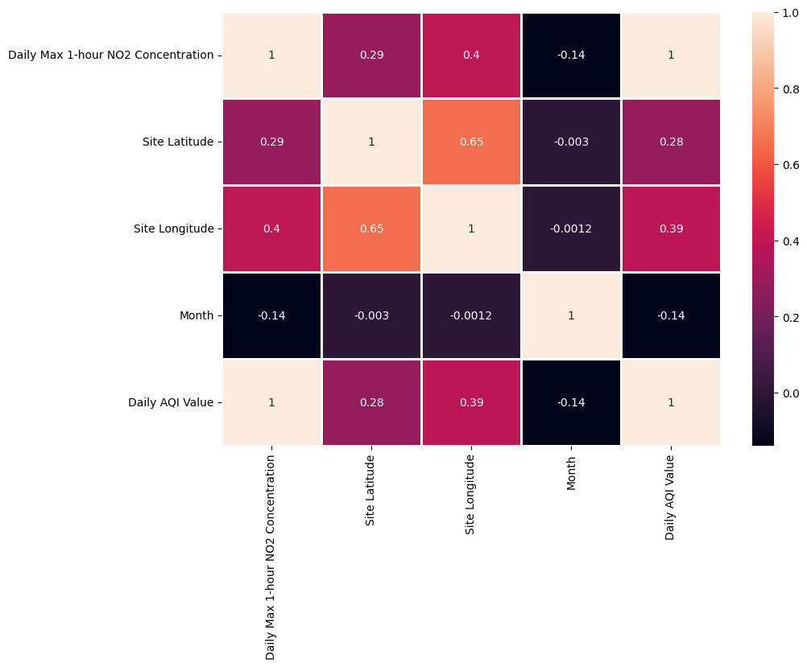
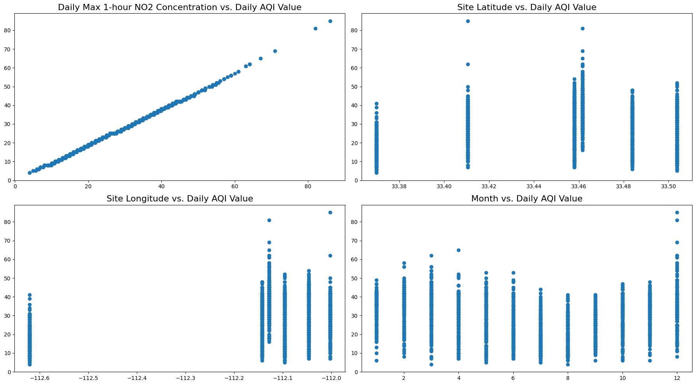
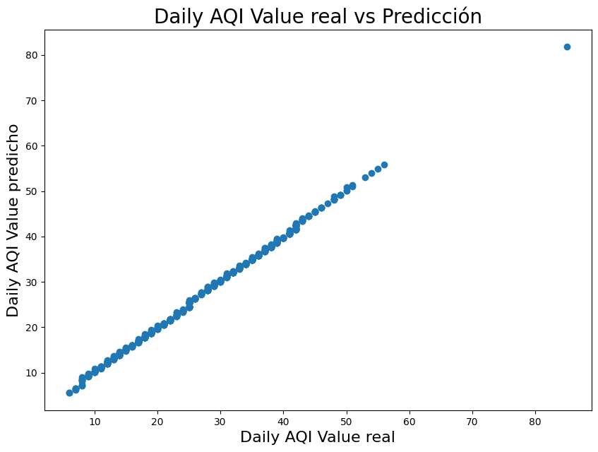
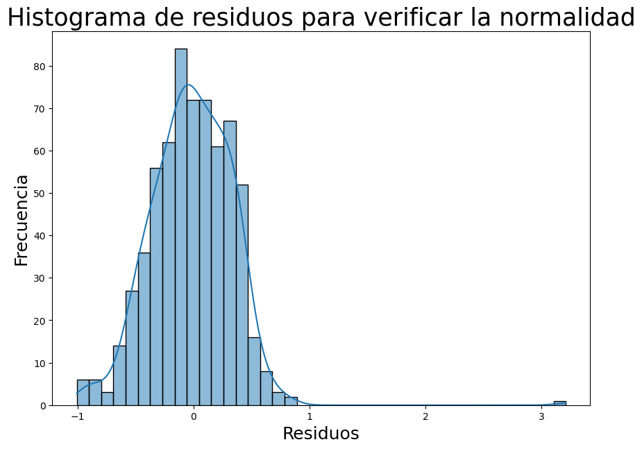
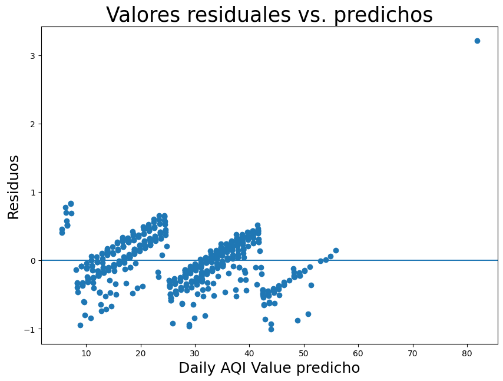
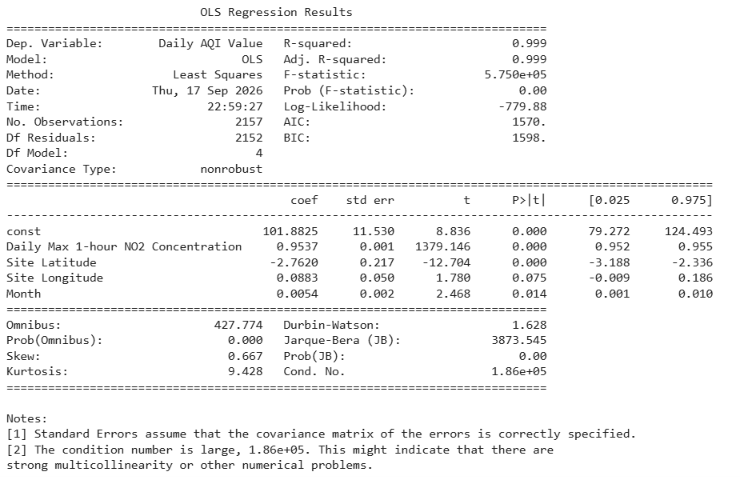

# Análisis de NO₂ y predicción del AQI mediante regresión lineal

**Curso:** Taller de Inteligencia Artificial  
**Caso de estudio:** Phoenix-Mesa-Scottsdale, Arizona, Estados Unidos  
**Periodo analizado:** 2022  
**Componente:** Dióxido de nitrógeno (NO₂)  
**Fuente de datos:** United States Environmental Protection Agency (EPA)

---

## 1. Introducción

La contaminación del aire constituye un aspecto importante del monitoreo ambiental debido a su relación con la salud pública. Entre los contaminantes atmosféricos se encuentra el **dióxido de nitrógeno (NO₂)**, asociado principalmente a procesos de combustión provenientes de vehículos, centrales eléctricas y otros equipos que utilizan combustibles [1].

En este trabajo se analizan registros diarios de calidad del aire correspondientes al año **2022** en el área de **Phoenix-Mesa-Scottsdale, Arizona**. Los datos fueron obtenidos del sistema **Air Quality System (AQS)** de la United States Environmental Protection Agency (EPA) [2].

El objetivo del análisis es estudiar la relación entre la concentración máxima diaria de NO₂ y el **Air Quality Index (AQI)**, y construir un modelo de **regresión lineal** que permita estimar el valor diario del AQI a partir de las variables seleccionadas.

---

## 2. Metodología

### 2.1. Datos utilizados

Los datos analizados corresponden a:

- **Año:** 2022
- **Componente:** Dióxido de nitrógeno (NO₂)
- **Lugar / geografía:** Phoenix-Mesa-Scottsdale, Arizona, Estados Unidos
- **Cantidad de registros:** 2 157

Los registros fueron obtenidos del sistema **Air Quality System (AQS)** de la EPA [2].

Primero se cargó el archivo CSV y se revisaron las columnas, los tipos de datos y las estadísticas descriptivas. Posteriormente, la variable `Date` fue convertida a formato de fecha y se creó la variable `Month`, con el fin de incorporar el mes correspondiente a cada observación.

### 2.2. Variables del modelo

La variable dependiente fue:

- **`Daily AQI Value`**: valor diario del índice de calidad del aire.

Las variables independientes fueron:

1. **`Daily Max 1-hour NO2 Concentration`**: concentración máxima diaria de NO₂ registrada durante una hora.
2. **`Site Latitude`**: latitud del sitio de monitoreo.
3. **`Site Longitude`**: longitud del sitio de monitoreo.
4. **`Month`**: mes correspondiente a cada observación.

El modelo puede representarse de la siguiente manera:

```math
AQI =
\beta_0 +
\beta_1(NO_2) +
\beta_2(Latitud) +
\beta_3(Longitud) +
\beta_4(Mes)
```

Donde `β0` representa el intercepto y los demás coeficientes representan la relación estimada entre cada variable predictora y el valor diario del AQI.

### 2.3. Análisis exploratorio

Antes de entrenar el modelo se realizó un análisis exploratorio para conocer el comportamiento de las variables seleccionadas.

Se utilizaron:

- estadísticas descriptivas;
- gráficos de dispersión;
- histograma del AQI;
- curva de densidad;
- matriz de correlación;
- mapa de calor de correlaciones.

Este análisis permitió observar la distribución de los datos e identificar las relaciones existentes entre las variables.

### 2.4. Funciones principales utilizadas

Para realizar el análisis se utilizaron principalmente las siguientes funciones:

- **`train_test_split()`**: divide los datos en conjuntos de entrenamiento y prueba.
- **`LinearRegression()`**: crea el modelo de regresión lineal [3].
- **`fit()`**: entrena el modelo utilizando los datos de entrenamiento.
- **`predict()`**: genera los valores estimados de AQI para el conjunto de prueba.
- **`mean_squared_error()`**: calcula el error cuadrático medio entre los valores reales y los valores predichos.
- **`sm.OLS()`**: realiza un análisis estadístico adicional mediante mínimos cuadrados ordinarios utilizando `statsmodels` [4].

### 2.5. División de entrenamiento y prueba

Los datos fueron divididos utilizando `train_test_split()` de la siguiente forma:

- **70 %** para entrenamiento.
- **30 %** para prueba.
- `random_state = 123` para mantener la misma división cada vez que se ejecuta el análisis.

De los **2 157 registros**:

- **1 509 observaciones** fueron utilizadas para entrenamiento.
- **648 observaciones** fueron utilizadas para prueba.

La finalidad de esta división es entrenar el modelo con una parte de los datos y posteriormente evaluar su funcionamiento con observaciones que no fueron utilizadas durante el entrenamiento.

### 2.6. Entrenamiento del modelo

Después de dividir los datos se creó el modelo utilizando `LinearRegression()` de scikit-learn [3] y se entrenó mediante `fit()`.

El término de intersección obtenido fue aproximadamente:

**97.8673**

Los coeficientes obtenidos fueron:

| Variable | Coeficiente |
|---|---:|
| Daily Max 1-hour NO2 Concentration | 0.953660 |
| Site Latitude | -2.680513 |
| Site Longitude | 0.076662 |
| Month | 0.004319 |

Estos parámetros fueron utilizados por el modelo para generar las predicciones de `Daily AQI Value`.

### 2.7. Evaluación del modelo

Para evaluar el desempeño del modelo se utilizaron:

- comparación entre valores reales y predichos;
- análisis de la distribución de los residuos;
- gráfico de residuos frente a valores predichos;
- **Mean Squared Error (MSE)**;
- análisis estadístico mediante **Ordinary Least Squares (OLS)** con `statsmodels` [4].

---

## 3. Resultados

### 3.1. Relación general entre las variables

<p align="center">
  
</p>

**Figura 1. Relación entre las variables seleccionadas.**

La relación más clara se observa entre **Daily Max 1-hour NO2 Concentration** y **Daily AQI Value**, cuyos puntos siguen prácticamente una tendencia lineal ascendente. Esto indica que, a medida que aumenta la concentración máxima diaria de NO₂, también aumenta el valor diario del AQI.

Las variables **Site Latitude** y **Site Longitude** aparecen agrupadas en valores específicos debido a que corresponden a ubicaciones fijas de las estaciones de monitoreo. Por otro lado, `Month` no muestra una relación lineal fuerte con el AQI.

---

### 3.2. Distribución del AQI diario

<p align="center">
  
</p>

**Figura 2. Distribución de `Daily AQI Value`.**

La mayor cantidad de observaciones se concentra aproximadamente entre valores de **15 y 45**, con una frecuencia especialmente alta alrededor de los valores de 30 a 40.

También se observan algunos valores superiores a 50 y una menor cantidad de registros cercanos a 80. La distribución presenta una cola hacia la derecha, lo que indica que los valores elevados del AQI son menos frecuentes que los valores intermedios.

---

### 3.3. Densidad del AQI diario

<p align="center">
  
</p>

**Figura 3. Densidad de `Daily AQI Value`.**

La curva de densidad confirma que la mayor concentración de valores del AQI se encuentra aproximadamente entre **15 y 45**.

La densidad disminuye progresivamente hacia valores superiores, mostrando una ligera asimetría hacia la derecha. Este comportamiento coincide con lo observado previamente en el histograma.

---

### 3.4. Mapa de calor de correlaciones

<p align="center">
  
</p>

**Figura 4. Matriz de correlación de las variables utilizadas.**

La variable **Daily Max 1-hour NO2 Concentration** presenta una correlación de **0.9995** con `Daily AQI Value`, lo que representa una relación lineal positiva muy fuerte.

Las correlaciones obtenidas con el AQI fueron:

| Variable | Correlación con Daily AQI Value |
|---|---:|
| Daily Max 1-hour NO2 Concentration | 0.9995 |
| Site Longitude | 0.3905 |
| Site Latitude | 0.2838 |
| Month | -0.1375 |

`Site Longitude` y `Site Latitude` presentan relaciones menores con el AQI, mientras que `Month` muestra una relación negativa débil.

Además, la correlación entre `Site Latitude` y `Site Longitude` fue aproximadamente **0.6487**, lo cual refleja la distribución geográfica de los sitios de monitoreo incluidos en el conjunto de datos.

---

### 3.5. Relación entre las variables predictoras y el AQI

<p align="center">
  
</p>

**Figura 5. Relación individual de las variables predictoras con `Daily AQI Value`.**

La concentración máxima diaria de NO₂ presenta una relación ascendente muy marcada con el AQI. Esto coincide con la correlación de **0.9995** obtenida anteriormente.

En los gráficos de `Site Latitude` y `Site Longitude` se observan grupos verticales de puntos. Esto ocurre porque los registros provienen de un conjunto determinado de estaciones con coordenadas geográficas fijas.

En el caso de `Month`, los valores del AQI se encuentran distribuidos a lo largo de los meses sin una tendencia lineal claramente definida, lo que coincide con su baja correlación de **-0.1375**.

---

### 3.6. Comparación entre valores reales y predichos

<p align="center">
  
</p>

**Figura 6. Valores reales frente a valores predichos por el modelo.**

Los puntos se encuentran muy próximos a una línea diagonal, lo que indica que las predicciones realizadas por el modelo son cercanas a los valores reales del AQI.

Esta correspondencia se observa tanto en valores bajos como en valores medios y altos, mostrando un ajuste elevado del modelo sobre el conjunto de prueba.

El conjunto de prueba estuvo compuesto por **648 observaciones**.

---

### 3.7. Distribución de los residuos

<p align="center">
  
</p>

**Figura 7. Histograma de residuos del modelo de regresión.**

La mayoría de los residuos se concentra alrededor de **0**, indicando que en gran parte de las observaciones la diferencia entre los valores reales y los predichos es pequeña.

Sin embargo, la distribución no es completamente simétrica y se observa una cola hacia valores positivos, además de algunos valores atípicos. Por ello, la distribución de los residuos no presenta una normalidad perfecta.

Este comportamiento también es consistente con el resumen estadístico OLS, donde las pruebas de normalidad presentan valores de probabilidad cercanos a cero.

---

### 3.8. Residuos frente a valores predichos

<p align="center">
  
</p>

**Figura 8. Residuos frente a los valores predichos.**

La mayoría de los residuos se encuentra alrededor de la línea horizontal de cero. Sin embargo, los puntos no forman una nube completamente uniforme y aparecen agrupados en diferentes zonas.

También se observa una variación en la dispersión de los errores según los valores predichos y la presencia de algunos valores atípicos.

Por lo tanto, la condición de homocedasticidad no se observa de manera completamente perfecta, aunque la magnitud de la mayoría de los errores es reducida.

---

### 3.9. Error cuadrático medio

El modelo obtuvo un **Mean Squared Error (MSE)** de:

**0.123182**

Este resultado indica una diferencia cuadrática promedio reducida entre los valores reales y los valores predichos. El valor obtenido es coherente con la fuerte alineación observada en la comparación entre valores reales y predichos.

---

### 3.10. Resumen estadístico del modelo OLS

<p align="center">
  
</p>

**Figura 9. Resumen estadístico del modelo mediante mínimos cuadrados ordinarios (OLS).**

El modelo OLS obtuvo:

- **R² = 0.999**
- **R² ajustado = 0.999**
- **Número de observaciones = 2 157**
- **F-statistic = 5.750 × 10⁵**
- **Prob (F-statistic) = 0.00**

El valor de **R² = 0.999** indica que el modelo explica aproximadamente el **99.9 % de la variabilidad** observada en `Daily AQI Value`.

Los resultados por variable fueron:

| Variable | Coeficiente | p-value | Interpretación |
|---|---:|---:|---|
| Daily Max 1-hour NO2 Concentration | 0.9537 | < 0.001 | Relación positiva y estadísticamente significativa |
| Site Latitude | -2.7620 | < 0.001 | Relación negativa y estadísticamente significativa |
| Site Longitude | 0.0883 | 0.075 | No significativa al nivel de 0.05 |
| Month | 0.0054 | 0.014 | Relación positiva pequeña y estadísticamente significativa |

La concentración máxima diaria de NO₂ presenta la relación más clara con el AQI. `Site Longitude`, en cambio, presenta un valor `p = 0.075`, por lo que no alcanza significancia estadística utilizando un nivel de significancia de 0.05.

Las pruebas de normalidad de residuos muestran `Prob(Omnibus) = 0.000` y `Prob(JB) = 0.00`, por lo que los residuos no presentan una distribución perfectamente normal.

Además, el **Condition Number = 1.86 × 10⁵** es elevado. El propio resumen OLS advierte que este valor puede estar relacionado con multicolinealidad fuerte u otros problemas numéricos.

---

## 4. Discusión

Los resultados muestran que el modelo de regresión lineal presenta un ajuste muy elevado. La concentración máxima diaria de NO₂ fue la variable con mayor relación con el AQI, alcanzando una correlación de **0.9995**.

El modelo obtuvo un **MSE de 0.123182** y el análisis OLS presentó un **R² de 0.999**, por lo que las predicciones realizadas fueron muy cercanas a los valores observados.

Esta relación elevada debe interpretarse considerando que el **Air Quality Index (AQI)** se calcula a partir de concentraciones de contaminantes y puntos de corte establecidos por la EPA [5]. Por este motivo, es esperable encontrar una relación muy fuerte entre la concentración de NO₂ y el AQI correspondiente.

Las variables geográficas y temporales presentaron una contribución menor en comparación con la concentración de NO₂. En particular, `Site Longitude` no presentó significancia estadística al nivel de 0.05.

Por otro lado, el análisis de residuos muestra que los supuestos estadísticos no se cumplen de manera perfecta. El histograma presenta cierta asimetría y valores atípicos, mientras que el gráfico de residuos frente a las predicciones muestra agrupamientos y variaciones en la dispersión.

En conjunto, el modelo presenta una alta capacidad de ajuste para los datos analizados de Phoenix-Mesa-Scottsdale durante 2022. Sin embargo, los resultados deben interpretarse considerando la forma en que se calcula el AQI, las características del conjunto de datos y las limitaciones observadas en el análisis de residuos.

---

## 5. Referencias

[1] U.S. Environmental Protection Agency, “Basic Information about NO₂,” *EPA*. [Online]. Available: https://www.epa.gov/no2-pollution/basic-information-about-no2. [Accessed: Sep. 17, 2026].

[2] U.S. Environmental Protection Agency, “Air Quality System (AQS),” *EPA*. [Online]. Available: https://www.epa.gov/aqs. [Accessed: Sep. 17, 2026].

[3] Scikit-learn Developers, “LinearRegression,” *Scikit-learn Documentation*. [Online]. Available: https://scikit-learn.org/stable/modules/generated/sklearn.linear_model.LinearRegression.html. [Accessed: Sep. 17, 2026].

[4] Statsmodels Developers, “Linear Regression,” *Statsmodels Documentation*. [Online]. Available: https://www.statsmodels.org/stable/regression.html. [Accessed: Sep. 17, 2026].

[5] U.S. Environmental Protection Agency, *Technical Assistance Document for the Reporting of Daily Air Quality — the Air Quality Index (AQI)*, EPA-454/B-24-002, May 2024. [Online]. Available: https://www.airnow.gov/sites/default/files/2024-05/aqi-technical-assistance-document.pdf. [Accessed: Sep. 17, 2026].

---

## 6. Estructura del repositorio

```text
Regresion_NO2_Phoenix_2022/
│
├── README.md
├── Regresion_NO2_Phoenix_2022.ipynb
└── imagenes/
    ├── 01_relacion_variables.png
    ├── 02_distribucion_aqi.png
    ├── 03_densidad_aqi.png
    ├── 04_mapa_calor_correlaciones.png
    ├── 05_variables_vs_aqi.png
    ├── 06_real_vs_predicho.png
    ├── 07_distribucion_residuos.png
    ├── 08_residuos_vs_predichos.png
    └── 09_resumen_ols.png
```
