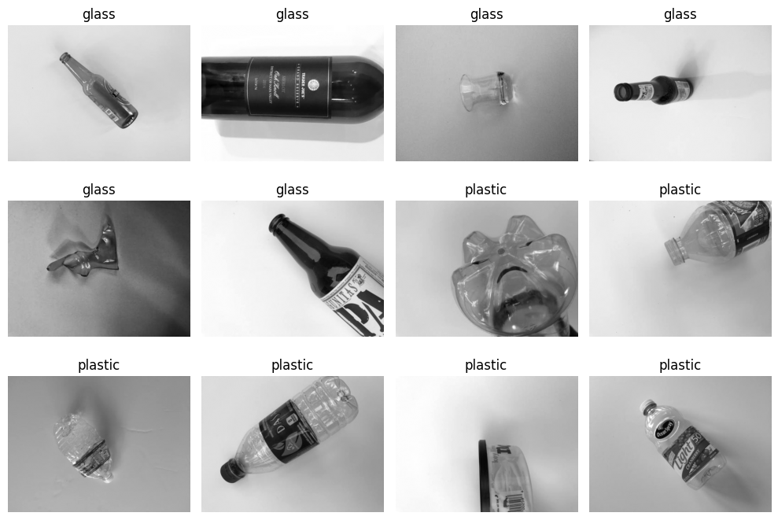
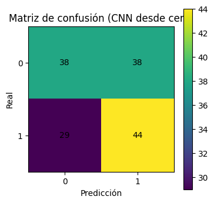
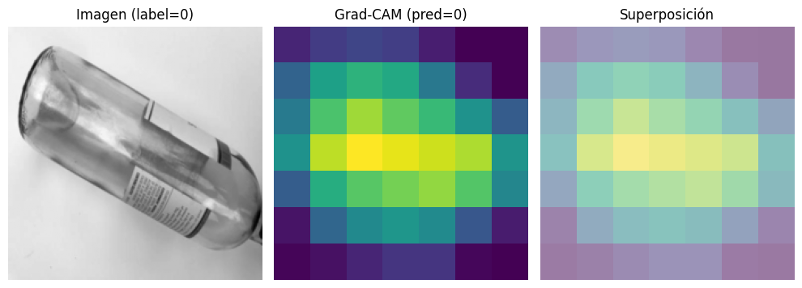
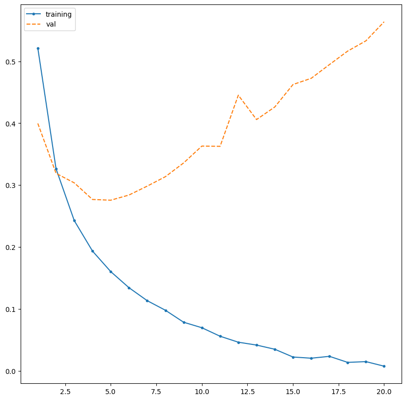
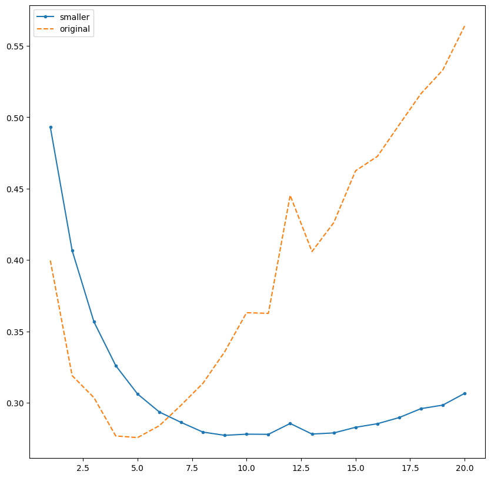
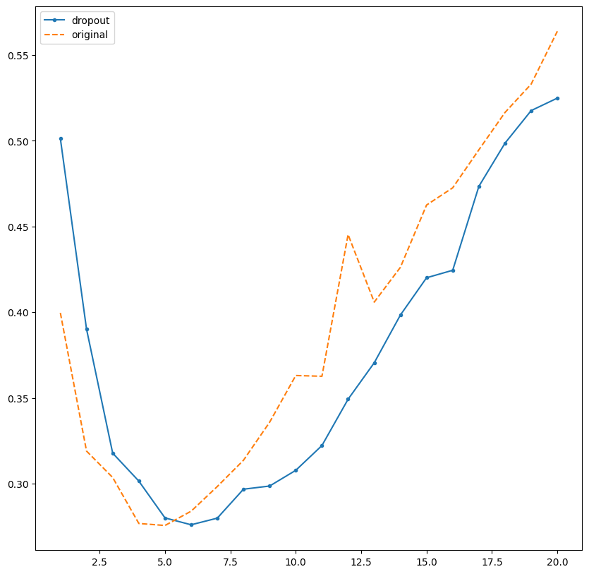
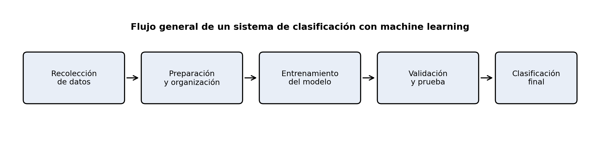

# Informe de redes neuronales y clasificación con machine learning

## Introducción

En esta práctica trabajamos con redes neuronales para entender cómo un programa puede aprender a partir de ejemplos y luego clasificar información nueva. En el notebook vimos una **CNN**, usamos **Keras** y probamos el funcionamiento de un **perceptrón**. También comparamos distintas formas de entrenamiento para observar qué ayuda a mejorar los resultados y qué problemas pueden aparecer durante el aprendizaje.

En este informe explicamos lo trabajado con un lenguaje simple. Primero se presenta lo aprendido en cada modelo y, al final, se añade un bloque aparte sobre cómo estas ideas podrían relacionarse con el proyecto de la granadilla.

## 1. Los datos que usamos para aprender a clasificar

En el ejercicio de CNN utilizamos imágenes de un conjunto de residuos llamado **TrashNet**. Nos concentramos en dos grupos: **vidrio (`glass = 0`) y plástico (`plastic = 1`)**. Eso hizo que el programa tuviera que elegir entre dos opciones posibles, es decir, una **clasificación binaria**.



*Figura 1. Ejemplos de imágenes del notebook. El modelo tenía que aprender a distinguir si el objeto correspondía a vidrio o a plástico.*

Dividimos los datos para que el programa no practique y sea evaluado con las mismas imágenes:

- **Entrenamiento:** ejemplos con los que aprende.
- **Validación:** ejemplos que usamos para revisar cómo va mientras aprende.
- **Prueba:** ejemplos reservados para comprobar el resultado final.

En el notebook quedaron **687 imágenes para entrenamiento, 147 para validación y 149 para prueba**. Esta división fue importante porque nos permitió observar si el modelo realmente estaba aprendiendo o si solo se estaba acostumbrando a los ejemplos vistos.

## 2. CNN: cómo aprendió a reconocer diferencias en imágenes

Una **CNN** o **red neuronal convolucional** revisa pequeñas partes de una imagen y trata de encontrar detalles útiles para clasificarla. En este caso, esos detalles podían ser bordes, formas, zonas brillantes, curvaturas o partes de la silueta de una botella o envase.

En el notebook creamos una CNN sencilla con **PyTorch**. Este fragmento corresponde a la parte principal del modelo:

```python
self.features = nn.Sequential(
    nn.Conv2d(1, 16, kernel_size=3, padding=1),
    nn.ReLU(),
    nn.MaxPool2d(2),

    nn.Conv2d(16, 32, kernel_size=3, padding=1),
    nn.ReLU(),
    nn.MaxPool2d(2),

    nn.Conv2d(32, 64, kernel_size=3, padding=1),
    nn.ReLU(),
    nn.AdaptiveAvgPool2d((1, 1))
)
self.classifier = nn.Sequential(
    nn.Flatten(),
    nn.Linear(64, num_classes)
)
```

En palabras simples:

- **`Conv2d`** busca detalles dentro de la imagen.
- **`ReLU`** ayuda a procesar esos detalles.
- **`MaxPool2d`** reduce la información para quedarse con lo más útil.
- **`Linear`** usa todo lo aprendido para decidir la clase final.

El primer `1` significa que se trabajó con imágenes en escala de grises. Los números `16`, `32` y `64` indican cuántos patrones intermedios iba aprendiendo a detectar la red.

### 2.1. Entrenamiento desde cero

Primero entrenamos una CNN nueva, es decir, un modelo que empezó sin conocimientos previos. El aprendizaje se realizó por épocas.

```python
criterion = nn.CrossEntropyLoss()
optimizer = torch.optim.Adam(model_scratch.parameters(), lr=1e-3)

epochs = 8
for epoch in range(1, epochs + 1):
    train_loss = train_one_epoch(model_scratch, train_loader, optimizer, criterion)
    val_acc, val_auc, _, _, _ = evaluate(model_scratch, val_loader)
```

Aquí, `train_one_epoch` hace que el modelo practique con las imágenes de entrenamiento, y `evaluate` revisa cómo va respondiendo en validación.


*Figura 2. Evolución del aprendizaje de la CNN. El porcentaje de acierto en validación llegó aproximadamente al 63 %, lo que muestra una mejora, aunque todavía con varios errores.*

Después se hizo la prueba final. El modelo logró alrededor de **55 % de aciertos**.



*Figura 3. Matriz de confusión de la CNN. La diagonal representa los aciertos y las otras casillas muestran las confusiones entre vidrio y plástico.*

Esta parte nos ayudó a entender que un modelo puede aprender algo útil, pero no siempre lo suficiente como para clasificar muy bien desde el primer intento.

## 3. Data augmentation: variar un poco los ejemplos

También trabajamos el **data augmentation**, que consiste en mostrar ejemplos parecidos, pero con pequeñas variaciones. En este caso, algunas imágenes se giraron o se movieron ligeramente.

```python
transform_aug = T.Compose([
    T.RandomRotation(degrees=10),
    T.RandomAffine(degrees=0, translate=(0.05, 0.05)),
    T.ToTensor()
])
```

En términos simples:

- **`RandomRotation`** gira un poco la imagen.
- **`RandomAffine`** la desplaza ligeramente.
- **`ToTensor`** la convierte al formato que necesita el modelo.

La idea fue que la red no dependiera de ver siempre la botella en la misma posición. En esta práctica, la mejora fue pequeña: la CNN sin estas variaciones obtuvo **55,03 %** de aciertos y la CNN con data augmentation obtuvo **56,38 %**. Eso nos enseñó que esta técnica puede ayudar, pero no garantiza un gran cambio por sí sola.

## 4. Transfer learning: aprovechar un modelo que ya había aprendido

Luego probamos el **transfer learning**, que consiste en usar un modelo que ya fue entrenado antes con muchas imágenes y adaptarlo a un problema nuevo. En el notebook usamos **ResNet18**.

```python
resnet = models.resnet18(weights=models.ResNet18_Weights.DEFAULT)
in_features = resnet.fc.in_features
resnet.fc = nn.Linear(in_features, num_classes)
resnet = resnet.to(device)
```

La idea principal fue conservar casi toda la experiencia previa del modelo y cambiar su parte final para que respondiera a nuestras dos clases: vidrio y plástico.

Al inicio, congelamos la mayor parte del modelo para entrenar solo la última capa:

```python
for name, param in resnet.named_parameters():
    param.requires_grad = False

for param in resnet.fc.parameters():
    param.requires_grad = True
```

Esto fue útil porque el modelo ya sabía reconocer patrones visuales generales, y nosotros solo le pedimos que aprendiera una decisión nueva al final.

## 5. Fine-tuning: ajustar un poco más el modelo reutilizado

Después del transfer learning, trabajamos el **fine-tuning**. Esto significa que, además de entrenar la parte final, permitimos que algunas capas del modelo vuelvan a ajustarse con nuestros datos.

```python
for name, param in resnet.named_parameters():
    if name.startswith("layer4") or name.startswith("fc"):
        param.requires_grad = True

trainable_params = [p for p in resnet.parameters() if p.requires_grad]
optimizer = torch.optim.Adam(trainable_params, lr=1e-4)
```

Aquí se habilitó el ajuste de `layer4` y `fc`, es decir, una parte final del modelo y la capa de salida. También se usó un paso de aprendizaje más pequeño (`lr=1e-4`) para que los cambios fueran más cuidadosos.

### 5.1. Comparación general de resultados

| Forma de entrenamiento | Aciertos en la prueba final |
|---|---:|
| CNN desde cero | 55,03 % |
| CNN con data augmentation | 56,38 % |
| ResNet18 con transferencia y fine-tuning | 86,58 % |

En esta práctica, el modelo reutilizado y ajustado obtuvo mejores resultados que la CNN entrenada desde cero. Esto no quiere decir que siempre pase lo mismo, pero sí muestra por qué el transfer learning y el fine-tuning suelen ser opciones muy valiosas.

## 6. Grad-CAM: ver qué partes de la imagen influyeron más

También usamos **Grad-CAM**, una herramienta que permite ver qué zonas de una imagen tuvieron más peso en la decisión del modelo.

```python
idx = 0
x, y = test_dataset_tl[idx]
cam, pred_class = grad_cam(resnet, x)
```

Estas líneas toman una imagen de prueba y generan un mapa de importancia.



*Figura 4. A la izquierda está la imagen original; al centro, el mapa de importancia; y a la derecha, la superposición. Las zonas más claras indican dónde se concentró más el modelo para tomar la decisión.*

Este resultado nos ayudó a entender mejor el comportamiento de la red. No solo vimos si acertó o falló, sino también en qué partes de la imagen se apoyó para responder.

## 7. Keras: crear y entrenar una red de forma más simple

En otra parte del notebook trabajamos con **Keras**, una herramienta que facilita crear redes neuronales. En este ejercicio no usamos botellas, sino **reseñas de películas**, para clasificarlas como negativas (`0`) o positivas (`1`).

El modelo se definió así:

```python
model = models.Sequential()
model.add(layers.Dense(16, activation='relu', input_shape=(10000,)))
model.add(layers.Dense(16, activation='relu'))
model.add(layers.Dense(1, activation='sigmoid'))
```

Y luego se compiló y entrenó de esta manera:

```python
model.compile(optimizer='rmsprop',
              loss='binary_crossentropy',
              metrics=['accuracy'])

modelb = model.fit(partial_x_train,
                   partial_y_train,
                   epochs=20,
                   batch_size=512,
                   validation_data=(x_val, y_val))
```

En términos simples, **Keras nos permitió armar una red de manera más rápida y clara**. El modelo alcanzó aproximadamente **86,1 % de aciertos** en la prueba final de reseñas.

### 7.1. Sobreajuste

En este ejercicio también vimos el **sobreajuste**, que ocurre cuando el modelo se acostumbra demasiado a los datos con los que practica y luego ya no responde tan bien con datos nuevos.



*Figura 5. Comparación entre entrenamiento y validación. Cuando la validación deja de mejorar o empeora, aparece una señal de sobreajuste.*

Este punto fue importante porque nos mostró que no basta con que un modelo “aprenda”; también debe aprender de una forma que le sirva para generalizar.

### 7.2. Modelo más pequeño

Una de las soluciones que probamos fue usar una red más pequeña:

```python
model2 = models.Sequential()
model2.add(layers.Dense(4, activation='relu', input_shape=(10000,)))
model2.add(layers.Dense(1, activation='sigmoid'))
```



*Figura 6. Comparación entre el modelo original y uno más pequeño. El modelo reducido mostró un sobreajuste menos pronunciado en esta práctica.*

## 8. Regularización y dropout

También probamos otras estrategias para controlar el sobreajuste.

### 8.1. Regularización

La **regularización** añade una especie de “castigo” cuando el modelo depende demasiado de ciertos valores. La idea es ayudarlo a aprender de forma más equilibrada.

En el notebook esto se aplicó con `regularizers.l2(0.001)` en algunas capas. Aunque por dentro es un detalle matemático, en términos simples significa que se buscó que el modelo no se volviera demasiado extremo al aprender.

### 8.2. Dropout

El **dropout** consiste en apagar temporalmente una parte de las neuronas mientras el modelo está entrenando. Así, la red no puede apoyarse siempre en las mismas y se ve obligada a repartir mejor el aprendizaje.

```python
model4.add(layers.Dense(16, activation='relu', input_shape=(10000,)))
model4.add(layers.Dropout(0.5))
model4.add(layers.Dense(16, activation='relu'))
model4.add(layers.Dropout(0.5))
```



*Figura 7. Comparación del error de validación entre el modelo original y el que usa dropout. Esta prueba permitió observar otra forma de controlar el sobreajuste.*

## 9. Perceptrón: la idea más básica de una neurona artificial

Por último, trabajamos el **perceptrón**, que es una forma sencilla de entender cómo una neurona artificial recibe datos, los combina y toma una decisión.

```python
def step_function(x):
    return 1 if x >= 0 else 0

def perceptron(inputs, weights, bias, activation_func):
    weighted_sum = np.dot(inputs, weights) + bias
    output = activation_func(weighted_sum)
    return output
```

Luego usamos un ejemplo con temperatura y vibración:

```python
temperatura = 100
vibracion = 50
weights = np.array([0.5, -0.5])
bias = -30
inputs = np.array([temperatura, vibracion])
```

Esto nos ayudó a ver, de forma muy clara, cómo una decisión puede depender de varias entradas a la vez. También probamos casos como **AND**, **OR** y **XOR**.


*Figura 8. Ejemplos de separación de casos con perceptrones. Esto ayuda a visualizar cómo una neurona sencilla puede decidir entre dos grupos.*

## 10. Aplicación posible al proyecto de la granadilla

Todo lo aprendido en el notebook nos sirve como base para pensar en el proyecto de la granadilla. En nuestro caso, **no se trabajará con cámaras**, sino con **machine learning de clasificación** usando datos de sensores, especialmente señales de **sonido y vibración**.

La idea general sería la siguiente:

1. **Recolectar datos** de varias granadillas.
2. **Organizar y preparar** esos datos.
3. **Entrenar un modelo de clasificación**.
4. **Validar y probar** el modelo con datos separados.
5. **Usar el modelo** para clasificar nuevas granadillas.



*Figura 9. Diagrama de flujo general de una posible aplicación al proyecto de la granadilla. **Esta imagen fue elaborada con ayuda de IA** para mejorar la explicación visual del proceso.*

Si llevamos estas ideas a nuestro proyecto, el trabajo ya no consistiría en reconocer botellas o reseñas, sino en enseñar al modelo a diferenciar la condición interna de una granadilla a partir de mediciones. Por ejemplo, el sistema podría recibir valores de vibración, intensidad de sonido, tiempo de respuesta o alguna otra señal obtenida por sensores.

Lo más importante que nos deja esta práctica es que el proyecto necesitará:

- **Datos bien etiquetados**, es decir, saber cuál era la condición real de cada granadilla.
- **Separación de datos** en entrenamiento, validación y prueba.
- **Comparación de modelos**, porque no basta con usar uno solo.
- **Revisión de errores**, para ver en qué casos falla el sistema.
- **Control del sobreajuste**, para que el modelo funcione también con granadillas nuevas.

Entonces, aunque en el notebook trabajamos con imágenes y texto, la enseñanza principal sí se puede trasladar al proyecto: **el objetivo sigue siendo clasificar correctamente a partir de ejemplos previos**.

## Conclusión

En esta práctica entendimos mejor cómo funcionan varios modelos de redes neuronales. Con la **CNN** aprendimos cómo un sistema puede reconocer diferencias en imágenes. Con **data augmentation** vimos que es posible variar los ejemplos para tratar de mejorar el aprendizaje. Con **transfer learning** y **fine-tuning** comprobamos la utilidad de aprovechar un modelo que ya tenía experiencia previa y ajustarlo a una tarea nueva. Con **Keras** vimos una manera más sencilla de construir y entrenar redes, además de observar problemas como el **sobreajuste** y alternativas como un modelo más pequeño, la **regularización** y el **dropout**. Finalmente, con el **perceptrón** comprendimos la idea básica de cómo una neurona artificial combina entradas y toma una decisión.

En conjunto, el notebook no solo nos mostró resultados, sino que nos ayudó a entender mejor el proceso de aprendizaje de los modelos y las decisiones que debemos tomar cuando queremos clasificar información.

---

**Nota:** Se utilizó **IA** para mejorar y ordenar la redacción y las ideas del informe.
