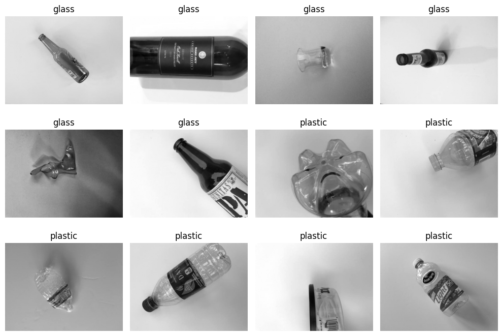
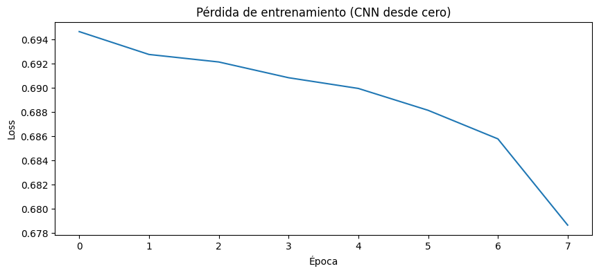
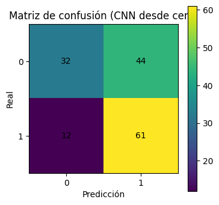
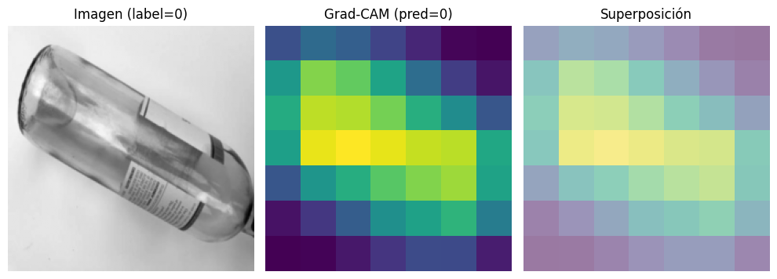
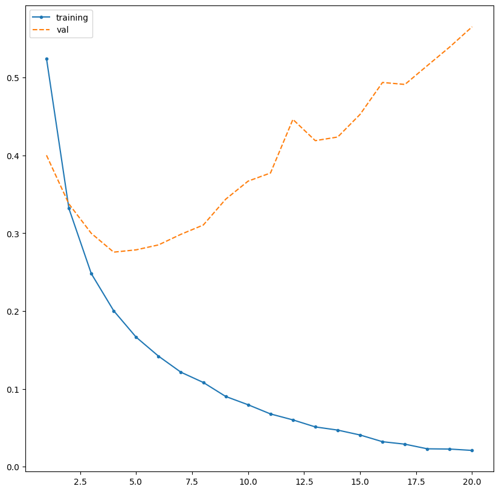
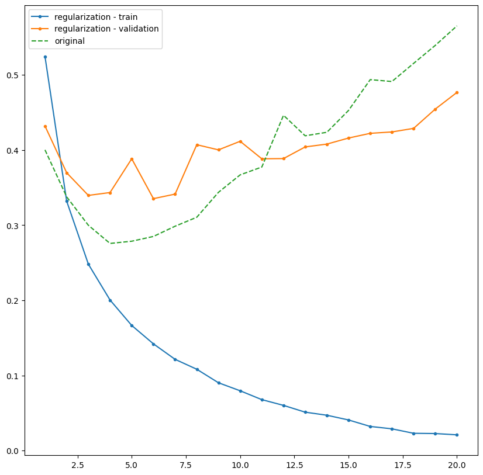
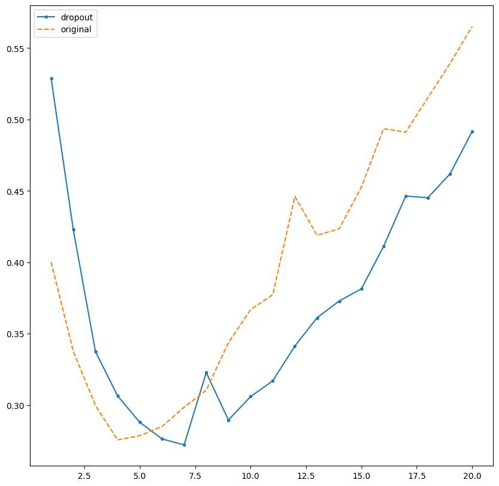
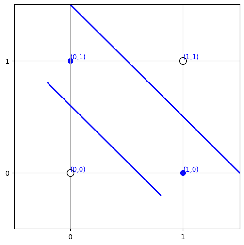

# Taller de Redes Neuronales
## CNN, Keras y Perceptrón

En este taller trabajamos con **redes neuronales** desde diferentes enfoques. Primero utilizamos una **Red Neuronal Convolucional (CNN)** para clasificar imágenes de residuos entre vidrio y plástico. Luego trabajamos con **Keras** para construir redes neuronales y analizar problemas como el sobreajuste. Finalmente, estudiamos el funcionamiento de un **perceptrón** mediante ejemplos sencillos como AND, OR y XOR.

El objetivo principal fue comprender no solo cómo entrenar estos modelos, sino también **cómo interpretar sus resultados, reconocer sus limitaciones y decidir qué tipo de red puede ser más adecuada según el problema**.

---

## 1. Redes Neuronales Convolucionales (CNN)

Una **CNN (Convolutional Neural Network)** es un tipo de red neuronal especialmente útil para trabajar con imágenes.

A diferencia de un modelo tradicional, una CNN puede aprender automáticamente características visuales como bordes, formas, texturas y patrones.

Entre sus componentes principales se encuentran:

- **Conv2D:** aplica filtros sobre la imagen para extraer características.
- **ReLU:** introduce no linealidad y permite aprender relaciones más complejas.
- **MaxPool:** reduce el tamaño de la información conservando las características más importantes.
- **Capas densas:** utilizan las características extraídas para realizar la clasificación final.

En el taller se trabajó con dos clases:

- **0 = glass**
- **1 = plastic**

<p align="center">
  
</p>

Las imágenes muestran ejemplos de los datos utilizados para entrenar la CNN. Se puede observar que los objetos presentan diferentes formas, posiciones y tamaños, por lo que el modelo debe aprender características que permitan distinguir vidrio de plástico.

---

## 2. Entrenamiento de la CNN

La CNN fue construida utilizando varias capas convolucionales junto con funciones de activación y capas de reducción.

Un fragmento importante de la arquitectura es:

```python
class SimpleCNN(nn.Module):
    def __init__(self, num_classes):
        super().__init__()

        self.features = nn.Sequential(
            nn.Conv2d(1, 16, kernel_size=3, padding=1),
            nn.ReLU(),
            nn.MaxPool2d(2),

            nn.Conv2d(16, 32, kernel_size=3, padding=1),
            nn.ReLU(),
            nn.MaxPool2d(2),

            nn.Conv2d(32, 64, kernel_size=3, padding=1),
            nn.ReLU(),
            nn.AdaptiveAvgPool2d((1, 1))
        )
```

También se utilizaron funciones importantes como:

```python
nn.CrossEntropyLoss()
```

para medir el error del modelo, y:

```python
torch.optim.Adam()
```

para actualizar los pesos durante el entrenamiento.

<p align="center">
  
</p>

La pérdida disminuye progresivamente durante las épocas. Esto indica que la CNN va reduciendo sus errores y aprendiendo patrones presentes en las imágenes de entrenamiento.

---

## 3. Matriz de confusión

Para analizar mejor los resultados utilizamos una **matriz de confusión**.

<p align="center">
  
</p>


Esto permite observar que el modelo no se comporta igual para ambas clases.

Por ejemplo, consiguió reconocer correctamente **61 imágenes de la clase 1**, pero también confundió varias imágenes reales de la clase 0.

Esta gráfica fue importante porque permitió entender que **el accuracy no siempre es suficiente para evaluar un modelo**. También es necesario revisar en qué casos se está equivocando.

---

## 4. Interpretación con Grad-CAM

Una de las partes más interesantes del taller fue el uso de **Grad-CAM**.

Grad-CAM genera un mapa de calor que permite observar qué regiones de una imagen tuvieron mayor influencia en la decisión de la CNN.

<p align="center">
  
</p>

En la visualización aparecen:

- la imagen original;
- el mapa generado por Grad-CAM;
- la superposición del mapa sobre la imagen.

Las zonas más claras representan regiones que tuvieron mayor influencia en la predicción.

Esto permite analizar si el modelo realmente se está concentrando en el objeto o si está utilizando información del fondo para tomar una decisión.

Grad-CAM fue importante porque mostró que **no basta con saber si el modelo acertó; también es útil intentar comprender por qué tomó esa decisión**.

---

## 5. Data Augmentation y Transfer Learning

También trabajamos con **Data Augmentation**, una técnica que genera pequeñas variaciones de las imágenes de entrenamiento.

Por ejemplo:

```python
transform_aug = T.Compose([
    T.RandomRotation(degrees=10),
    T.RandomAffine(
        degrees=0,
        translate=(0.05, 0.05)
    ),
    T.ToTensor()
])
```

Estas transformaciones permiten que el modelo observe diferentes versiones de una misma imagen y ayudan a evitar que memorice únicamente los ejemplos originales.

También se utilizó **Transfer Learning** con una red previamente entrenada:

```python
resnet = models.resnet18(
    weights=models.ResNet18_Weights.DEFAULT
)
```

Los resultados obtenidos fueron:

| Modelo | Accuracy | ROC-AUC |
|---|---:|---:|
| CNN desde cero | 0.6242 | 0.6496 |
| CNN con Data Augmentation | 0.5101 | 0.6404 |
| ResNet18 con Transfer Learning | **0.8859** | **0.9598** |

El modelo que más destacó fue **ResNet18 con Transfer Learning**.

Esto mostró que aprovechar conocimiento previamente aprendido puede mejorar considerablemente el rendimiento, especialmente cuando no se dispone de una gran cantidad de datos.

---

## 6. Keras

Después trabajamos con **Keras**, una librería que facilita la construcción, entrenamiento y evaluación de redes neuronales.

A diferencia de una CNN, que corresponde a un tipo de arquitectura de red neuronal, **Keras es una herramienta que permite implementar modelos de redes neuronales de una manera más sencilla**.

En esta parte del taller se utilizó una red neuronal para realizar una **clasificación binaria**.

Un ejemplo de la estructura utilizada fue:

```python
model = models.Sequential()

model.add(
    layers.Dense(
        16,
        activation='relu',
        input_shape=(10000,)
    )
)

model.add(
    layers.Dense(
        16,
        activation='relu'
    )
)

model.add(
    layers.Dense(
        1,
        activation='sigmoid'
    )
)
```

La red está formada por dos capas ocultas de 16 neuronas con función de activación `ReLU` y una capa de salida con función `sigmoid`, utilizada para obtener una salida entre 0 y 1.

### Funciones principales

#### `model.compile()`

```python
model.compile(
    optimizer='rmsprop',
    loss='binary_crossentropy',
    metrics=['accuracy']
)
```

Permite configurar el modelo antes del entrenamiento, definiendo el optimizador, la función de pérdida y la métrica utilizada para evaluar su desempeño.

#### `model.fit()`

```python
model.fit(
    x_train,
    y_train,
    epochs=20,
    batch_size=512
)
```

Se utiliza para entrenar la red neuronal con los datos de entrenamiento.

#### `model.evaluate()`

```python
model.evaluate(
    x_test,
    y_test
)
```

Permite evaluar el rendimiento del modelo utilizando datos de prueba.

#### `model.predict()`

```python
model.predict(x_test)
```

Permite obtener las predicciones realizadas por el modelo sobre nuevos datos.

---

## 7. Sobreajuste

Uno de los conceptos más importantes observados fue el **sobreajuste u overfitting**.

<p align="center">
  
</p>

La pérdida de entrenamiento continúa disminuyendo durante las épocas, mientras que la pérdida de validación disminuye al inicio y posteriormente comienza a aumentar.

Esto indica que el modelo empieza a aprender demasiado bien los datos de entrenamiento y pierde capacidad para generalizar a datos nuevos.

Una forma sencilla de entenderlo es pensar en un estudiante que memoriza las respuestas de una práctica, pero tiene dificultades cuando las preguntas cambian.

---

## 8. Regularización

Una técnica utilizada para reducir el sobreajuste fue la **regularización L2**.

```python
from keras import regularizers

layers.Dense(
    16,
    activation='relu',
    kernel_regularizer=regularizers.l2(0.001)
)
```

<p align="center">
  
</p>

La regularización penaliza pesos demasiado grandes y busca que el modelo encuentre una solución más general.

Al comparar el comportamiento con el modelo original, se puede observar que la regularización modifica la evolución de la pérdida e intenta reducir el sobreajuste.

---

## 9. Dropout

Otra técnica utilizada fue **Dropout**.

```python
layers.Dropout(0.5)
```

Durante el entrenamiento, Dropout desactiva temporalmente algunas neuronas de forma aleatoria.

Esto obliga a la red a no depender siempre de las mismas conexiones.

<p align="center">
  
</p>

La comparación entre el modelo original y el modelo con Dropout muestra cómo esta técnica puede ayudar a controlar el sobreajuste.

Esto también permitió entender que **un modelo más complejo no siempre significa un modelo mejor**.

---

## 10. Perceptrón

Finalmente trabajamos con el **perceptrón**, uno de los modelos más sencillos dentro de las redes neuronales.

El perceptrón recibe una o varias entradas, asigna un peso a cada una y calcula una suma ponderada. A este resultado se le añade un `bias` y finalmente se aplica una función de activación para obtener la salida.

Un ejemplo utilizado fue:

```python
temperatura = 100
vibracion = 50

weights = np.array([0.5, -0.5])
bias = -30
```

También se utilizaron funciones de activación como:

```python
def step_function(x):
    return 1 if x >= 0 else 0
```

y:

```python
def tanh_activation(x):
    return np.tanh(x)
```

La función de activación transforma la suma ponderada en una salida que puede utilizarse para tomar una decisión.

---

## 11. AND y OR

El perceptrón también se utilizó para comprender problemas linealmente separables.

<p align="center">
  
</p>

Las compuertas AND y OR pueden separarse utilizando una frontera lineal.

Por ejemplo:

| Entrada A | Entrada B | Salida AND |
|---:|---:|---:|
| 0 | 0 | 0 |
| 0 | 1 | 0 |
| 1 | 0 | 0 |
| 1 | 1 | 1 |

y:

| Entrada A | Entrada B | Salida OR |
|---:|---:|---:|
| 0 | 0 | 0 |
| 0 | 1 | 1 |
| 1 | 0 | 1 |
| 1 | 1 | 1 |

Esto muestra que un perceptrón simple puede resolver este tipo de problemas.

---

## 12. XOR

El problema cambia cuando trabajamos con **XOR**.

<p align="center">
  
</p>

XOR se comporta de la siguiente forma:

| Entrada A | Entrada B | Salida XOR |
|---:|---:|---:|
| 0 | 0 | 0 |
| 0 | 1 | 1 |
| 1 | 0 | 1 |
| 1 | 1 | 0 |

En este caso no existe una sola frontera lineal capaz de separar correctamente las clases.

Por ello:

Un solo perceptrón no puede resolver correctamente el problema XOR porque las clases no pueden separarse con una única frontera lineal.

mientras que una estructura con más neuronas y capas puede representar relaciones más complejas.

Esta parte permitió comprender de manera visual **por qué las redes neuronales necesitan varias neuronas y capas para resolver problemas más difíciles**.

---

# Lo que más resaltó del taller

Lo que más me llamó la atención fue la diferencia entre entrenar una CNN desde cero y utilizar **Transfer Learning**.

La CNN inicial obtuvo una exactitud aproximada de **62.4 %**, mientras que ResNet18 alcanzó aproximadamente **88.6 %**.

Esto permitió comprobar de manera práctica que aprovechar conocimiento previamente aprendido puede mejorar bastante el rendimiento del modelo.

También me pareció interesante utilizar **Grad-CAM**, porque permitió observar qué regiones de una imagen influyeron en la decisión de la red. Esto ayuda a no quedarnos únicamente con una métrica de accuracy, sino también a intentar comprender qué información está utilizando el modelo.

---

# ¿Qué aprendí?

Durante este taller aprendí que entrenar una red neuronal no consiste solamente en obtener una predicción.

Con el **perceptrón** entendí la idea básica de una neurona artificial: entradas, pesos, bias y función de activación.

Con las **CNN** aprendí cómo una red puede extraer automáticamente características de una imagen y utilizarlas para realizar una clasificación.

Con **Keras** vimos que es posible construir redes neuronales de una manera más sencilla y también aprendimos a detectar problemas como el sobreajuste.

Además, comprendí la importancia de técnicas como:

- Data Augmentation;
- Transfer Learning;
- Regularización;
- Dropout;
- Grad-CAM.

En general, el taller permitió entender que también debemos analizar **cómo aprende el modelo, dónde se equivoca, si generaliza y qué información utiliza para tomar una decisión**.


---

# ¿Cuál utilizaríamos en nuestro proyecto?

Si en nuestro Proyecto Integrador incorporáramos una red neuronal, utilizaríamos una **CNN**.

Nuestro proyecto busca evaluar de manera no destructiva la condición interna de una granadilla mediante una **excitación vibroacústica controlada** y el análisis de la respuesta generada por el fruto.

Una posible forma de aplicar una CNN sería transformar las señales obtenidas por los sensores en **espectrogramas**, que representan visualmente cómo se distribuyen las frecuencias de una señal. La CNN podría aprender patrones presentes en estos espectrogramas y utilizarlos para diferenciar distintas condiciones de la granadilla.

Elegiríamos una CNN porque puede identificar automáticamente patrones complejos en este tipo de representaciones, mientras que un perceptrón simple sería demasiado limitado para analizar relaciones de mayor complejidad.

Para implementar y entrenar esta CNN podríamos utilizar **Keras**, ya que facilita la construcción y evaluación de redes neuronales.

Por lo tanto, suponiendo que incorporáramos redes neuronales al proyecto, utilizaríamos una **CNN aplicada a espectrogramas de las señales vibroacústicas**, implementada mediante Keras.
