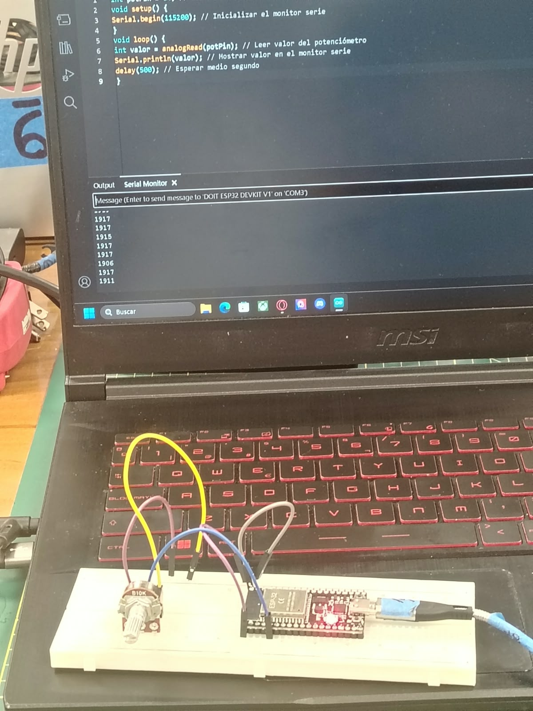
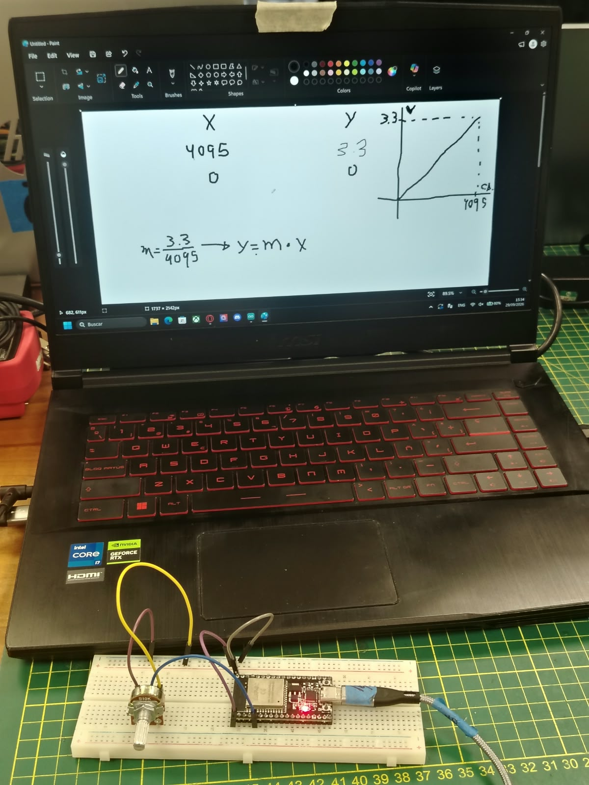
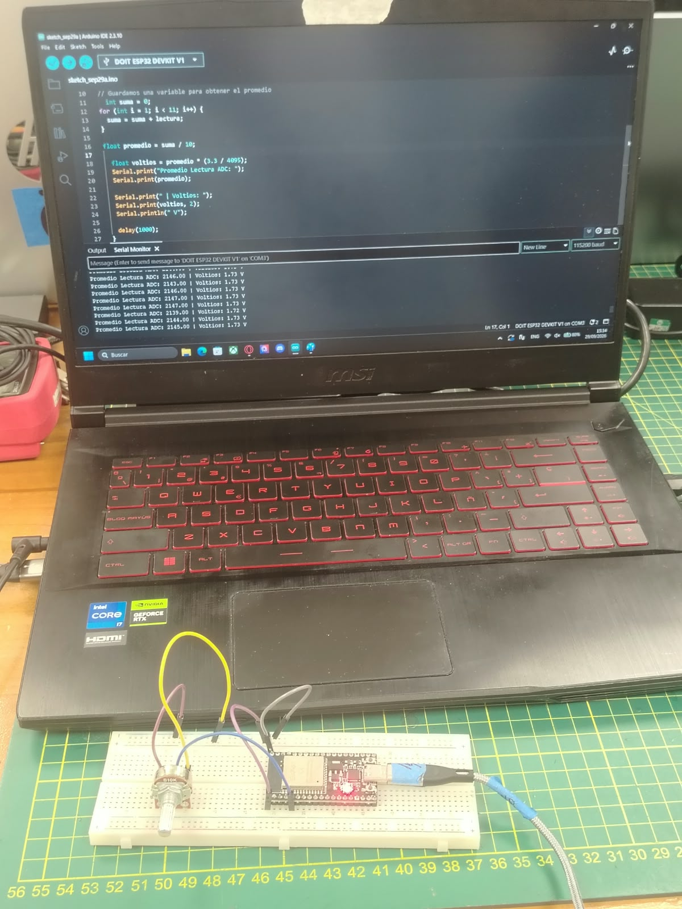
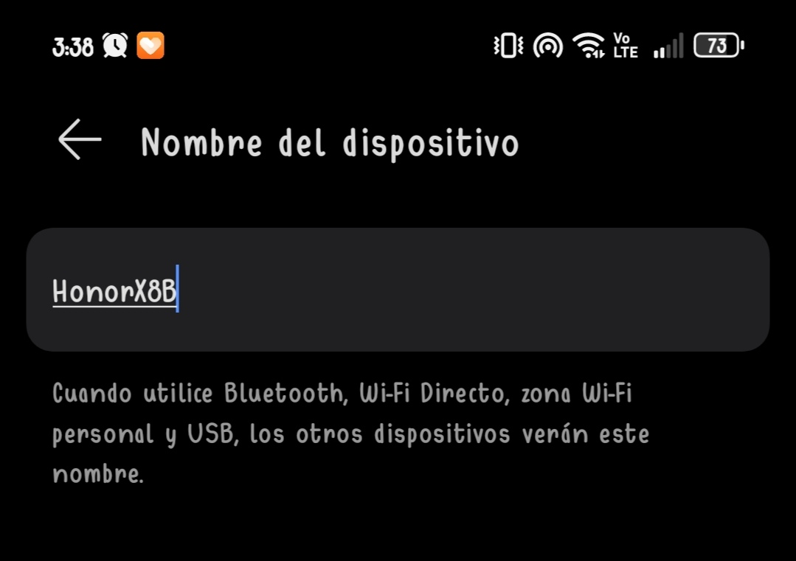
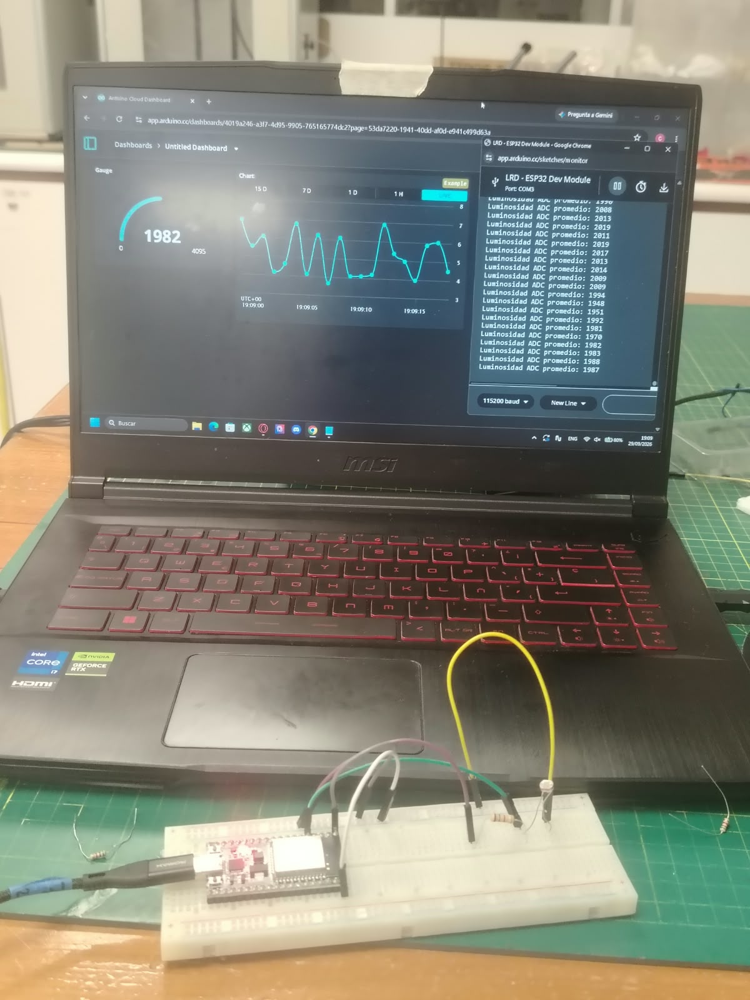
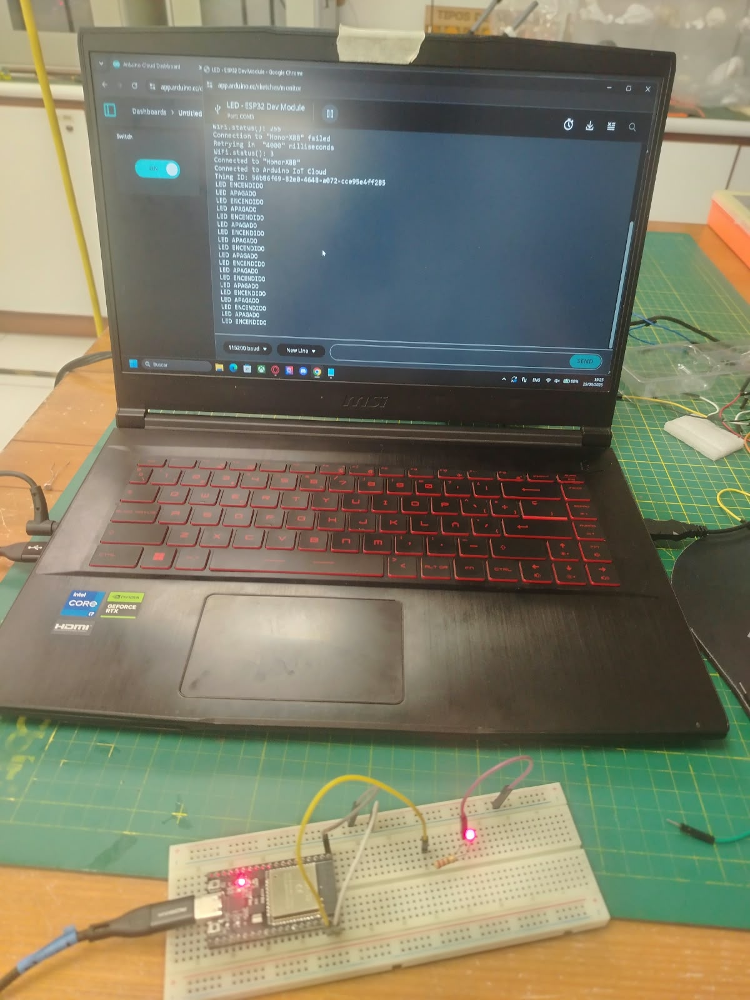
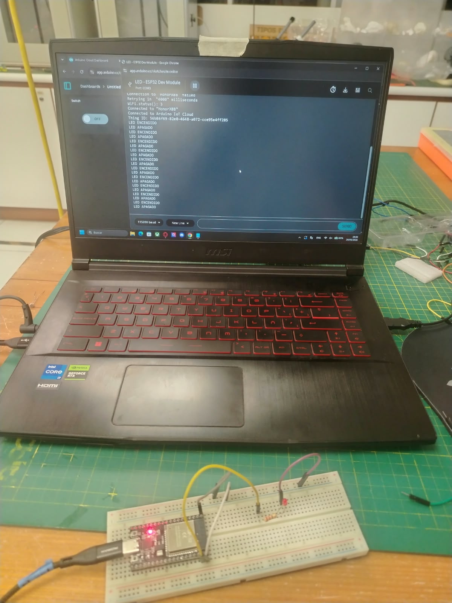

# Taller de IoT con ESP32

## Introducción

En este taller se trabajó con el **ESP32** para comprender el funcionamiento de entradas analógicas, sensores y actuadores, además de su integración con plataformas de **Internet de las Cosas (IoT)**.

Durante las actividades se utilizaron un **potenciómetro**, un **sensor LDR** y un **LED**, realizando lecturas analógicas, conversiones a voltaje y comunicación mediante WiFi. Finalmente, se utilizó **Arduino Cloud** para visualizar datos y controlar dispositivos de manera remota mediante un dashboard.

---

## 1. Lectura analógica con potenciómetro

En la primera actividad se trabajó con un **potenciómetro conectado al ESP32**.

Esta parte no presentó mayores complicaciones, ya que el cableado fue sencillo y se contó con el código base necesario para realizar las lecturas analógicas.

El objetivo principal fue observar cómo variaba el valor leído por el ESP32 al modificar manualmente la posición del potenciómetro.

### Evidencia

---

## 2. Conversión de la lectura analógica a voltaje

En la segunda parte se realizó un cálculo matemático para determinar la **ecuación de conversión** que permite relacionar el valor obtenido por el ADC del ESP32 con su voltaje correspondiente.

De esta manera, las lecturas analógicas pudieron expresarse como valores de voltaje, facilitando su interpretación.

Además, se calcularon las **primeras diez mediciones** obtenidas y posteriormente se halló su promedio. Esto permitió obtener un valor más representativo de las lecturas realizadas y reducir el efecto de pequeñas variaciones entre mediciones.

---

## 2.1. Conectividad WiFi del ESP32

Antes de comenzar con la integración IoT, se comprobó una de las principales características del **ESP32: su conectividad WiFi integrada**.

Mediante un escaneo de redes se pudo verificar que el dispositivo era capaz de detectar diferentes redes WiFi disponibles en el entorno.

Entre las redes detectadas se encontró la red compartida desde mi celular **HonorX8B**, además de la red de la universidad **UPCH_CENTRAL**.

Esta prueba permitió comprobar que el ESP32 podía reconocer redes inalámbricas cercanas y que estaba preparado para conectarse a Internet y posteriormente comunicarse con una plataforma IoT.

---

## 3. Integración con una plataforma IoT

La tercera parte fue la más compleja del taller, debido a que fue necesario comprender el funcionamiento de una plataforma IoT y realizar correctamente su configuración.

Inicialmente se intentó trabajar con **Ubidots**. Sin embargo, su configuración y uso resultaron más complejos de lo esperado durante el desarrollo de la actividad.

Por esta razón, se decidió utilizar **Arduino Cloud**, plataforma con la cual se logró completar satisfactoriamente la integración del ESP32 con Internet.

Esta etapa fue importante porque permitió comprender cómo los datos obtenidos por un dispositivo físico pueden ser enviados a una plataforma digital para posteriormente ser **visualizados y controlados de manera remota**.

---

## 4. Monitoreo de luminosidad mediante un LDR

Una vez configurada la comunicación con Arduino Cloud, se utilizó un **LDR (Light Dependent Resistor)** para medir cambios en la intensidad de la luz.

El ESP32 realizaba la lectura del sensor y enviaba los datos hacia Arduino Cloud, donde podían visualizarse prácticamente en tiempo real mediante un **dashboard**.

Para comprobar el funcionamiento del sistema, se acercó una linterna al LDR. Al aumentar la cantidad de luz recibida por el sensor, se pudo observar cómo los valores mostrados en el dashboard cambiaban de acuerdo con la luminosidad detectada.

Esta actividad permitió comprobar de manera práctica el proceso:

**Sensor LDR → ESP32 → WiFi → Arduino Cloud → Dashboard**

---

## 5. Control remoto de un LED

En la última actividad se utilizó un **LED conectado al ESP32**, acompañado de una resistencia de **220 Ω** para limitar la corriente que circulaba por el componente.

Posteriormente, el LED fue vinculado con un **switch ubicado en el dashboard de Arduino Cloud**, permitiendo encenderlo y apagarlo de manera remota.

### LED encendido

### LED apagado

Con esta actividad se comprobó que una plataforma IoT no solo permite **recibir y visualizar información de sensores**, sino también **enviar órdenes desde Internet hacia dispositivos físicos**.

---

# Conclusión

En general, el taller estuvo orientado a comprender la integración entre el **ESP32, sensores, actuadores, conectividad WiFi y plataformas IoT**.

Las primeras actividades permitieron comprender la lectura de señales analógicas y su conversión a valores útiles, como el voltaje. Posteriormente, mediante el LDR, se observó cómo las mediciones obtenidas por un sensor pueden enviarse a una plataforma digital y visualizarse mediante un dashboard.

Finalmente, el control del LED permitió realizar el proceso inverso: enviar una instrucción desde Arduino Cloud hacia el ESP32 para controlar físicamente un componente.

El taller también permitió conocer distintas plataformas orientadas al Internet de las Cosas, como **Arduino Cloud, Ubidots y ThingSpeak**, y comprender que estas herramientas permiten conectar dispositivos físicos con servicios digitales para **monitorear información y controlar dispositivos de manera inalámbrica**.
