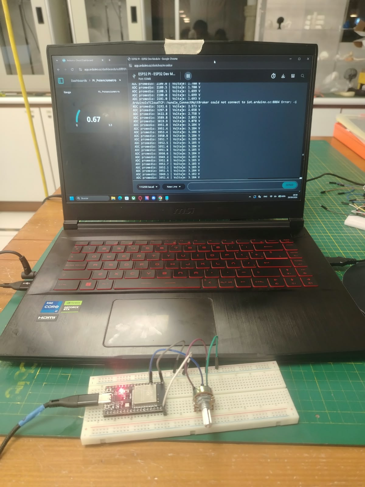

# Taller de IoT con ESP32

## Introducción

En este taller se trabajó con el **ESP32** utilizando un potenciómetro, un sensor LDR y un LED. También se realizaron pruebas de conexión WiFi y se utilizó **Arduino Cloud** para visualizar datos y controlar componentes desde un dashboard.

---

## 1. Lectura del potenciómetro

En la primera parte se trabajó con un **potenciómetro conectado al ESP32**. No hubo mucha complicación, ya que el cableado fue sencillo y el código necesario para realizar las lecturas ya estaba dado.

Se comprobó cómo los valores cambiaban al girar el potenciómetro.

---

## 2. Conversión a voltaje y promedio

En la segunda parte se realizó un cálculo matemático sencillo para obtener la ecuación que permitía convertir la lectura analógica del ESP32 a un valor de voltaje.

También se tomaron las primeras diez mediciones del potenciómetro y se calculó su promedio.

---

## 2.1. Conectividad WiFi del ESP32

Antes de comenzar con IoT, se comprobó que el **ESP32 tiene WiFi incorporado**. Para esto se realizó un escaneo de las redes disponibles.

El ESP32 pudo reconocer varias redes cercanas, entre ellas la red compartida desde mi celular **HonorX8B** y la red de la universidad **UPCH_CENTRAL**.

---

## 3. Integración con una plataforma IoT

Esta fue la parte más complicada del taller, ya que primero fue necesario entender cómo funciona una plataforma IoT y cómo conectarla con el ESP32.

En un inicio se intentó trabajar con **Ubidots**, pero su configuración resultó complicada. Por esta razón, se decidió cambiar a **Arduino Cloud**, donde finalmente se pudo completar la actividad.

Una vez realizada la conexión, se volvió a trabajar con el **potenciómetro**. Esta vez sus valores se enviaron a Arduino Cloud y se mostraron en un **dashboard**.

Al girar el potenciómetro se podía observar cómo cambiaba el valor mostrado en el dashboard.

De esta manera se pudo comprobar la comunicación entre el ESP32 y Arduino Cloud mediante WiFi.

---

## 4. Monitoreo de luminosidad con LDR

En la siguiente parte se utilizó un **LDR** para medir los cambios de luminosidad.

Los valores obtenidos por el ESP32 se enviaron a **Arduino Cloud** y se mostraron en tiempo real mediante un dashboard.

Para probarlo, se acercó una linterna al LDR y se observó cómo cambiaban los valores de luminosidad mostrados en el dashboard.

---

## 5. Control de un LED desde Arduino Cloud

En la última parte se utilizó un **LED con una resistencia de 220 Ω** conectado al ESP32.

Se creó un switch en el dashboard de **Arduino Cloud** para encender y apagar el LED de manera remota.

### LED encendido

### LED apagado

Con esta prueba se comprobó que Arduino Cloud no solo permite visualizar los datos de los sensores, sino también controlar componentes conectados al ESP32.

---

# Conclusión

En general, el taller estuvo orientado a comprender cómo utilizar tecnologías y plataformas de **IoT**, como Arduino Cloud, Ubidots y ThingSpeak.

Primero se trabajó con las lecturas del potenciómetro y su conversión a voltaje. Luego se comprobó la conexión WiFi del ESP32 y se utilizó Arduino Cloud para mostrar los valores del potenciómetro en un dashboard.

Después se utilizó un LDR para visualizar los cambios de luminosidad en tiempo real y, finalmente, se controló un LED mediante un switch desde el dashboard.

Con estas actividades se pudo comprender de manera práctica cómo enviar las mediciones de los sensores a una plataforma digital y cómo controlar componentes de manera inalámbrica utilizando el ESP32.
