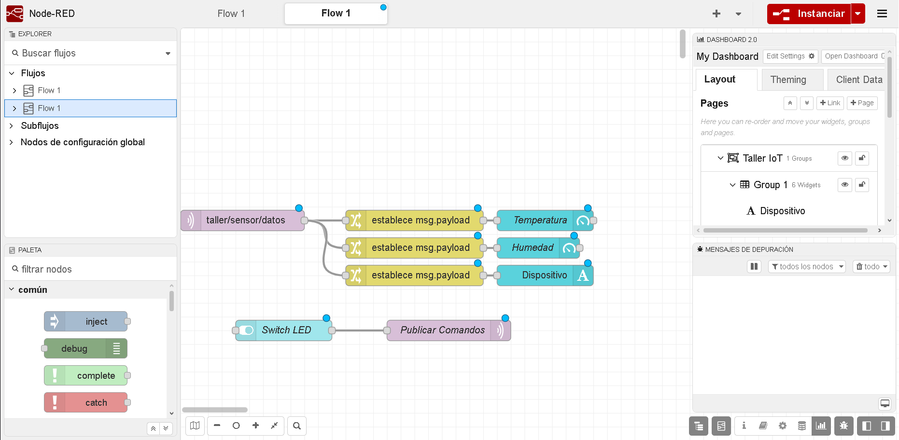
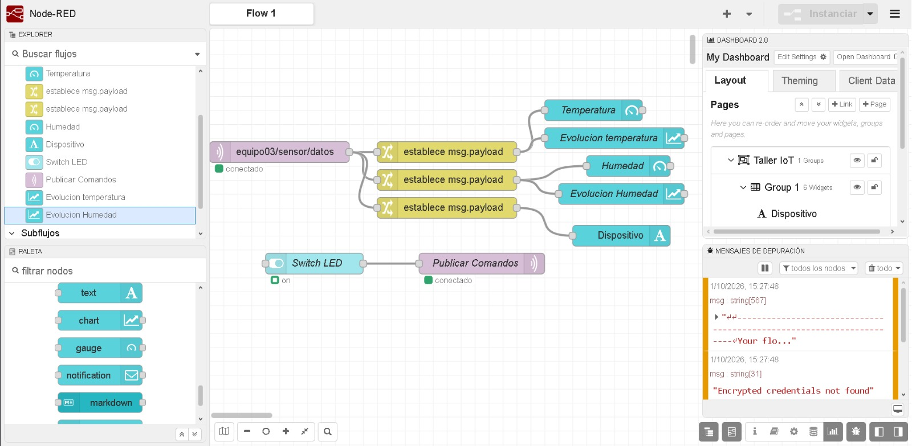
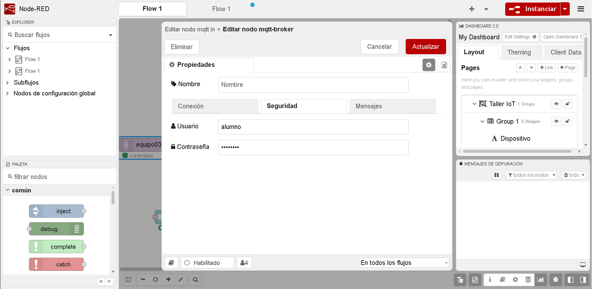
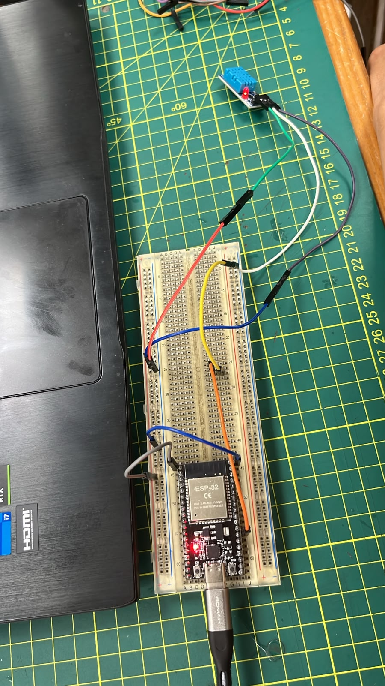
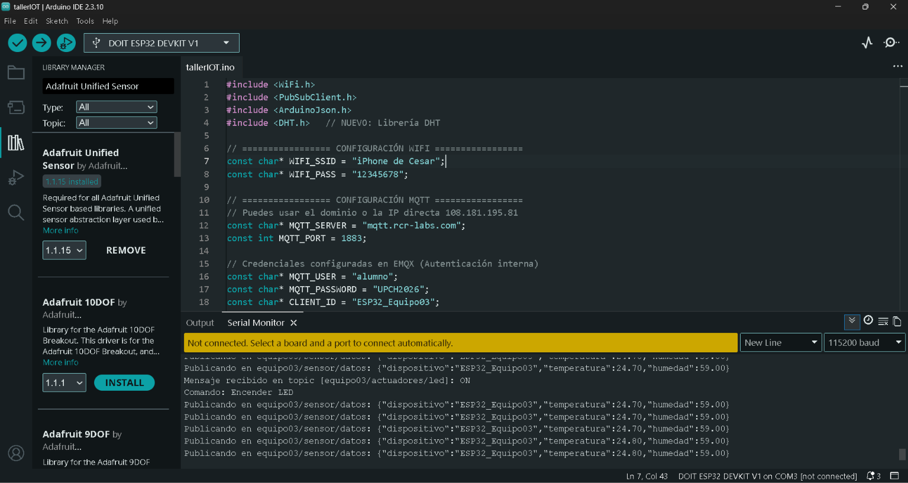
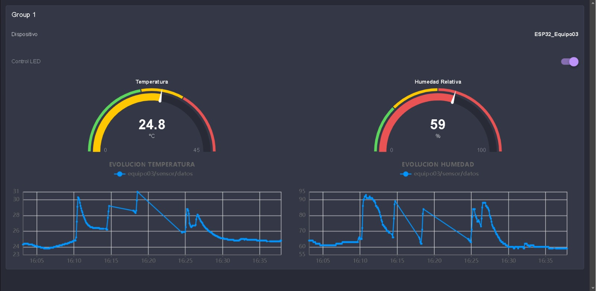
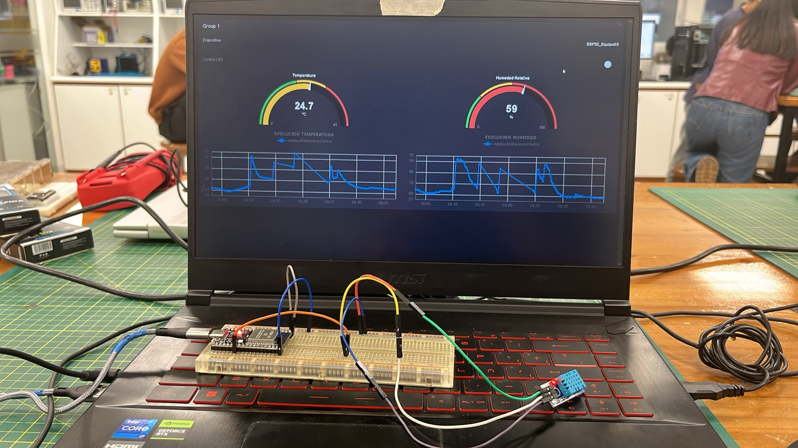
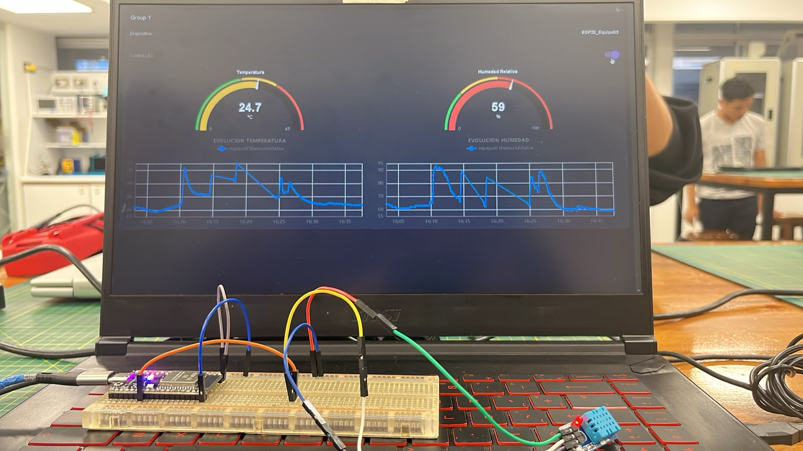

# Taller de Node-RED y MQTT

## Introducción

En este taller exploramos el uso de **Node-RED** como herramienta para
desarrollar una aplicación de **Internet de las Cosas (IoT)**. Para
ello, utilizamos un **ESP32** conectado a un sensor **DHT11**, con el
cual obtuvimos datos de temperatura y humedad. Estos datos fueron
enviados mediante el protocolo **MQTT** hacia Node-RED, donde los
visualizamos en un dashboard. Además, implementamos el control remoto
del LED integrado del ESP32.

El objetivo principal fue comprender de forma práctica cómo un
dispositivo físico puede enviar información a través de la red y, al
mismo tiempo, recibir comandos desde una interfaz remota.

------------------------------------------------------------------------

## 1. Preparación de Node-RED

Primero ingresamos al servidor de Node-RED proporcionado para el taller:

`https://equipo3.rcr-labs.com/`

Al iniciar encontramos un flujo vacío, por lo que importamos el archivo
**`tallerIOT.json`**, ubicado en la raíz del proyecto. Este archivo
contenía la plantilla inicial que utilizamos para trabajar con los nodos
MQTT y los elementos del dashboard.



Después de importar el flujo, modificamos los tópicos MQTT para que
correspondieran a nuestro equipo. Los tópicos utilizados fueron:

-   **Publicación de datos del sensor:** `equipo03/sensor/datos`
-   **Control del LED:** `equipo03/actuadores/led`

De esta manera, los datos enviados por nuestro ESP32 podían ser
identificados correctamente y Node-RED podía enviar comandos al
dispositivo.



Durante la configuración tuvimos un problema de conectividad con el
broker MQTT. Para solucionarlo, ingresamos a la configuración del broker
y, en el apartado **Seguridad**, colocamos el usuario `alumno` y la
contraseña correspondiente proporcionada para el taller. Después de
realizar esta configuración, los nodos MQTT pudieron conectarse
correctamente.



Una vez terminada la configuración inicial de Node-RED, procedimos a
realizar las conexiones electrónicas.

------------------------------------------------------------------------

## 2. Conexiones electrónicas

Para obtener datos del entorno utilizamos un **ESP32** y un sensor
**DHT11**, encargado de medir la temperatura y la humedad relativa.

Según el código utilizado en el taller, la señal de datos del DHT11 se
conectó al **GPIO 4** del ESP32. Además, alimentamos el módulo mediante
**3.3 V** y conectamos su tierra al **GND** del ESP32.

Las conexiones realizadas fueron las siguientes:

| Pin del DHT11 | Pin del ESP32 | Función |
|:---:|:---:|---|
| **VCC** | **3.3 V** | Alimentación del sensor |
| **DATA** | **GPIO 4** | Lectura de temperatura y humedad |
| **GND** | **GND** | Tierra común |

> **Nota:** El LED utilizado en el taller es el LED integrado del ESP32, controlado mediante el **GPIO 2**, por lo que no fue necesario realizar una conexión externa para este componente.

A continuación se muestra el montaje físico realizado durante el taller:



------------------------------------------------------------------------

## 3. Código del ESP32

Una vez realizadas las conexiones, programamos el ESP32 desde **Arduino
IDE**. El código permite realizar cuatro tareas principales:

1.  Conectarse a una red Wi-Fi.
2.  Leer la temperatura y humedad mediante el DHT11.
3.  Publicar las mediciones mediante MQTT en `equipo03/sensor/datos`.
4.  Suscribirse a `equipo03/actuadores/led` para encender o apagar
    remotamente el LED integrado del ESP32.

El archivo completo utilizado en el proyecto se encuentra en
[`tallerIOT.ino`](./tallerIOT.ino).


``` cpp
#include <WiFi.h>
#include <PubSubClient.h>
#include <ArduinoJson.h>
#include <DHT.h>   // NUEVO: Librería DHT

// ================= CONFIGURACIÓN WIFI =================
const char* WIFI_SSID = "TU_RED_WIFI";
const char* WIFI_PASS = "TU_CONTRASENA_WIFI"; // Puede variar segun la red que se use en el momento

// ================= CONFIGURACIÓN MQTT =================
// Puedes usar el dominio o la IP directa 108.181.195.81
const char* MQTT_SERVER = "mqtt.rcr-labs.com";
const int MQTT_PORT = 1883;

// Credenciales configuradas en EMQX (Autenticación interna)
const char* MQTT_USER = "alumno";
const char* MQTT_PASSWORD = "UPCH2026";
const char* CLIENT_ID = "ESP32_Equipo03";

// Topics MQTT
const char* TOPIC_PUB = "equipo03/sensor/datos";
const char* TOPIC_SUB = "equipo03/actuadores/led";

// ================= CONFIGURACIÓN DHT11 =================
// NUEVO
#define DHTPIN 4
#define DHTTYPE DHT11

DHT dht(DHTPIN, DHTTYPE);

// ================= OBJETOS Y VARIABLES ===============
WiFiClient espClient;
PubSubClient client(espClient);

unsigned long ultimoEnvio = 0;
const long intervaloEnvio = 5000;  // Envío cada 5 segundos (no bloqueante)

// Conexión a la red Wi-Fi
void setupWiFi() {
  delay(10);
  Serial.println();
  Serial.print("Conectando a Wi-Fi: ");
  Serial.println(WIFI_SSID);

  WiFi.mode(WIFI_STA);
  WiFi.begin(WIFI_SSID, WIFI_PASS);

  while (WiFi.status() != WL_CONNECTED) {
    delay(500);
    Serial.print(".");
  }

  Serial.println("\nWiFi conectado con éxito");
  Serial.print("Dirección IP local: ");
  Serial.println(WiFi.localIP());
}

// Recepción de mensajes suscritos
void callback(char* topic, byte* payload, unsigned int length) {
  Serial.print("Mensaje recibido en topic [");
  Serial.print(topic);
  Serial.print("]: ");

  String mensaje = "";
  for (unsigned int i = 0; i < length; i++) {
    mensaje += (char)payload[i];
  }
  Serial.println(mensaje);

  // Ejemplo: procesar comando
  if (String(topic) == TOPIC_SUB) {
    if (mensaje == "ON") {
      digitalWrite(2, HIGH);
      Serial.println("Comando: Encender LED");
    } else if (mensaje == "OFF") {
      digitalWrite(2, LOW);
      Serial.println("Comando: Apagar LED");
    }
  }
}

// Reconexión automática al broker EMQX
void reconnect() {
  while (!client.connected()) {
    Serial.print("Intentando conectar con broker MQTT...");

    // Autenticación con credenciales en EMQX
    if (client.connect(CLIENT_ID, MQTT_USER, MQTT_PASSWORD)) {
      Serial.println(" ¡Conectado!");

      // Suscribirse a tópicos de control si es necesario
      client.subscribe(TOPIC_SUB);
      Serial.print("Suscrito a: ");
      Serial.println(TOPIC_SUB);
    } else {
      Serial.print(" Falló. Código de error rc=");
      Serial.print(client.state());
      Serial.println(" Reintentando en 5 segundos...");
      delay(5000);
    }
  }
}

void setup() {
  Serial.begin(115200);

  dht.begin();   // NUEVO: iniciar DHT11

  setupWiFi();

  client.setServer(MQTT_SERVER, MQTT_PORT);
  client.setCallback(callback);
  pinMode(2, OUTPUT);
}

void loop() {
  // Asegurar persistencia de la sesión MQTT
  if (!client.connected()) {
    reconnect();
  }
  client.loop();

  // Envío periódico sin usar delay()
  unsigned long ahora = millis();
  if (ahora - ultimoEnvio >= intervaloEnvio) {
    ultimoEnvio = ahora;

    // ==================================================
    // LECTURA REAL DEL DHT11
    // Antes aquí estaban los valores random
    // ==================================================
    float tempSimulada = dht.readTemperature();
    float humSimulada = dht.readHumidity();

    // Comprobar que el DHT11 respondió correctamente
    if (isnan(tempSimulada) || isnan(humSimulada)) {
      Serial.println("Error al leer el DHT11");
      return;
    }

    // Creación del documento JSON
    StaticJsonDocument<200> doc;
    doc["dispositivo"] = CLIENT_ID;
    doc["temperatura"] = serialized(String(tempSimulada, 2));
    doc["humedad"] = serialized(String(humSimulada, 2));

    char jsonBuffer[256];
    serializeJson(doc, jsonBuffer);

    // Publicación hacia EMQX
    Serial.print("Publicando en ");
    Serial.print(TOPIC_PUB);
    Serial.print(": ");
    Serial.println(jsonBuffer);

    client.publish(TOPIC_PUB, jsonBuffer);
  }
}
```

Durante las pruebas utilizamos el monitor serial de Arduino IDE para
comprobar la conexión Wi-Fi, la conexión con el broker MQTT, la
publicación de los datos y la recepción de los comandos `ON` y `OFF`.



------------------------------------------------------------------------

## 4. Instanciación de objetos en Node-RED

Con el programa del ESP32 funcionando correctamente, continuamos
configurando los objetos necesarios en Node-RED para visualizar la
información recibida.

El nodo MQTT de entrada recibe el mensaje publicado en:

`equipo03/sensor/datos`

El ESP32 envía un objeto JSON con una estructura similar a la siguiente:

``` json
{
  "dispositivo": "ESP32_Equipo03",
  "temperatura": 24.80,
  "humedad": 59.00
}
```

A partir de este mensaje utilizamos nodos de cambio para separar los
valores de **temperatura**, **humedad** y **dispositivo**. Luego
conectamos cada valor con los elementos correspondientes del dashboard.

Además de los indicadores tipo *gauge*, agregamos dos objetos **Chart**
para observar la evolución de la temperatura y la humedad mediante
gráficos de líneas.

El flujo quedó organizado de la siguiente manera:


En la parte inferior del flujo configuramos también el control del LED.
El **Switch LED** genera los valores `ON` u `OFF`, que son enviados
mediante un nodo MQTT hacia el tópico:

`equipo03/actuadores/led`

El ESP32 permanece suscrito a este tópico y, cuando recibe el mensaje,
modifica el estado del LED integrado conectado internamente al GPIO 2.

------------------------------------------------------------------------

## 5. Visualización del dashboard

Una vez instanciados los objetos del dashboard, procedimos a
configurarlos y acomodarlos para presentar la información de una forma
clara y ordenada.

Configuramos los indicadores y los gráficos para visualizar tanto los
valores actuales como su evolución durante las pruebas.


Después seleccionamos **Open Dashboard** para abrir la interfaz final.
En ella pudimos visualizar:

-   El identificador del dispositivo `ESP32_Equipo03`.
-   El interruptor para controlar el LED.
-   La temperatura actual en °C.
-   La humedad relativa en %.
-   La evolución de la temperatura mediante un gráfico.
-   La evolución de la humedad mediante un gráfico.



Durante las pruebas observamos cómo los valores cambiaban en tiempo
real. También comprobamos la comunicación en sentido contrario
utilizando el switch del dashboard.

### LED apagado

Cuando colocamos el switch en estado **OFF**, Node-RED publicó el
mensaje `OFF` en el tópico de control y el ESP32 apagó su LED integrado.



### LED encendido

Al cambiar el switch a **ON**, Node-RED publicó el mensaje `ON`. El
ESP32 recibió el comando mediante MQTT y encendió el LED integrado.



De esta manera comprobamos que la comunicación no solo permitía enviar
datos desde el ESP32 hacia Node-RED, sino también enviar comandos desde
Node-RED hacia el dispositivo.

------------------------------------------------------------------------

## Conclusiones

En este taller logramos integrar un **ESP32**, un sensor **DHT11**, el
protocolo **MQTT** y **Node-RED** en una aplicación IoT funcional. El
ESP32 obtuvo datos reales de temperatura y humedad y los publicó
periódicamente para que fueran visualizados mediante indicadores y
gráficos en el dashboard.

También comprobamos la comunicación bidireccional mediante MQTT, ya que
Node-RED recibió los datos enviados por el ESP32 y, a su vez, pudo
enviar comandos para controlar remotamente el LED integrado de la placa.

La práctica nos permitió comprender de manera sencilla el funcionamiento
básico de una arquitectura IoT, desde la adquisición de datos mediante
sensores hasta su transmisión, visualización y control remoto.
