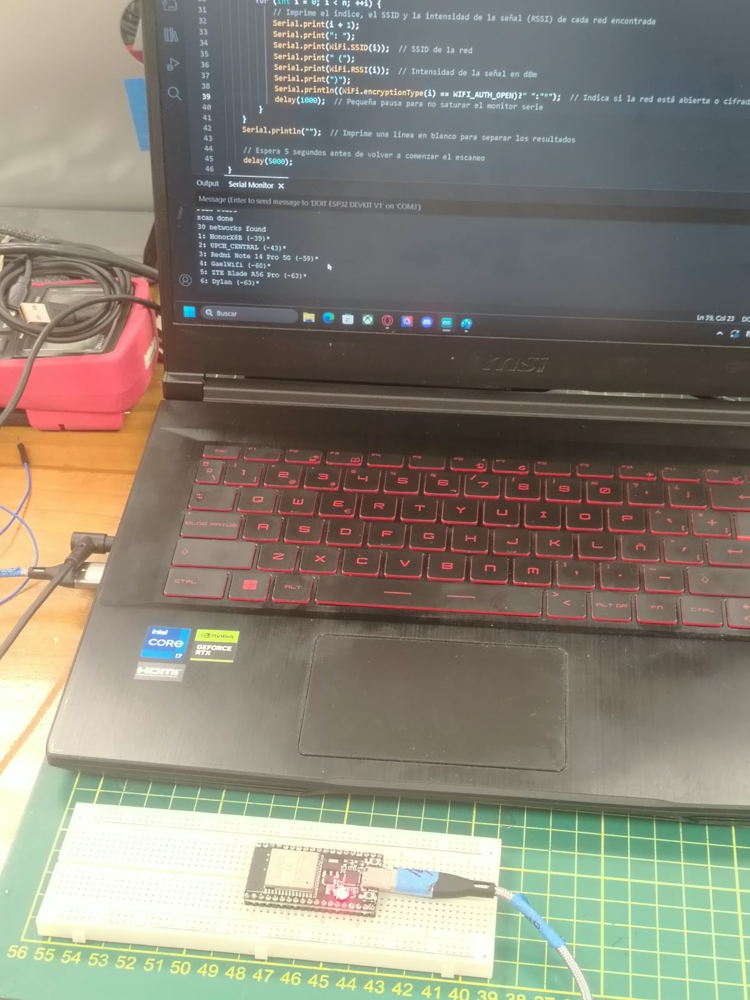

# Taller de Internet de las Cosas (IoT)

## Introducción

El presente taller tiene como finalidad desarrollar una comprensión práctica y teórica sobre el **Internet de las Cosas (IoT)** mediante el uso del **ESP32** y diferentes sensores y actuadores.

A lo largo de las actividades se trabajó con la adquisición y procesamiento de datos, la conexión del ESP32 a redes Wi-Fi, el envío de información a plataformas IoT en la nube y la visualización de datos en tiempo real. Asimismo, se realizaron pruebas de control remoto de dispositivos mediante interfaces web.

Estas actividades permitieron aplicar conceptos relacionados con sensores, conversión analógica-digital, conectividad inalámbrica, monitoreo remoto y control de dispositivos, integrando hardware y software dentro de una arquitectura IoT.

# Actividad 01 - Lectura de un potenciómetro con ESP32

## Objetivo

Mejorar la lectura de un potenciómetro conectado al ESP32 mediante el promediado de varias muestras y convertir los valores obtenidos por el ADC a valores de voltaje.

## Componentes utilizados

Para el desarrollo de esta actividad se utilizaron los siguientes componentes:

| Componente | Descripción | Imagen |
|---|---|---|
| ESP32 DevKit V1 | Tarjeta de desarrollo utilizada para realizar la lectura analógica del potenciómetro y procesar los datos obtenidos. |  |
| Potenciómetro | Componente resistivo variable cuya posición modifica el voltaje de salida que será leído por el ESP32. |  |
| Protoboard | Permite realizar las conexiones del circuito sin necesidad de soldadura. |  |
| Cables jumper | Se utilizan para realizar las conexiones entre el ESP32, el potenciómetro y la protoboard. |  |


## Conexión

El potenciómetro se conectó al ESP32 utilizando el pin GPIO 34 como entrada analógica.

| Potenciómetro | ESP32 |
|---|---|
| VCC | 3.3 V |
| Señal | GPIO 34 |
| GND | GND |

La conexión permite que el ESP32 lea la variación de voltaje generada al girar el potenciómetro.

## Funcionamiento

El ESP32 realiza la lectura analógica del potenciómetro mediante el pin GPIO 34.  
El valor obtenido por el convertidor ADC varía entre 0 y 4095.

Para obtener una lectura más estable, se toman varias muestras consecutivas y se calcula el promedio de los valores obtenidos.

Posteriormente, el valor promedio del ADC se convierte a voltaje utilizando la siguiente expresión:

**V = (ADC × 3.3) / 4095**

donde:

- `ADC` representa el valor promedio leído.
- `3.3 V` corresponde al voltaje de referencia.
- `4095` es el valor máximo del ADC de 12 bits.

La relación entre el valor ADC y el voltaje es lineal, como se observa en la siguiente gráfica:


Finalmente, tanto el valor promedio del ADC como el voltaje calculado se muestran en el monitor serial.

## Código

El siguiente programa realiza varias lecturas consecutivas del potenciómetro conectado al GPIO 34, calcula el promedio de los valores obtenidos y convierte el resultado del ADC a voltaje.

```cpp
int potPin = 34;          // Pin donde está conectado el potenciómetro
int numLecturas = 10;     // Cantidad de lecturas para calcular el promedio

void setup() {
  Serial.begin(115200);   // Inicializar el monitor serial
}

void loop() {

  int suma = 0;

  // Tomar varias lecturas
  for (int i = 0; i < numLecturas; i++) {
    suma += analogRead(potPin);
    delay(10);
  }

  // Calcular el promedio
  float promedio = suma / (float)numLecturas;

  // Convertir el valor ADC a voltaje
  float voltaje = promedio * 3.3 / 4095.0;

  // Mostrar resultados en el monitor serial
  Serial.print("ADC promedio: ");
  Serial.print(promedio);

  Serial.print(" | Voltaje: ");
  Serial.print(voltaje, 2);
  Serial.println(" V");

  delay(500);
}

```

## Resultado

Se realizó la lectura del potenciómetro conectado al ESP32 y se visualizaron los valores obtenidos en el monitor serial.

Durante la prueba se observaron valores promedio del ADC cercanos a 468 y un voltaje aproximado de 0.38 V. Al girar el potenciómetro, estos valores cambian, demostrando que el ESP32 detecta correctamente la variación de la señal analógica.


## Conclusión

En esta actividad se logró realizar la lectura analógica de un potenciómetro utilizando el ESP32. Para mejorar la estabilidad de la medición se aplicó un promedio de varias muestras y posteriormente se convirtió el valor obtenido por el ADC a voltaje.

Los resultados mostrados en el monitor serial permitieron comprobar que, al variar la posición del potenciómetro, también cambian de manera proporcional el valor ADC y el voltaje calculado. Con ello se reforzó el uso del convertidor ADC del ESP32 y el procesamiento básico de señales analógicas.


# Actividad 02 - Conexión del ESP32 a una red Wi-Fi mediante Hotspot

## Objetivo

Crear una red Wi-Fi utilizando un smartphone como Hotspot, conectar el ESP32 a dicha red y visualizar en el monitor serial la dirección IP asignada al dispositivo.

## Componentes utilizados

Para el desarrollo de esta actividad se utilizaron los siguientes componentes:

| Componente | Descripción | Imagen |
|---|---|---|
| ESP32 DevKit V1 | Tarjeta de desarrollo utilizada para realizar la conexión a la red Wi-Fi. |  |
| Smartphone | Dispositivo utilizado para crear la red Wi-Fi mediante la función Hotspot. |  |
| Cable USB | Permite alimentar y programar el ESP32 desde la computadora. |  |
| Computadora | Utilizada para programar el ESP32 y visualizar los resultados en el monitor serial. |  |

## Configuración de la red

Primero se activó la función **Hotspot** del smartphone para crear una red Wi-Fi a la cual posteriormente se conectaría el ESP32.

Se configuró un nombre para la red (**SSID**) y una contraseña de acceso. Además, se verificó que el Hotspot trabajara en la banda de **2.4 GHz**, compatible con el módulo Wi-Fi del ESP32.

## Escaneo de redes Wi-Fi disponibles

Antes de realizar la conexión, se programó el ESP32 para realizar un escaneo de las redes Wi-Fi disponibles en el entorno.

Para ello, se utilizó la librería `WiFi.h` y la función `WiFi.scanNetworks()`, la cual permite detectar las redes inalámbricas cercanas.

El programa muestra en el Monitor Serial la siguiente información de cada red detectada:

- Número de la red encontrada.
- Nombre de la red o **SSID**.
- Intensidad de la señal mediante el valor **RSSI**, expresado en dBm.
- Estado de seguridad de la red, indicando si se encuentra abierta o protegida.

El escaneo se realiza nuevamente después de unos segundos para actualizar la lista de redes disponibles.

## Verificación del escaneo

Una vez cargado el programa en el ESP32, se abrió el **Monitor Serial** para observar los resultados.

Durante la prueba, el ESP32 logró detectar múltiples redes Wi-Fi disponibles en el entorno. En la evidencia obtenida se observa que el dispositivo encontró aproximadamente **30 redes**, mostrando sus respectivos nombres y valores de intensidad de señal.

Los valores RSSI permiten conocer qué tan fuerte es la señal recibida. Un valor más cercano a `0 dBm` representa una señal de mayor intensidad.

## Evidencia

La siguiente imagen muestra el ESP32 conectado a la computadora y el resultado del escaneo de redes Wi-Fi visualizado mediante el Monitor Serial.

<p align="center">
  
</p>

En el Monitor Serial se observa el mensaje `scan done`, seguido del número de redes encontradas y la información correspondiente a cada una de ellas.

# Actividad 03 - Envío de datos del potenciómetro a Arduino Cloud

## Objetivo

Leer en tiempo real la variación de un potenciómetro conectado al ESP32 y enviar los datos obtenidos a **Arduino Cloud** para su visualización mediante un dashboard.

## Componentes utilizados

Para el desarrollo de esta actividad se utilizaron los siguientes componentes:

| Componente | Descripción | Imagen |
|---|---|---|
| ESP32 DevKit V1 | Tarjeta de desarrollo encargada de leer el valor analógico del potenciómetro y enviar los datos a Arduino Cloud. |  |
| Potenciómetro | Componente analógico cuya posición modifica el voltaje leído por el ESP32. |  |
| Protoboard | Utilizada para realizar las conexiones entre el potenciómetro y el ESP32. |  |
| Cables jumper | Permiten realizar las conexiones eléctricas entre los componentes. |  |
| Cable USB | Utilizado para alimentar y programar el ESP32. |  |
| Computadora | Utilizada para programar el ESP32 y acceder a Arduino Cloud. |  |
| Smartphone | Utilizado como Hotspot para proporcionar conexión a Internet al ESP32. |  |

## Conexión del potenciómetro

Se utilizó el mismo montaje realizado en la Actividad 01.

| Potenciómetro | ESP32 |
|---|---|
| VCC | 3.3 V |
| GND | GND |
| Señal | GPIO 34 |

El pin GPIO 34 se utilizó como entrada analógica para leer el valor entregado por el potenciómetro mediante el convertidor ADC del ESP32.

## Configuración en Arduino Cloud

Se ingresó a **Arduino Cloud** y se configuró un dispositivo basado en el ESP32.

Posteriormente, se creó un **Thing** y una variable llamada `potenciometro`, encargada de almacenar el valor de voltaje obtenido a partir de la lectura del potenciómetro.

También se configuraron las credenciales de la red Wi-Fi para permitir que el ESP32 se conectara a Internet y pudiera enviar los datos a la nube.

Finalmente, se creó un dashboard para visualizar en tiempo real los valores enviados por el ESP32.

Arduino Cloud permite conectar dispositivos IoT a Internet y gestionar sus datos mediante una interfaz web o móvil. :chatgpt-content-reference{index="1"}

## Código utilizado

Para realizar la lectura del potenciómetro y enviar los datos a Arduino Cloud se utilizó el siguiente código:

```cpp
#include "thingProperties.h"

int potPin = 34;
int numLecturas = 10;

void setup() {
  Serial.begin(115200);
  delay(1500);

  initProperties();

  ArduinoCloud.begin(ArduinoIoTPreferredConnection);
}

void loop() {
  ArduinoCloud.update();

  int suma = 0;

  for (int i = 0; i < numLecturas; i++) {
    suma += analogRead(potPin);
    delay(10);
  }

  float promedio = suma / (float)numLecturas;

  float voltaje = promedio * 3.3 / 4095.0;

  potenciometro = voltaje;

  Serial.print("ADC promedio: ");
  Serial.print(promedio);

  Serial.print(" | Voltaje: ");
  Serial.print(voltaje, 2);
  Serial.println(" V");

  delay(500);
}
