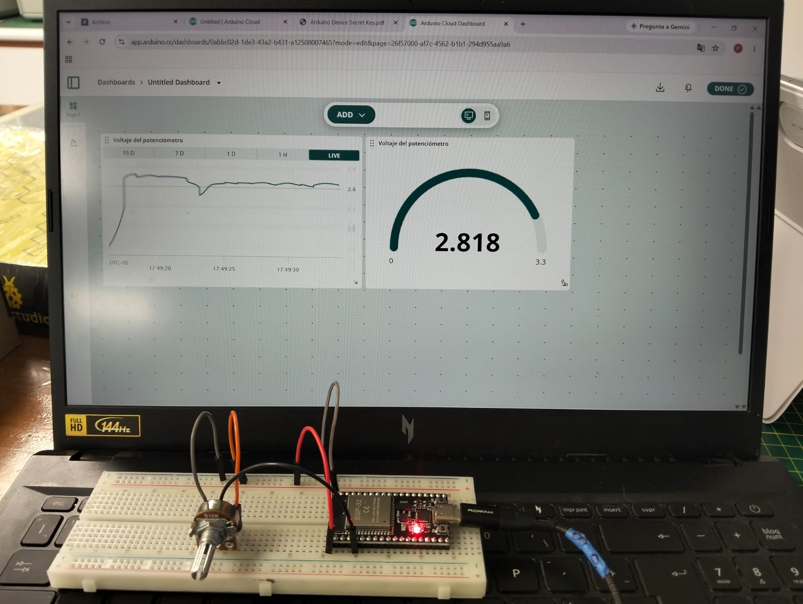
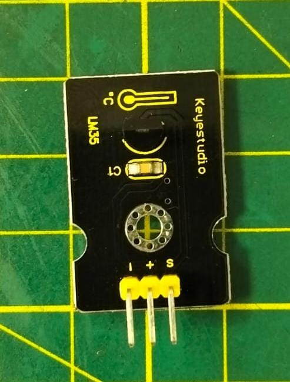
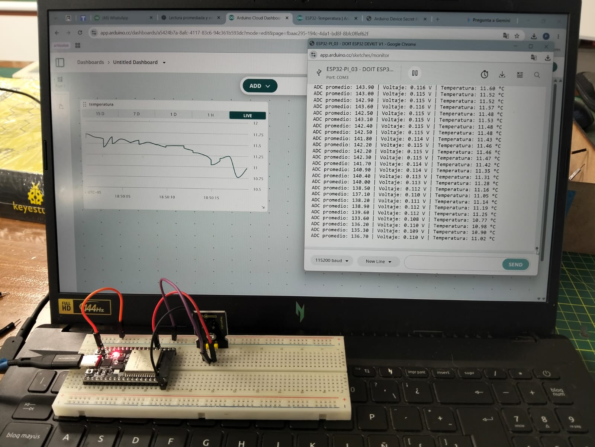
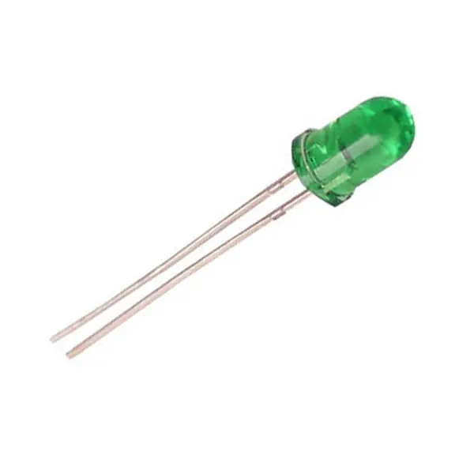
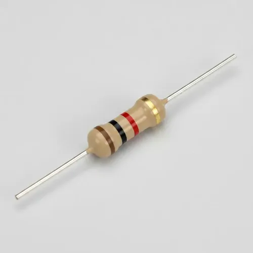
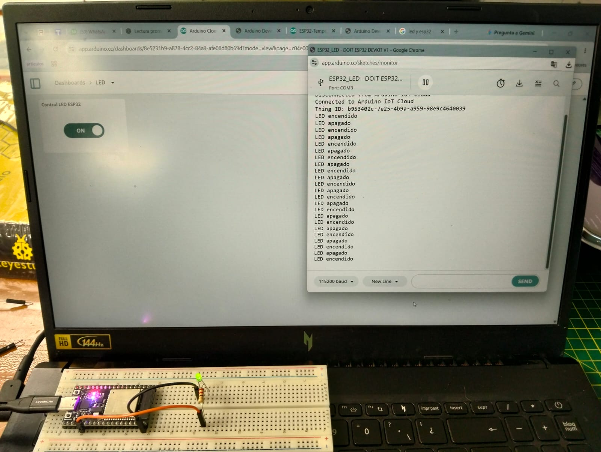

# Taller de Internet de las Cosas (IoT)

## Introducción

El presente taller tiene como finalidad desarrollar una comprensión práctica y teórica sobre el **Internet de las Cosas (IoT)** mediante el uso del **ESP32** y diferentes sensores y actuadores.

A lo largo de las actividades se trabajó con la adquisición y procesamiento de datos, la conexión del ESP32 a redes Wi-Fi, el envío de información a plataformas IoT en la nube y la visualización de datos en tiempo real. Asimismo, se realizaron pruebas de control remoto de dispositivos mediante interfaces web.

Estas actividades permitieron aplicar conceptos relacionados con sensores, conversión analógica-digital, conectividad inalámbrica, monitoreo remoto y control de dispositivos, integrando hardware y software dentro de una arquitectura IoT.

# Actividad 01 - Lectura de un potenciómetro con ESP32

## Objetivo

Mejorar la lectura de un potenciómetro conectado al ESP32 mediante el promediado de varias muestras y convertir los valores obtenidos por el ADC a valores de voltaje.

## Componentes utilizados

Para el desarrollo de esta actividad se utilizaron los siguientes componentes:

| Componente | Descripción | Imagen |
|---|---|---|
| ESP32 DevKit V1 | Tarjeta de desarrollo utilizada para realizar la lectura analógica del potenciómetro y procesar los datos obtenidos. |  |
| Potenciómetro | Componente resistivo variable cuya posición modifica el voltaje de salida que será leído por el ESP32. |  |
| Protoboard | Permite realizar las conexiones del circuito sin necesidad de soldadura. |  |
| Cables jumper | Se utilizan para realizar las conexiones entre el ESP32, el potenciómetro y la protoboard. |  |


## Conexión

El potenciómetro se conectó al ESP32 utilizando el pin GPIO 34 como entrada analógica.

| Potenciómetro | ESP32 |
|---|---|
| VCC | 3.3 V |
| Señal | GPIO 34 |
| GND | GND |

La conexión permite que el ESP32 lea la variación de voltaje generada al girar el potenciómetro.

## Funcionamiento

El ESP32 realiza la lectura analógica del potenciómetro mediante el pin GPIO 34.  
El valor obtenido por el convertidor ADC varía entre 0 y 4095.

Para obtener una lectura más estable, se toman varias muestras consecutivas y se calcula el promedio de los valores obtenidos.

Posteriormente, el valor promedio del ADC se convierte a voltaje utilizando la siguiente expresión:

**V = (ADC × 3.3) / 4095**

donde:

- `ADC` representa el valor promedio leído.
- `3.3 V` corresponde al voltaje de referencia.
- `4095` es el valor máximo del ADC de 12 bits.

Finalmente, tanto el valor promedio del ADC como el voltaje calculado se muestran en el Monitor Serial.

## Código

El siguiente programa realiza varias lecturas consecutivas del potenciómetro conectado al GPIO 34, calcula el promedio de los valores obtenidos y convierte el resultado del ADC a voltaje.

```cpp
int potPin = 34;          // Pin donde está conectado el potenciómetro
int numLecturas = 10;     // Cantidad de lecturas para calcular el promedio

void setup() {
  Serial.begin(115200);   // Inicializar el Monitor Serial
}

void loop() {

  int suma = 0;

  // Tomar varias lecturas
  for (int i = 0; i < numLecturas; i++) {
    suma += analogRead(potPin);
    delay(10);
  }

  // Calcular el promedio
  float promedio = suma / (float)numLecturas;

  // Convertir el valor ADC a voltaje
  float voltaje = promedio * 3.3 / 4095.0;

  // Mostrar resultados en el Monitor Serial
  Serial.print("ADC promedio: ");
  Serial.print(promedio);

  Serial.print(" | Voltaje: ");
  Serial.print(voltaje, 2);
  Serial.println(" V");

  delay(500);
}

```

## Resultado

Se realizó la lectura del potenciómetro conectado al ESP32 y se visualizaron los valores obtenidos en el Monitor Serial.

Durante la prueba se observaron valores promedio del ADC cercanos a 468 y un voltaje aproximado de 0.38 V. Al girar el potenciómetro, estos valores cambian, demostrando que el ESP32 detecta correctamente la variación de la señal analógica.


## Conclusión

En esta actividad se logró realizar la lectura analógica de un potenciómetro utilizando el ESP32. Para mejorar la estabilidad de la medición se aplicó un promedio de varias muestras y posteriormente se convirtió el valor obtenido por el ADC a voltaje.

Los resultados mostrados en el Monitor Serial permitieron comprobar que, al variar la posición del potenciómetro, también cambian de manera proporcional el valor ADC y el voltaje calculado. Con ello se reforzó el uso del convertidor ADC del ESP32 y el procesamiento básico de señales analógicas.


# Actividad 02 - Conexión del ESP32 a una red Wi-Fi mediante Hotspot

## Objetivo

Crear una red Wi-Fi utilizando un smartphone como Hotspot, conectar el ESP32 a dicha red y visualizar en el Monitor Serial la dirección IP asignada al dispositivo.

## Componentes utilizados

| Componente | Descripción | Imagen |
|---|---|---|
| ESP32 DevKit V1 | Tarjeta de desarrollo utilizada para realizar el escaneo y la conexión a redes Wi-Fi. |  |
| Smartphone | Dispositivo utilizado para crear la red Wi-Fi mediante la función Hotspot. |  |
| Cable USB | Permite alimentar y programar el ESP32 desde la computadora. |  |
| Computadora | Utilizada para programar el ESP32 y visualizar los resultados en el Monitor Serial. |  |

## Uso de la biblioteca WiFi.h

Para esta actividad se utilizó la biblioteca `WiFi.h`, que permite gestionar la conectividad Wi-Fi del ESP32.

Esta biblioteca permite realizar acciones como:

- Escanear las redes Wi-Fi disponibles.
- Conectarse a una red inalámbrica.
- Consultar el estado de la conexión.
- Obtener la dirección IP asignada al ESP32.
- Consultar la intensidad de la señal mediante el valor RSSI.

El uso de `WiFi.h` permite que el ESP32 pueda conectarse a Internet y comunicarse con otros dispositivos o plataformas IoT.

## Parte 1 - Escaneo de redes Wi-Fi

### Código utilizado

Para realizar el escaneo de las redes Wi-Fi disponibles se utilizó el siguiente código:

```cpp
#include <WiFi.h>

void setup() {
  Serial.begin(115200);
  delay(1000);

  WiFi.mode(WIFI_STA);
  WiFi.disconnect();

  delay(100);

  Serial.println("Escaneando redes WiFi...");
}

void loop() {

  Serial.println();
  Serial.println("Iniciando escaneo...");

  int n = WiFi.scanNetworks();

  Serial.println("Escaneo finalizado");

  if (n == 0) {
    Serial.println("No se encontraron redes WiFi");
  } else {
    Serial.print("Redes encontradas: ");
    Serial.println(n);

    Serial.println();

    for (int i = 0; i < n; i++) {

      Serial.print(i + 1);
      Serial.print(": ");

      Serial.print(WiFi.SSID(i));

      Serial.print(" (");
      Serial.print(WiFi.RSSI(i));
      Serial.print(" dBm)");

      Serial.print(" ");

      if (WiFi.encryptionType(i) == WIFI_AUTH_OPEN) {
        Serial.println("Abierta");
      } else {
        Serial.println("Protegida");
      }

      delay(10);
    }
  }

  Serial.println();
  Serial.println("-----------------------------");

  WiFi.scanDelete();

  delay(5000);
}

```

### Resultado y evidencia

El ESP32 realizó correctamente el escaneo de las redes Wi-Fi disponibles en el entorno.

En el Monitor Serial se muestran las redes detectadas junto con su nombre, intensidad de señal RSSI y estado de seguridad.

<p align="center">
  
</p>


## Parte 2 - Configuración del Hotspot

Para realizar la conexión del ESP32 se configuró un smartphone como punto de acceso Wi-Fi o Hotspot.

La red utilizada fue:

- **SSID:** `3DS_WIFI`
- **Seguridad:** red protegida mediante contraseña

Una vez configurado el Hotspot, se activó la red para permitir que el ESP32 pudiera conectarse a ella.


## Parte 3 - Conexión del ESP32 al Hotspot

### Código utilizado

Para conectar el ESP32 a la red Wi-Fi creada mediante el Hotspot se utilizó el siguiente código:

```cpp
#include <WiFi.h>

const char* ssid = "3DS_WIFI";
const char* password = "CONTRASEÑA_DEL_HOTSPOT";

void setup() {
  Serial.begin(115200);
  delay(1000);

  Serial.println();
  Serial.print("Conectando a la red: ");
  Serial.println(ssid);

  WiFi.begin(ssid, password);

  while (WiFi.status() != WL_CONNECTED) {
    delay(500);
    Serial.print(".");
  }

  Serial.println();
  Serial.println("Conectado a WiFi correctamente");

  Serial.print("Dirección IP asignada: ");
  Serial.println(WiFi.localIP());

  Serial.print("Intensidad de señal: ");
  Serial.print(WiFi.RSSI());
  Serial.println(" dBm");
}

void loop() {
}

```

### Verificación y evidencia

La siguiente imagen muestra el resultado obtenido en el Monitor Serial después de conectar el ESP32 a la red Wi-Fi `3DS_WIFI`.

<p align="center">
  
</p>

En la evidencia se observa que el ESP32 se conectó correctamente a la red, obtuvo la dirección IP `10.149.161.237` y registró una intensidad de señal de `-25 dBm`.


## Resultado

Se logró realizar correctamente el escaneo de redes Wi-Fi disponibles y posteriormente conectar el ESP32 a la red `3DS_WIFI`.

La conexión fue verificada mediante el Monitor Serial, donde se visualizó la dirección IP asignada al dispositivo y la intensidad de la señal recibida.

## Conclusión

La actividad permitió comprender el uso de la biblioteca `WiFi.h` para gestionar la conectividad Wi-Fi del ESP32.

Primero se realizó un escaneo de las redes disponibles en el entorno y luego se estableció una conexión con una red Wi-Fi creada mediante un Hotspot.

Finalmente, se comprobó la conexión observando la dirección IP asignada al ESP32 en el Monitor Serial.


# Actividad 03 - Envío de datos del potenciómetro a Arduino Cloud

## Objetivo

Leer la variación de un potenciómetro conectado al ESP32 y enviar los valores obtenidos a Arduino Cloud para visualizarlos en tiempo real mediante un dashboard.

## Componentes utilizados

| Componente | Descripción | Imagen |
|---|---|---|
| ESP32 DevKit V1 | Tarjeta de desarrollo encargada de leer el valor analógico del potenciómetro y enviar los datos a Arduino Cloud. |  |
| Potenciómetro | Componente analógico cuya posición modifica el voltaje leído por el ESP32. |  |
| Protoboard | Utilizada para realizar las conexiones entre el potenciómetro y el ESP32. |  |
| Cables jumper | Permiten realizar las conexiones eléctricas entre los componentes. |  |
| Cable USB | Utilizado para alimentar y programar el ESP32. |  |
| Computadora | Utilizada para programar el ESP32 y acceder a Arduino Cloud. |  |

## Conexión del potenciómetro

Se utilizó el mismo montaje realizado en la Actividad 01.

| Potenciómetro | ESP32 |
|---|---|
| VCC | 3.3 V |
| Señal | GPIO 34 |
| GND | GND |

El GPIO 34 se utilizó como entrada analógica para obtener la señal generada por el potenciómetro.

## Configuración en Arduino Cloud

Se configuró el ESP32 en Arduino Cloud y se creó un **Thing** para gestionar la comunicación entre el dispositivo y la plataforma.

Dentro del Thing se creó una variable llamada `potenciometro`, encargada de almacenar el valor de voltaje obtenido a partir de la lectura del potenciómetro.

También se configuró la conexión Wi-Fi para permitir que el ESP32 pudiera conectarse a Internet y enviar los datos a Arduino Cloud.

Finalmente, se creó un dashboard para visualizar en tiempo real la variación del potenciómetro.

## Código utilizado

Para leer el valor del potenciómetro y enviar el voltaje obtenido a Arduino Cloud se utilizó el siguiente código:

```cpp
#include "thingProperties.h"

int potPin = 34;
int numLecturas = 10;

void setup() {
  Serial.begin(115200);
  delay(1500);

  initProperties();

  ArduinoCloud.begin(ArduinoIoTPreferredConnection);
}

void loop() {
  ArduinoCloud.update();

  int suma = 0;

  for (int i = 0; i < numLecturas; i++) {
    suma += analogRead(potPin);
    delay(10);
  }

  float promedio = suma / (float)numLecturas;

  float voltaje = promedio * 3.3 / 4095.0;

  potenciometro = voltaje;

  Serial.print("ADC promedio: ");
  Serial.print(promedio);

  Serial.print(" | Voltaje: ");
  Serial.print(voltaje, 2);
  Serial.println(" V");

  delay(500);
}

```

## Verificación y evidencia

La siguiente imagen muestra el funcionamiento del sistema durante el envío de datos a Arduino Cloud.

En el dashboard se puede observar en tiempo real la variación del voltaje del potenciómetro mediante una gráfica y un indicador.

<p align="center">
  
</p>

En la evidencia se observa un valor de aproximadamente `2.818 V`, correspondiente al voltaje leído por el ESP32 y enviado a Arduino Cloud.

## Resultado

Se logró leer correctamente la variación del potenciómetro mediante el ESP32 y enviar los valores obtenidos a Arduino Cloud.

Los datos fueron visualizados en tiempo real mediante un dashboard que mostró tanto la variación del voltaje en una gráfica como el valor instantáneo mediante un indicador.

Durante la prueba se observó un valor aproximado de `2.818 V`, confirmando que la información obtenida por el ESP32 fue enviada correctamente a la plataforma.

## Conclusión

La actividad permitió integrar el ESP32 con Arduino Cloud para realizar el monitoreo en tiempo real de una variable analógica.

Mediante la lectura del potenciómetro, el cálculo del promedio y la conversión del valor ADC a voltaje, fue posible obtener datos más estables antes de enviarlos a la nube.

Finalmente, se comprobó que Arduino Cloud permite visualizar de manera remota y en tiempo real los datos generados por el ESP32 mediante un dashboard.


# Actividad 04 - Monitoreo de temperatura con LM35 en Arduino Cloud

## Objetivo

Medir la temperatura utilizando un sensor LM35 conectado al ESP32 y enviar los valores obtenidos a Arduino Cloud para visualizarlos en tiempo real mediante un dashboard.

## Componentes utilizados

| Componente | Descripción | Imagen |
|---|---|---|
| ESP32 DevKit V1 | Tarjeta de desarrollo encargada de leer la señal analógica del sensor LM35 y enviar los datos a Arduino Cloud. |  |
| Sensor LM35 | Sensor analógico utilizado para medir la temperatura. |  |
| Protoboard | Utilizada para realizar las conexiones entre el LM35 y el ESP32. |  |
| Cables jumper | Permiten realizar las conexiones eléctricas entre los componentes. |  |
| Cable USB | Utilizado para alimentar y programar el ESP32. |  |
| Computadora | Utilizada para programar el ESP32 y visualizar los datos en Arduino Cloud. |  |

## Conexión del sensor LM35

Para medir la temperatura se utilizó el módulo LM35 del kit Keyestudio, conectado al ESP32 mediante una entrada analógica.

La conexión realizada fue la siguiente:

| Módulo LM35 | ESP32 |
|---|---|
| S | GPIO 34 |
| + | 5 V |
| - | GND |

El pin `S` corresponde a la salida analógica del sensor y se conectó al GPIO 34 del ESP32 para realizar la lectura mediante el ADC.

El módulo LM35 fue alimentado con `5 V`, mientras que la señal analógica generada por el sensor fue leída mediante el GPIO 34.

## Código utilizado

Para realizar la lectura del sensor LM35 y enviar la temperatura obtenida a Arduino Cloud se utilizó el siguiente código:

```cpp
#include "thingProperties.h"

int lm35Pin = 34;
int numLecturas = 10;

void setup() {
  Serial.begin(115200);
  delay(1500);

  initProperties();
  ArduinoCloud.begin(ArduinoIoTPreferredConnection);
}

void loop() {
  ArduinoCloud.update();

  int suma = 0;

  for (int i = 0; i < numLecturas; i++) {
    suma += analogRead(lm35Pin);
    delay(10);
  }

  float promedio = suma / (float)numLecturas;

  float voltaje = promedio * 3.3 / 4095.0;

  float temperaturaC = voltaje * 100.0;

  temperatura = temperaturaC;

  Serial.print("ADC promedio: ");
  Serial.print(promedio);

  Serial.print(" | Voltaje: ");
  Serial.print(voltaje, 3);

  Serial.print(" V | Temperatura: ");
  Serial.print(temperaturaC, 2);
  Serial.println(" °C");

  delay(500);
}

/*
  Since Temperatura is READ_WRITE variable, onTemperaturaChange() is
  executed every time a new value is received from IoT Cloud.
*/
void onTemperaturaChange()  {

}

```

## Verificación y evidencia

La siguiente imagen muestra el funcionamiento del sistema durante la medición de temperatura con el sensor LM35 y el envío de datos a Arduino Cloud.

<p align="center">
  
</p>

En la evidencia se observa que el ESP32 realiza la lectura del sensor LM35, calcula el voltaje correspondiente y obtiene la temperatura en grados Celsius.

Además, los valores son enviados a Arduino Cloud y visualizados en tiempo real mediante una gráfica.

Durante la prueba se registraron valores cercanos a `11 °C`, observándose su variación tanto en el Monitor Serial como en el dashboard.

## Resultado

Se logró medir correctamente la temperatura mediante el sensor LM35 conectado al ESP32.

El programa realizó varias lecturas del sensor, calculó un promedio y convirtió el valor obtenido en voltaje para posteriormente determinar la temperatura en grados Celsius.

Los datos fueron enviados a Arduino Cloud y se visualizaron en tiempo real mediante una gráfica. Durante la prueba se registraron valores cercanos a `11 °C`.

## Conclusión

La actividad permitió utilizar el sensor LM35 para medir temperatura y enviar los datos obtenidos desde el ESP32 hacia Arduino Cloud.

El uso del promedio de varias lecturas permitió obtener valores más estables antes de realizar la conversión a temperatura.

Finalmente, se comprobó que Arduino Cloud permite monitorear en tiempo real los datos provenientes de un sensor conectado al ESP32.


# Actividad 05 - Control de un LED desde Arduino Cloud

## Objetivo

Controlar el encendido y apagado de un LED conectado al ESP32 mediante Arduino Cloud.

## Componentes utilizados

| Componente | Descripción | Imagen |
|---|---|---|
| ESP32 DevKit V1 | Tarjeta de desarrollo utilizada para controlar el LED y comunicarse con Arduino Cloud. |  |
| LED | Componente utilizado como salida visual para comprobar el control remoto desde Arduino Cloud. |  |
| Resistencia de 220 Ω | Limita la corriente que circula por el LED para protegerlo. |  |
| Protoboard | Utilizada para realizar las conexiones entre el ESP32, la resistencia y el LED. |  |
| Cables jumper | Permiten realizar las conexiones eléctricas entre los componentes. |  |
| Cable USB | Utilizado para alimentar y programar el ESP32. |  |
| Computadora | Utilizada para programar el ESP32 y acceder a Arduino Cloud. |  |

## Conexión del LED

Para controlar el encendido y apagado del LED se utilizó el pin digital GPIO 2 del ESP32.

La conexión realizada fue la siguiente:

| Componente | Conexión |
|---|---|
| Ánodo del LED (+) | GPIO 2 |
| Cátodo del LED (-) | Resistencia de 220 Ω |
| Resistencia de 220 Ω | GND |

La resistencia de `220 Ω` se utilizó para limitar la corriente que circula por el LED y proteger el componente.

En Arduino Cloud se creó una variable booleana llamada `led`, vinculada al dashboard para permitir el encendido y apagado remoto del LED.

## Código utilizado

Para controlar el LED desde Arduino Cloud se utilizó el siguiente código:

```cpp
#include "thingProperties.h"

int ledPin = 2;

void setup() {
  Serial.begin(115200);
  delay(1500);

  pinMode(ledPin, OUTPUT);
  digitalWrite(ledPin, LOW);

  initProperties();
  ArduinoCloud.begin(ArduinoIoTPreferredConnection);
}

void loop() {
  ArduinoCloud.update();
}

void onLedChange() {
  if (led) {
    digitalWrite(ledPin, HIGH);
    Serial.println("LED encendido");
  } else {
    digitalWrite(ledPin, LOW);
    Serial.println("LED apagado");
  }
}

```

## Verificación y evidencia

Para verificar el funcionamiento, se utilizó un control en el dashboard de Arduino Cloud para modificar el estado de la variable `led`.

Al activar el control, el LED conectado al GPIO 2 se encendió. Al desactivarlo, el LED se apagó.

La siguiente imagen muestra el funcionamiento del sistema durante la prueba.

<p align="center">
  
</p>

En la evidencia se puede observar el LED conectado al ESP32 y su control mediante Arduino Cloud.

## Resultado

Se logró controlar correctamente el encendido y apagado de un LED conectado al GPIO 2 del ESP32 mediante Arduino Cloud.

Los cambios realizados desde el dashboard fueron recibidos por el ESP32, permitiendo modificar el estado del LED de forma remota.

## Conclusión

La actividad permitió comprobar que Arduino Cloud no solo puede utilizarse para visualizar datos enviados por el ESP32, sino también para controlar dispositivos conectados a sus pines digitales.

Mediante una variable vinculada con Arduino Cloud fue posible cambiar el estado del GPIO 2 y controlar remotamente el encendido y apagado del LED.

Esta actividad permitió comprender un ejemplo básico de control remoto aplicado a sistemas de Internet de las Cosas.
