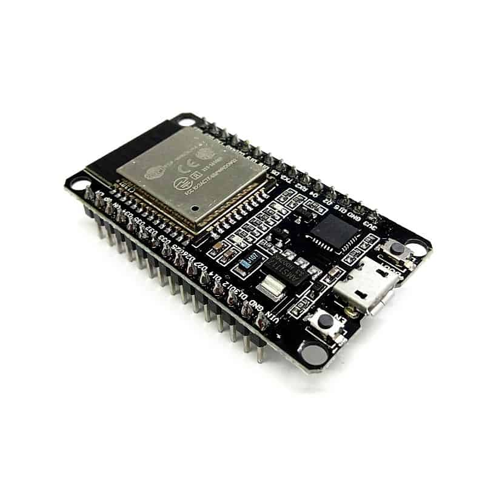
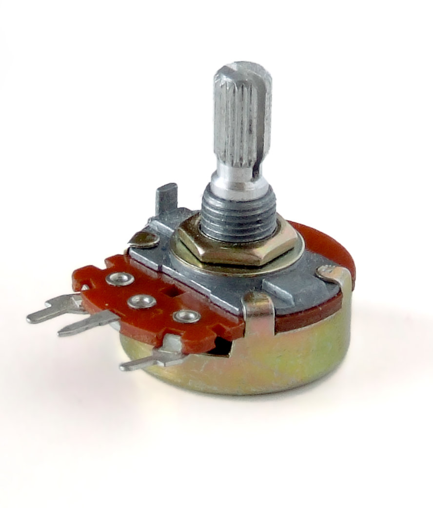
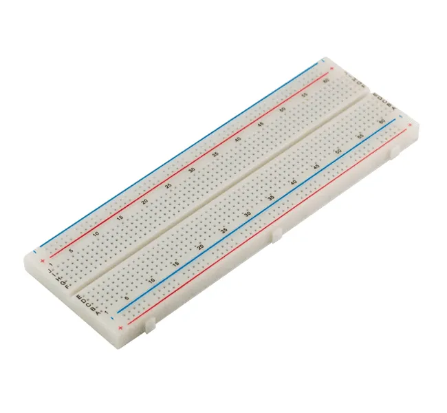
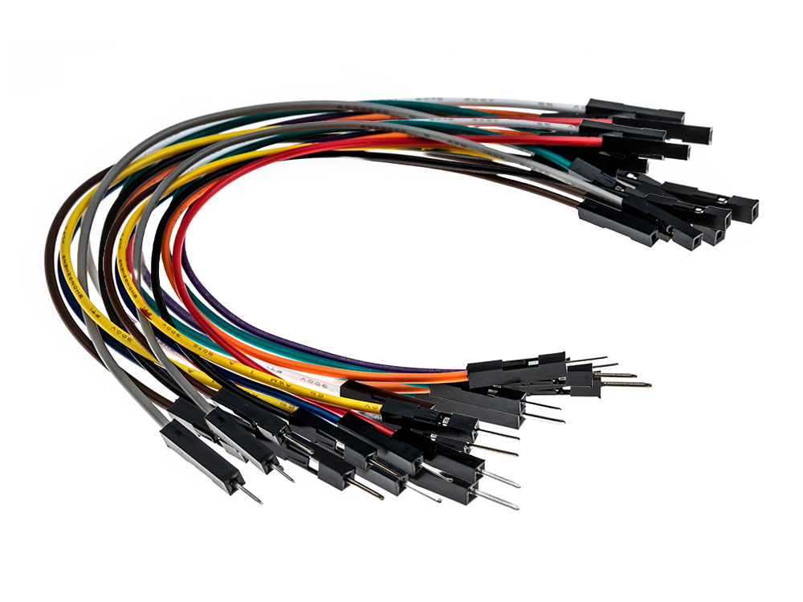
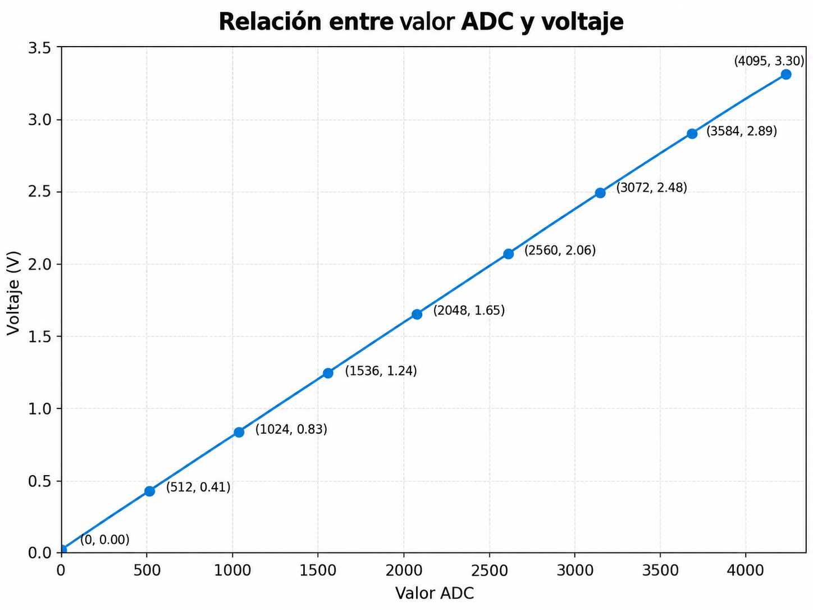
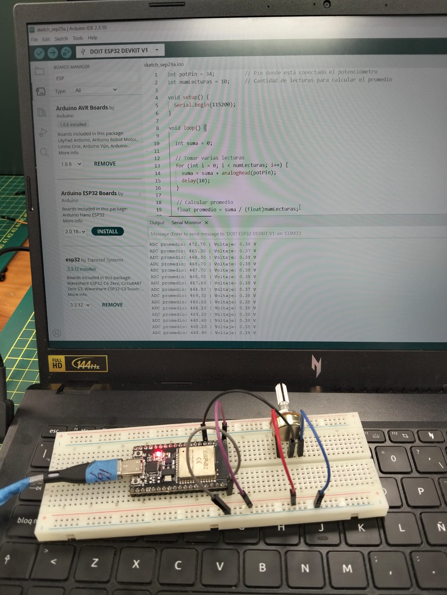
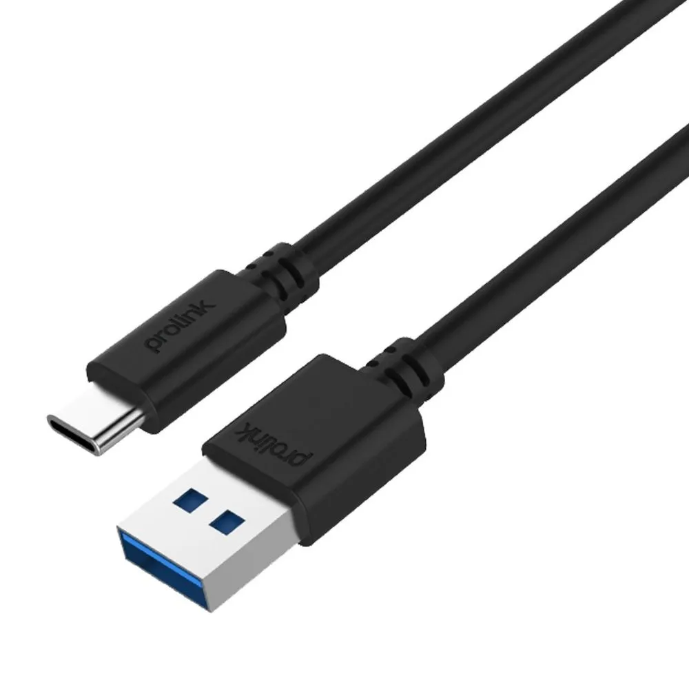
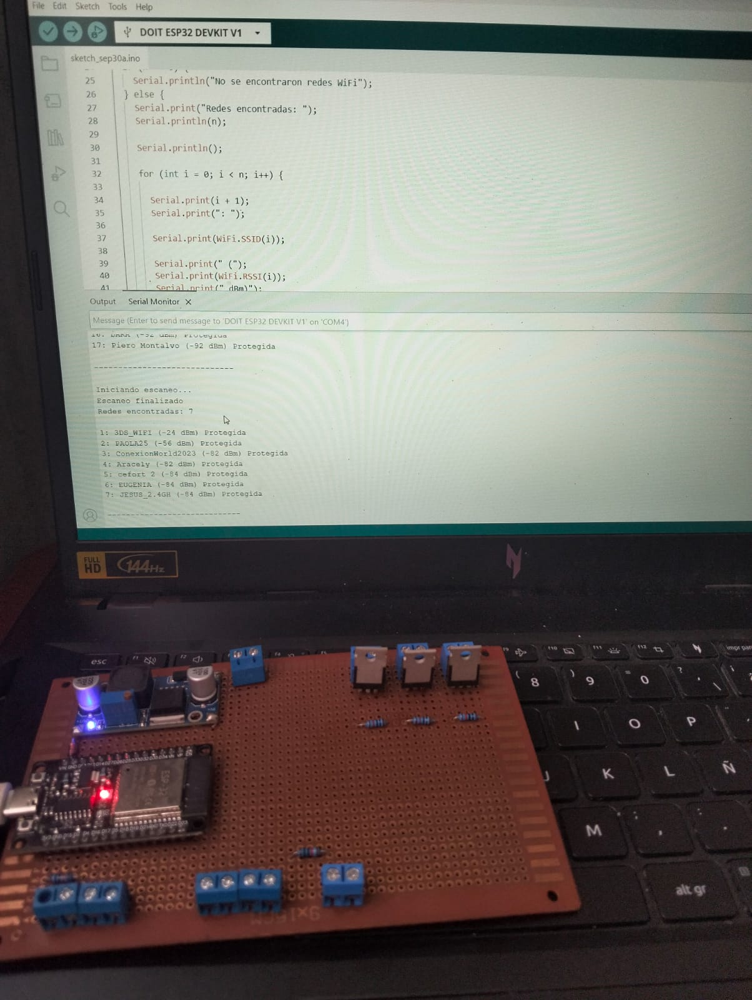
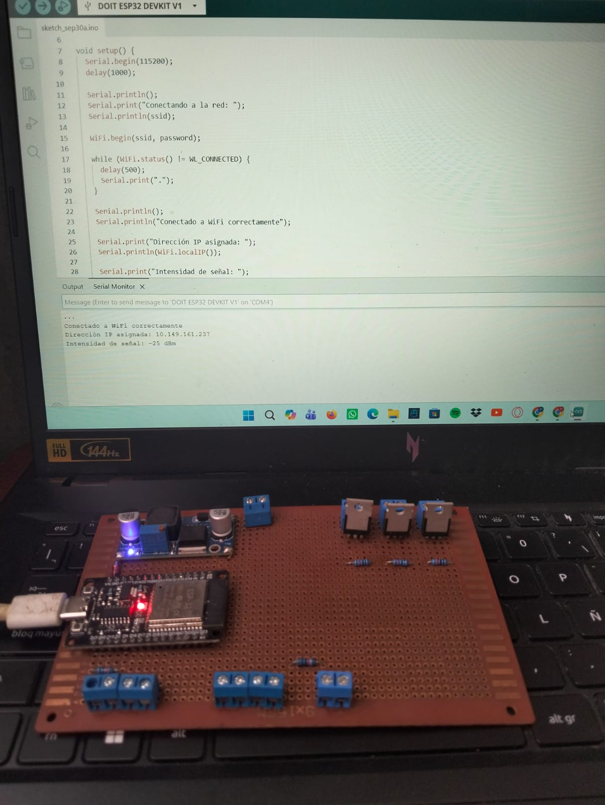

# Taller de Internet de las Cosas (IoT)

## Introducción

El presente taller tiene como finalidad desarrollar una comprensión práctica y teórica sobre el **Internet de las Cosas (IoT)** mediante el uso del **ESP32** y diferentes sensores y actuadores.

A lo largo de las actividades se trabajó con la adquisición y procesamiento de datos, la conexión del ESP32 a redes Wi-Fi, el envío de información a plataformas IoT en la nube y la visualización de datos en tiempo real. Asimismo, se realizaron pruebas de control remoto de dispositivos mediante interfaces web.

Estas actividades permitieron aplicar conceptos relacionados con sensores, conversión analógica-digital, conectividad inalámbrica, monitoreo remoto y control de dispositivos, integrando hardware y software dentro de una arquitectura IoT.

# Actividad 01 - Lectura de un potenciómetro con ESP32

## Objetivo

Mejorar la lectura de un potenciómetro conectado al ESP32 mediante el promediado de varias muestras y convertir los valores obtenidos por el ADC a valores de voltaje.

## Componentes utilizados

Para el desarrollo de esta actividad se utilizaron los siguientes componentes:

| Componente | Descripción | Imagen |
|---|---|---|
| ESP32 DevKit V1 | Tarjeta de desarrollo utilizada para realizar la lectura analógica del potenciómetro y procesar los datos obtenidos. |  |
| Potenciómetro | Componente resistivo variable cuya posición modifica el voltaje de salida que será leído por el ESP32. |  |
| Protoboard | Permite realizar las conexiones del circuito sin necesidad de soldadura. |  |
| Cables jumper | Se utilizan para realizar las conexiones entre el ESP32, el potenciómetro y la protoboard. |  |


## Conexión

El potenciómetro se conectó al ESP32 utilizando el pin GPIO 34 como entrada analógica.

| Potenciómetro | ESP32 |
|---|---|
| VCC | 3.3 V |
| Señal | GPIO 34 |
| GND | GND |

La conexión permite que el ESP32 lea la variación de voltaje generada al girar el potenciómetro.

## Funcionamiento

El ESP32 realiza la lectura analógica del potenciómetro mediante el pin GPIO 34.  
El valor obtenido por el convertidor ADC varía entre 0 y 4095.

Para obtener una lectura más estable, se toman varias muestras consecutivas y se calcula el promedio de los valores obtenidos.

Posteriormente, el valor promedio del ADC se convierte a voltaje utilizando la siguiente expresión:

**V = (ADC × 3.3) / 4095**

donde:

- `ADC` representa el valor promedio leído.
- `3.3 V` corresponde al voltaje de referencia.
- `4095` es el valor máximo del ADC de 12 bits.

La relación entre el valor ADC y el voltaje es lineal, como se observa en la siguiente gráfica:



Finalmente, tanto el valor promedio del ADC como el voltaje calculado se muestran en el monitor serial.

## Código

El siguiente programa realiza varias lecturas consecutivas del potenciómetro conectado al GPIO 34, calcula el promedio de los valores obtenidos y convierte el resultado del ADC a voltaje.

```cpp
int potPin = 34;          // Pin donde está conectado el potenciómetro
int numLecturas = 10;     // Cantidad de lecturas para calcular el promedio

void setup() {
  Serial.begin(115200);   // Inicializar el monitor serial
}

void loop() {

  int suma = 0;

  // Tomar varias lecturas
  for (int i = 0; i < numLecturas; i++) {
    suma += analogRead(potPin);
    delay(10);
  }

  // Calcular el promedio
  float promedio = suma / (float)numLecturas;

  // Convertir el valor ADC a voltaje
  float voltaje = promedio * 3.3 / 4095.0;

  // Mostrar resultados en el monitor serial
  Serial.print("ADC promedio: ");
  Serial.print(promedio);

  Serial.print(" | Voltaje: ");
  Serial.print(voltaje, 2);
  Serial.println(" V");

  delay(500);
}

```

## Resultado

Se realizó la lectura del potenciómetro conectado al ESP32 y se visualizaron los valores obtenidos en el monitor serial.

Durante la prueba se observaron valores promedio del ADC cercanos a 468 y un voltaje aproximado de 0.38 V. Al girar el potenciómetro, estos valores cambian, demostrando que el ESP32 detecta correctamente la variación de la señal analógica.



## Conclusión

En esta actividad se logró realizar la lectura analógica de un potenciómetro utilizando el ESP32. Para mejorar la estabilidad de la medición se aplicó un promedio de varias muestras y posteriormente se convirtió el valor obtenido por el ADC a voltaje.

Los resultados mostrados en el monitor serial permitieron comprobar que, al variar la posición del potenciómetro, también cambian de manera proporcional el valor ADC y el voltaje calculado. Con ello se reforzó el uso del convertidor ADC del ESP32 y el procesamiento básico de señales analógicas.


# Actividad 02 - Conexión del ESP32 a una red Wi-Fi mediante Hotspot

## Objetivo

Crear una red Wi-Fi utilizando un smartphone como Hotspot, conectar el ESP32 a dicha red y visualizar en el Monitor Serial la dirección IP asignada al dispositivo.

## Componentes utilizados

| Componente | Descripción | Imagen |
|---|---|---|
| ESP32 DevKit V1 | Tarjeta de desarrollo utilizada para realizar el escaneo y la conexión a redes Wi-Fi. |  |
| Smartphone | Dispositivo utilizado para crear la red Wi-Fi mediante la función Hotspot. |  |
| Cable USB | Permite alimentar y programar el ESP32 desde la computadora. |  |
| Computadora | Utilizada para programar el ESP32 y visualizar los resultados en el Monitor Serial. |  |

## Uso de la biblioteca WiFi.h

Para esta actividad se utilizó la biblioteca `WiFi.h`, que permite gestionar la conectividad Wi-Fi del ESP32.

Esta biblioteca permite realizar acciones como:

- Escanear las redes Wi-Fi disponibles.
- Conectarse a una red inalámbrica.
- Consultar el estado de la conexión.
- Obtener la dirección IP asignada al ESP32.
- Consultar la intensidad de la señal mediante el valor RSSI.

El uso de `WiFi.h` permite que el ESP32 pueda conectarse a Internet y comunicarse con otros dispositivos o plataformas IoT.

## Código utilizado

Para realizar el escaneo de las redes Wi-Fi disponibles se utilizó el siguiente código:

```cpp
#include <WiFi.h>

void setup() {
  Serial.begin(115200);
  delay(1000);

  WiFi.mode(WIFI_STA);
  WiFi.disconnect();

  delay(100);

  Serial.println("Escaneando redes WiFi...");
}

void loop() {

  Serial.println();
  Serial.println("Iniciando escaneo...");

  int n = WiFi.scanNetworks();

  Serial.println("Escaneo finalizado");

  if (n == 0) {
    Serial.println("No se encontraron redes WiFi");
  } else {
    Serial.print("Redes encontradas: ");
    Serial.println(n);

    Serial.println();

    for (int i = 0; i < n; i++) {

      Serial.print(i + 1);
      Serial.print(": ");

      Serial.print(WiFi.SSID(i));

      Serial.print(" (");
      Serial.print(WiFi.RSSI(i));
      Serial.print(" dBm)");

      Serial.print(" ");

      if (WiFi.encryptionType(i) == WIFI_AUTH_OPEN) {
        Serial.println("Abierta");
      } else {
        Serial.println("Protegida");
      }

      delay(10);
    }
  }

  Serial.println();
  Serial.println("-----------------------------");

  WiFi.scanDelete();

  delay(5000);
}

```

### Resultado y evidencia

El ESP32 realizó correctamente el escaneo de las redes Wi-Fi disponibles en el entorno.

En el Monitor Serial se muestran las redes detectadas junto con su nombre, intensidad de señal RSSI y estado de seguridad.

<p align="center">
  
</p>


## Parte 2 - Configuración del Hotspot

Para realizar la conexión del ESP32 se configuró un smartphone como punto de acceso Wi-Fi o Hotspot.

La red utilizada fue:

- **SSID:** `3DS_WIFI`
- **Seguridad:** red protegida mediante contraseña

Una vez configurado el Hotspot, se activó la red para permitir que el ESP32 pudiera conectarse a ella.


## Parte 3 - Conexión del ESP32 al Hotspot

### Código utilizado

Para conectar el ESP32 a la red Wi-Fi creada mediante el Hotspot se utilizó el siguiente código:

```cpp
#include <WiFi.h>

const char* ssid = "3DS_WIFI";
const char* password = "CONTRASEÑA_DEL_HOTSPOT";

void setup() {
  Serial.begin(115200);
  delay(1000);

  Serial.println();
  Serial.print("Conectando a la red: ");
  Serial.println(ssid);

  WiFi.begin(ssid, password);

  while (WiFi.status() != WL_CONNECTED) {
    delay(500);
    Serial.print(".");
  }

  Serial.println();
  Serial.println("Conectado a WiFi correctamente");

  Serial.print("Dirección IP asignada: ");
  Serial.println(WiFi.localIP());

  Serial.print("Intensidad de señal: ");
  Serial.print(WiFi.RSSI());
  Serial.println(" dBm");
}

void loop() {
}

```

### Verificación y evidencia

La siguiente imagen muestra el resultado obtenido en el Monitor Serial después de conectar el ESP32 a la red Wi-Fi `3DS_WIFI`.

<p align="center">
  
</p>

En la evidencia se observa que el ESP32 se conectó correctamente a la red, obtuvo la dirección IP `10.149.161.237` y registró una intensidad de señal de `-25 dBm`.
