# Informe del Taller de Internet de las Cosas (IoT) con ESP32

En este taller aprendimos a conectar una placa **ESP32** con sensores y componentes, a leer lo que miden, a conectarla a internet (Wi-Fi) y a mostrar y controlar esos datos desde la nube con **Arduino Cloud**.

Las actividades fueron, en orden:

1. Ejemplo 01: leer un potenciómetro con el ESP32
2. Actividad 1: mejorar la lectura (promedio y voltaje)
3. Actividad 2: buscar redes Wi-Fi y conectarse a una
4. Actividad 3: enviar los datos del potenciómetro a la nube
5. Actividad 4: medir la luz (LDR) y verla en gráficos en la nube
6. Actividad 5: encender y apagar un LED desde la nube

---

## Materiales utilizados

| Material | Imagen | ¿Para qué sirve? |
|---|---|---|
| **ESP32 DevKit V1** | 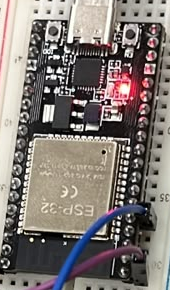 | Es el "cerebro" del proyecto. Lee los sensores y se conecta al Wi-Fi. |
| **Protoboard** | 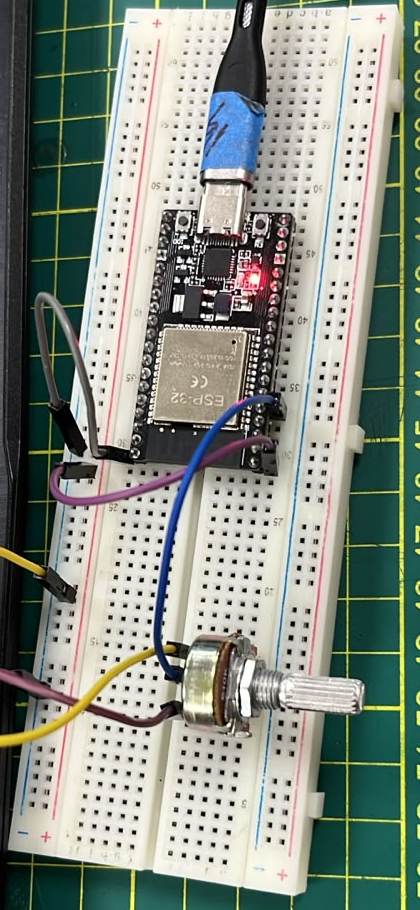 | Tablero para armar el circuito sin soldar. |
| **Potenciómetro** | 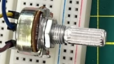 | Perilla que cambia su resistencia al girarla. Nos da un valor variable para leer. |
| **Cables jumper** | 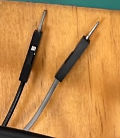 | Unen los componentes con la placa. |
| **Cable USB** | 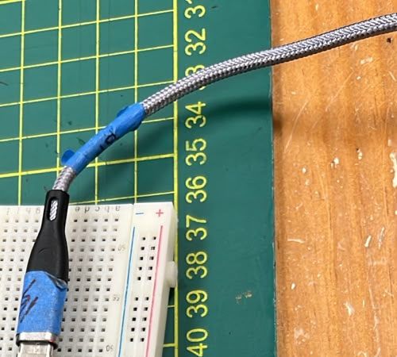 | Alimenta la placa y la conecta a la laptop para subir el código. |
| **LDR (fotorresistencia) + resistencia** | 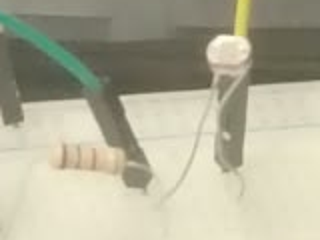 | Sensor que cambia según la cantidad de luz. |
| **LED + resistencia** | 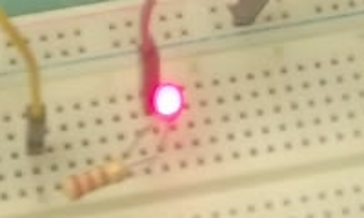 | Foco pequeño que usamos para encender y apagar desde la nube. |
| **Laptop con Arduino IDE** | – | Para escribir el código, subirlo a la placa y ver los resultados. |

---

## Ejemplo 01: Lectura de un potenciómetro con ESP32

### ¿Qué se hizo?
Conectamos un potenciómetro al ESP32 usando la protoboard y cables, y programamos la placa para que leyera el valor de la perilla y lo mostrara en la pantalla de la computadora (el **Monitor Serie**).

### ¿Cómo se hizo?
- Un extremo del potenciómetro va a **3.3 V**, el otro a **GND** (tierra) y el pin del medio al pin **34** del ESP32, que es el que lee la señal.
- Se escribió un código muy sencillo que lee el pin 34 cada medio segundo y lo imprime.

```cpp
int potPin = 34;  // Pin donde está conectado el potenciómetro

void setup() {
  Serial.begin(115200);  // Inicializar el monitor serie
}

void loop() {
  int valor = analogRead(potPin);  // Leer valor del potenciómetro
  Serial.println(valor);           // Mostrar valor en el monitor serie
  delay(500);                      // Esperar medio segundo
}
```

### Evidencias

**Código y resultado en el Monitor Serie:**

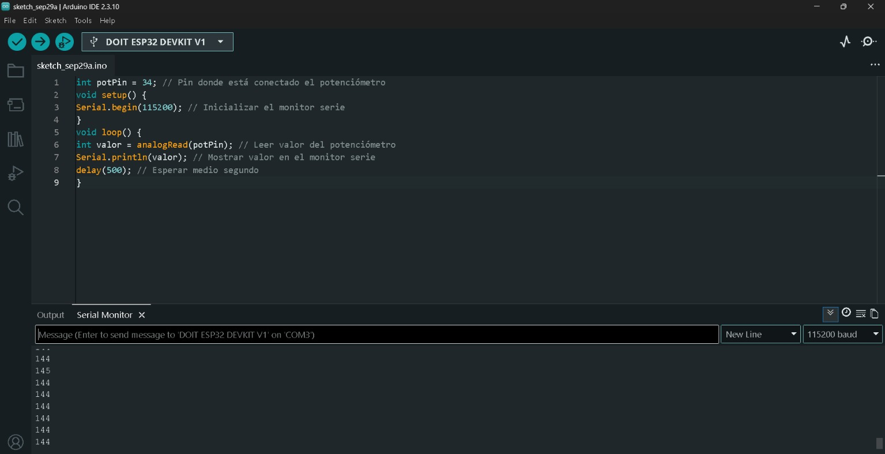

**Circuito armado:**

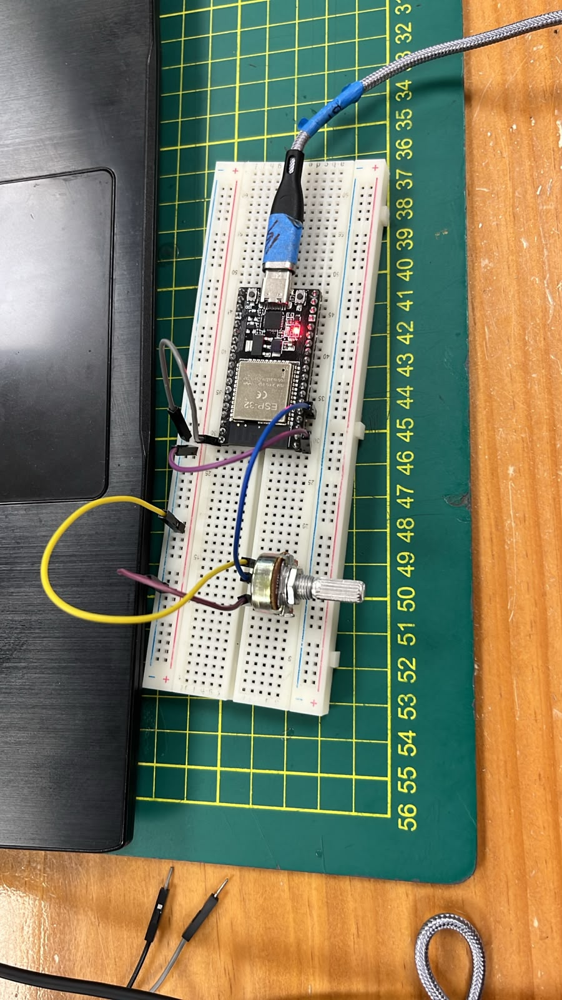

### Interpretación
El ESP32 convierte el voltaje de la perilla en un número entre **0 y 4095**. Con la perilla en un extremo vimos valores cercanos a **0** y en el otro extremo llegamos a **4095** (el máximo). En la captura se ven valores estables alrededor de 144, y en otra prueba de 4095. Esto confirma que, al girar la perilla, el número cambia, es decir, la placa está "sintiendo" el cambio.

---

## Actividad 1: Promedio y conversión a voltaje

### ¿Qué se hizo?
Mejoramos el código anterior con dos cambios:
1. **Promediar** varias lecturas, para que el número sea más estable.
2. **Convertir** el número (0 a 4095) a **voltios** (0 a 3.3 V), que es más fácil de entender.

### ¿Cómo se hizo?
- Se suman 10 lecturas y se divide entre 10 para obtener el promedio.
- Para pasar a voltios se usa una regla de tres: `voltios = promedio × (3.3 / 4095)`.

```cpp
const int potPin = 34;  // Pin ADC del potenciómetro

void setup() {
  Serial.begin(115200);
}

void loop() {
  int lectura = analogRead(potPin);

  // Guardamos una variable para obtener el promedio
  int suma = 0;
  for (int i = 1; i < 11; i++) {
    suma = suma + lectura;
  }

  float promedio = suma / 10;

  float voltios = promedio * (3.3 / 4095);
  Serial.print("Promedio Lectura ADC: ");
  Serial.print(promedio);

  Serial.print(" | Voltios: ");
  Serial.print(voltios, 2);
  Serial.println(" V");

  delay(1000);
}
```

> **Mejora opcional:** en este código la lectura se toma una sola vez antes del ciclo, así que las 10 sumas usan el mismo valor. Para que el promedio sea realmente de 10 lecturas distintas, basta con mover `analogRead` dentro del ciclo:
>
> ```cpp
> int suma = 0;
> for (int i = 0; i < 10; i++) {
>   suma = suma + analogRead(potPin);
>   delay(5);
> }
> float promedio = suma / 10.0;
> ```

### Evidencia

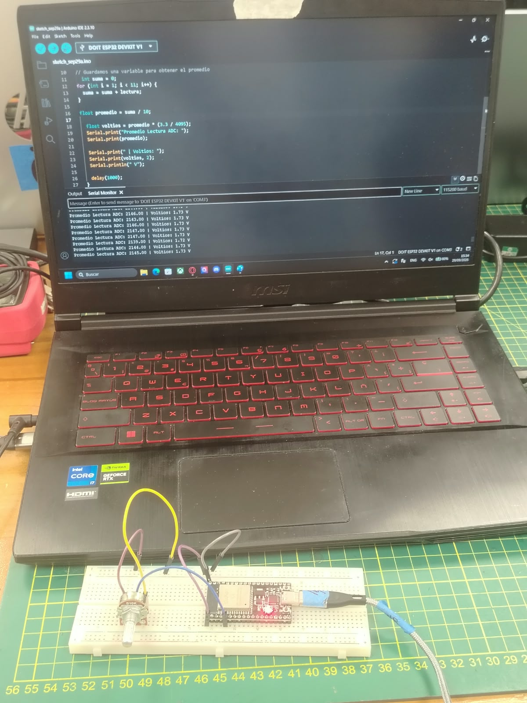

### Interpretación
Ahora el Monitor Serie muestra el promedio y el voltaje al mismo tiempo. Por ejemplo, un promedio cercano a **2146** equivale a **1.73 V**, que es más o menos la mitad del rango (la perilla estaba hacia el centro). Así es más fácil entender qué está midiendo la placa.

---

## Actividad 2: Buscar redes Wi-Fi y conectarse

### ¿Qué se hizo?
Primero usamos el ESP32 como "escáner" para ver qué redes Wi-Fi había cerca. Luego creamos una red con el **hotspot del celular** y conectamos el ESP32 a ella, mostrando en pantalla la **dirección IP** que recibió.

### ¿Cómo se hizo?
**Paso 1: Escanear redes.** Con la librería `WiFi.h` el ESP32 busca redes y muestra su nombre y la intensidad de la señal.

```cpp
#include "WiFi.h"

void setup() {
  Serial.begin(115200);
  WiFi.mode(WIFI_STA);   // Modo "estación" (cliente)
  WiFi.disconnect();     // Se desconecta de cualquier red previa
  delay(100);
  Serial.println("Setup done");
}

void loop() {
  Serial.println("scan start");
  int n = WiFi.scanNetworks();   // Busca redes cercanas
  Serial.println("scan done");

  if (n == 0) {
    Serial.println("no networks found");
  } else {
    Serial.print(n);
    Serial.println(" networks found");
    for (int i = 0; i < n; ++i) {
      Serial.print(i + 1);
      Serial.print(": ");
      Serial.print(WiFi.SSID(i));      // Nombre de la red
      Serial.print(" (");
      Serial.print(WiFi.RSSI(i));      // Intensidad de la señal
      Serial.print(")");
      Serial.println((WiFi.encryptionType(i) == WIFI_AUTH_OPEN) ? " " : "*");
      delay(10);
    }
  }
  Serial.println("");
  delay(5000);   // Espera 5 segundos y vuelve a escanear
}
```

**Paso 2: Conectarse al hotspot del celular y mostrar la IP.**

```cpp
#include <WiFi.h>

const char* ssid = "NOMBRE_DE_TU_HOTSPOT";   // Nombre de la red del celular
const char* password = "TU_CONTRASEÑA";      // Contraseña del hotspot

void setup() {
  Serial.begin(115200);
  WiFi.mode(WIFI_STA);
  WiFi.begin(ssid, password);

  Serial.print("Conectando");
  while (WiFi.status() != WL_CONNECTED) {
    delay(500);
    Serial.print(".");
  }

  Serial.println();
  Serial.println("WiFi conectado correctamente");
  Serial.print("Direccion IP asignada: ");
  Serial.println(WiFi.localIP());   // Muestra la IP que nos dio la red
}

void loop() {
}
```

### Evidencias

**Escaneo de redes (se encontraron 27):**

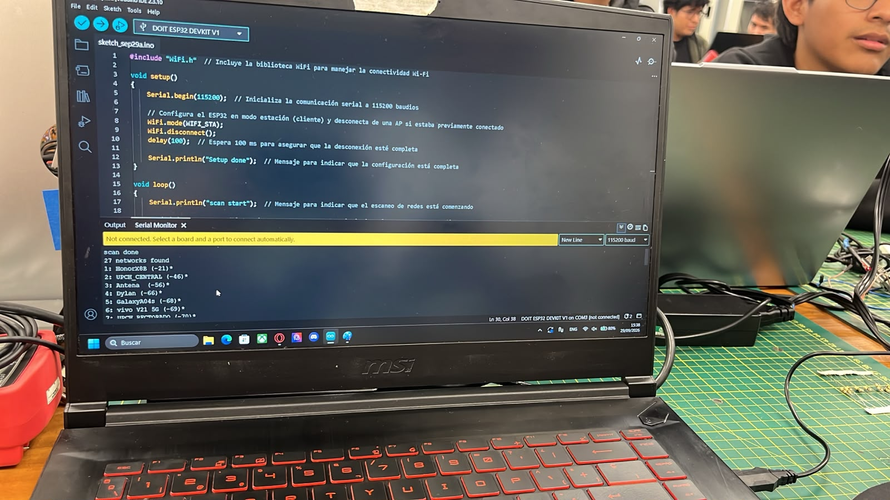

**Conexión exitosa y dirección IP:**

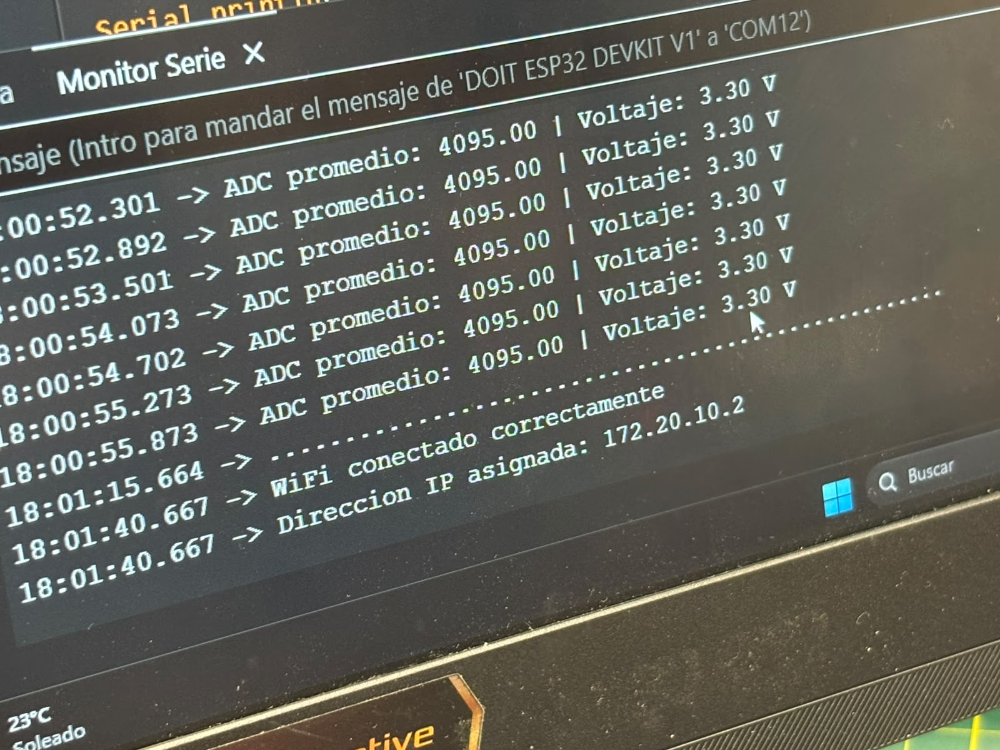

### Interpretación
- En el escaneo el ESP32 encontró **27 redes**. Mientras más cercano a 0 es el número entre paréntesis, más fuerte es la señal. La red del celular (HonorX8B) apareció con la mejor señal (-21) porque estaba junto a la placa.
- En la segunda captura, los puntos (`....`) muestran que estaba intentando conectarse. Cuando lo logró, mostró el mensaje **"WiFi conectado correctamente"** y la IP **172.20.10.2**, que es como el "número de casa" del ESP32 dentro de esa red.

---

## Actividad 3: Enviar datos del potenciómetro a la nube

### ¿Qué se hizo?
Enviamos el valor del potenciómetro a **Arduino Cloud** y lo mostramos en un **dashboard** (panel) con un medidor tipo reloj (gauge), para ver los cambios casi en tiempo real desde el navegador.

### ¿Cómo se hizo?
1. En Arduino Cloud se creó un **dispositivo** (el ESP32) y una **"Thing"** con una variable llamada `voltaje` (tipo decimal, solo lectura).
2. Arduino Cloud genera automáticamente un archivo `thingProperties.h` con la red Wi-Fi y las claves del dispositivo.
3. En el código principal se lee el potenciómetro, se calcula el voltaje y se guarda en la variable. Arduino Cloud se encarga de enviarla.
4. Se creó un dashboard con un widget **Gauge** (de 0 a 3.3 V) enlazado a la variable.

```cpp
#include "thingProperties.h"   // Archivo generado por Arduino Cloud

const int potPin = 34;

void setup() {
  Serial.begin(115200);
  delay(1500);

  initProperties();                                         // Carga la configuración de la nube
  ArduinoCloud.begin(ArduinoIoTPreferredConnection);        // Conecta a Arduino Cloud
  setDebugMessageLevel(2);
  ArduinoCloud.printDebugInfo();
}

void loop() {
  ArduinoCloud.update();   // Mantiene la conexión y envía los datos

  // Promedio de 10 lecturas
  long suma = 0;
  for (int i = 0; i < 10; i++) {
    suma += analogRead(potPin);
    delay(5);
  }
  float promedio = suma / 10.0;

  voltaje = promedio * (3.3 / 4095.0);   // Variable que se envía a la nube

  Serial.print("ADC promedio: ");
  Serial.print(promedio, 1);
  Serial.print(" | Voltaje: ");
  Serial.print(voltaje, 3);
  Serial.println(" V");

  delay(500);
}
```

Variable creada en la nube (dentro de `thingProperties.h`):

```cpp
float voltaje;   // Se agrega con: ArduinoCloud.addProperty(voltaje, READ, 1 * SECONDS, NULL);
```

### Evidencia

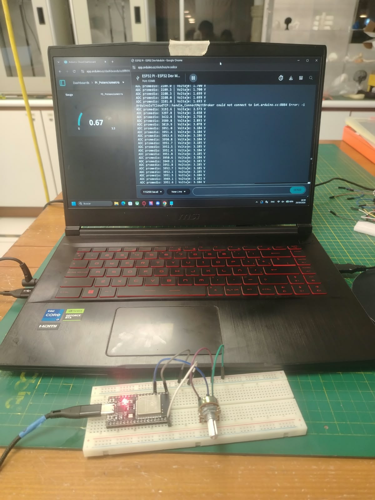

### Interpretación
A la izquierda está el dashboard de Arduino Cloud con el medidor del potenciómetro (`PI_Potenciometro`), y a la derecha el Monitor Serie con los valores que envía la placa (por ejemplo, 3951 de ADC equivale a unos 3.18 V). Se ve que los valores cambian cuando se gira la perilla: pasaron de ~1.70 V a ~3.18 V. En esa captura también aparece un mensaje de error momentáneo de conexión con el servidor de Arduino (`could not connect`), algo normal cuando el Wi-Fi tarda en reconectar, y luego las lecturas continúan.

---

## Actividad 4: Sensor de luz (LDR) y gráficos en la nube

### ¿Qué se hizo?
Cambiamos el potenciómetro por un sensor de luz **LDR**. Medimos la luminosidad del ambiente y enviamos el dato a Arduino Cloud, donde se ve en un **medidor** y en un **gráfico** que se actualiza con el tiempo.

### ¿Cómo se hizo?
- El LDR se conecta con una **resistencia** formando un "divisor de voltaje": un extremo a 3.3 V, el otro a la resistencia que va a GND, y el punto de unión al pin del ESP32. Así la placa puede leer cuánto cambia el voltaje según la luz.
- En Arduino Cloud se creó una variable `luminosidad` (entero, solo lectura) y se agregaron un widget **Gauge** y un **Chart** (gráfico de línea).

```cpp
#include "thingProperties.h"   // Archivo generado por Arduino Cloud

const int ldrPin = 34;   // Pin donde está conectado el divisor del LDR (ajústalo al que usaste)

void setup() {
  Serial.begin(115200);
  delay(1500);

  initProperties();
  ArduinoCloud.begin(ArduinoIoTPreferredConnection);
  setDebugMessageLevel(2);
  ArduinoCloud.printDebugInfo();
}

void loop() {
  ArduinoCloud.update();

  // Promedio de 10 lecturas para que el dato sea más estable
  long suma = 0;
  for (int i = 0; i < 10; i++) {
    suma += analogRead(ldrPin);
    delay(5);
  }
  luminosidad = suma / 10;   // Variable que se envía a la nube

  Serial.print("Luminosidad ADC promedio: ");
  Serial.println(luminosidad);

  delay(500);
}
```

Variable creada en la nube:

```cpp
int luminosidad;   // ArduinoCloud.addProperty(luminosidad, READ, 1 * SECONDS, NULL);
```

### Evidencia

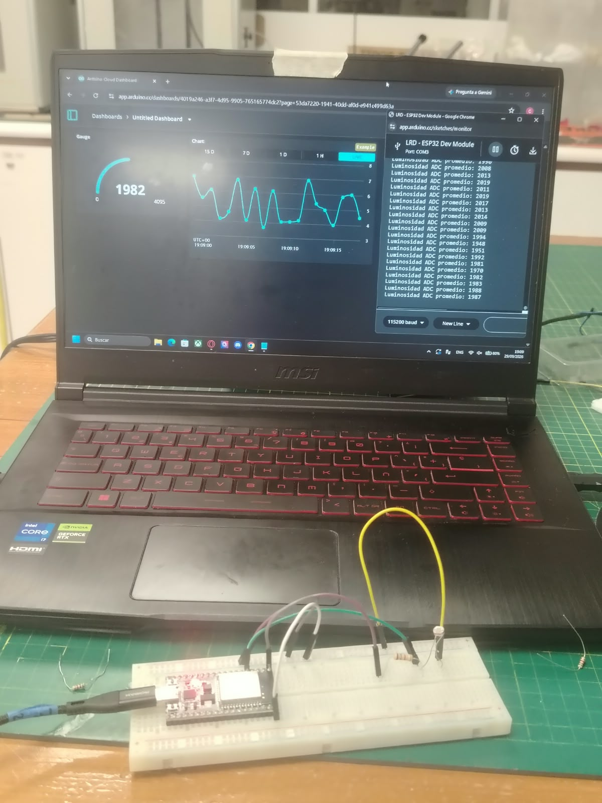

### Interpretación
El medidor marca **1982** (de un máximo de 4095), lo que indica una luz ambiental intermedia. El gráfico muestra cómo sube y baja el valor con el tiempo, y en el Monitor Serie se ven los mismos datos ("Luminosidad ADC promedio: 2008, 2013, 2019..."). Al tapar o iluminar el sensor, el valor cambia, lo que demuestra que la nube recibe en tiempo real lo que mide el sensor.

---

## Actividad 5: Encender y apagar un LED desde la nube

### ¿Qué se hizo?
Conectamos un LED al ESP32 y lo controlamos desde un **interruptor (Switch)** en el dashboard de Arduino Cloud. Esta vez la información viaja al revés: **de la nube hacia la placa**.

### ¿Cómo se hizo?
- El LED se conecta con una **resistencia** (para protegerlo) a un pin digital del ESP32 y a GND.
- En Arduino Cloud se creó una variable `led` (tipo Booleano, lectura y escritura) y se enlazó a un widget **Switch**.
- Cuando el interruptor cambia, Arduino Cloud avisa a la placa, que enciende o apaga el LED y escribe el estado en el Monitor Serie.

```cpp
#include "thingProperties.h"   // Archivo generado por Arduino Cloud

const int ledPin = 4;   // Pin del LED (ajústalo al que usaste)

void setup() {
  Serial.begin(115200);
  delay(1500);

  pinMode(ledPin, OUTPUT);   // El pin del LED funciona como salida

  initProperties();
  ArduinoCloud.begin(ArduinoIoTPreferredConnection);
  setDebugMessageLevel(2);
  ArduinoCloud.printDebugInfo();
}

void loop() {
  ArduinoCloud.update();
}

// Esta función se ejecuta sola cada vez que cambias el Switch en la nube
void onLedChange() {
  if (led) {
    digitalWrite(ledPin, HIGH);          // Enciende el LED
    Serial.println("LED ENCENDIDO");
  } else {
    digitalWrite(ledPin, LOW);           // Apaga el LED
    Serial.println("LED APAGADO");
  }
}
```

Variable creada en la nube:

```cpp
bool led;   // ArduinoCloud.addProperty(led, READ_WRITE, ON_CHANGE, onLedChange);
```

### Evidencias

**Switch en ON y LED encendido:**

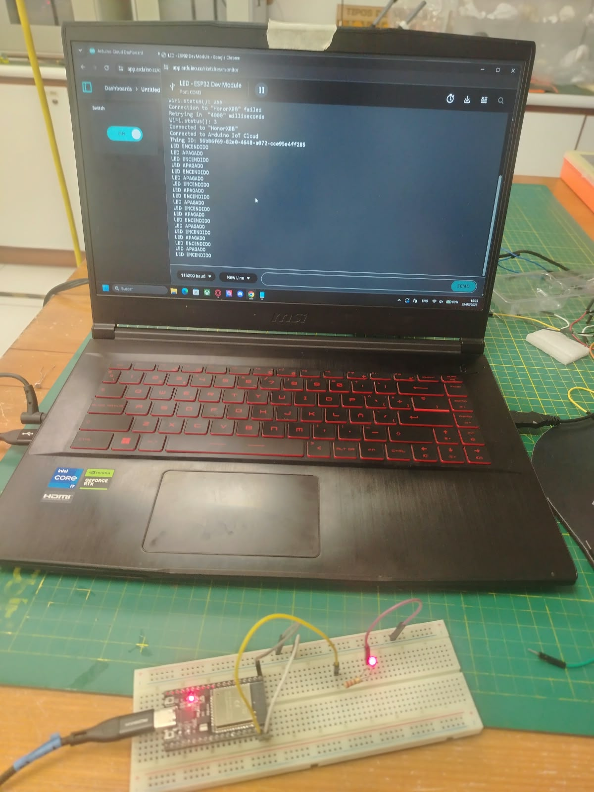

**Switch en OFF y LED apagado:**

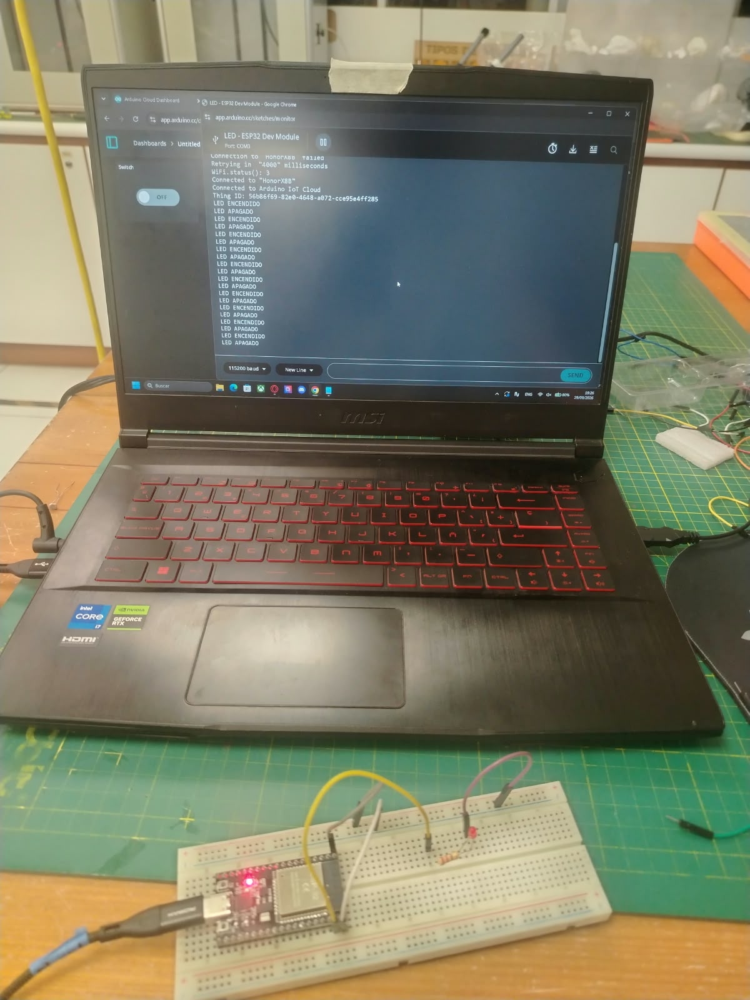

### Interpretación
Al poner el interruptor en **ON** en el dashboard, el LED rojo se enciende en la protoboard y el Monitor Serie muestra **"LED ENCENDIDO"**. Al ponerlo en **OFF**, el LED se apaga y aparece **"LED APAGADO"**. Esto demuestra que podemos **controlar un dispositivo físico a distancia** desde internet. También se ve que la placa se conectó correctamente a la red del celular y a Arduino Cloud.

---

## Conclusiones

- Aprendimos a **leer datos** del mundo real (perilla y luz) con el ESP32 y a convertirlos en valores comprensibles, como el voltaje.
- Logramos **conectar la placa a internet** mediante Wi-Fi y verificar su dirección IP.
- Con **Arduino Cloud** pudimos **ver datos en tiempo real** (medidores y gráficos) y también **controlar un LED desde la nube**.
- En conjunto, estas prácticas muestran el ciclo básico de un sistema IoT: **medir → enviar a la nube → visualizar → controlar**.
