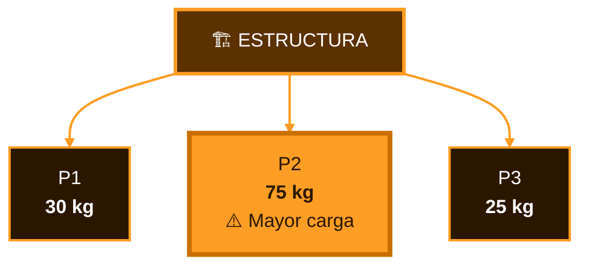
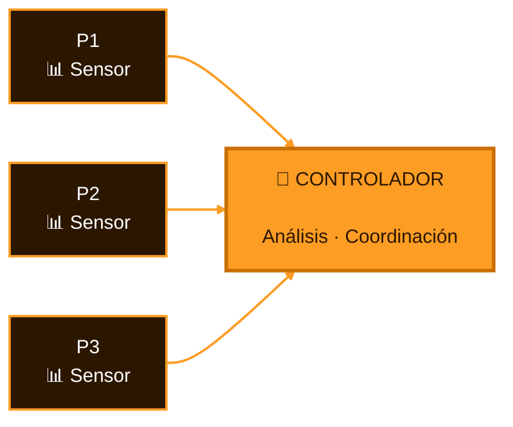
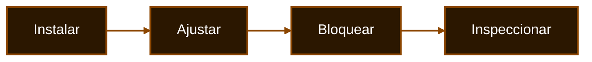
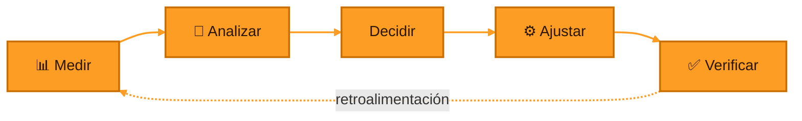
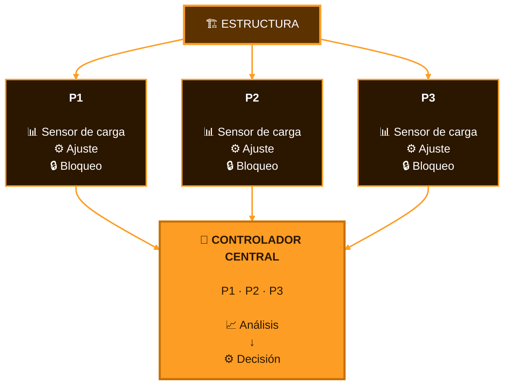
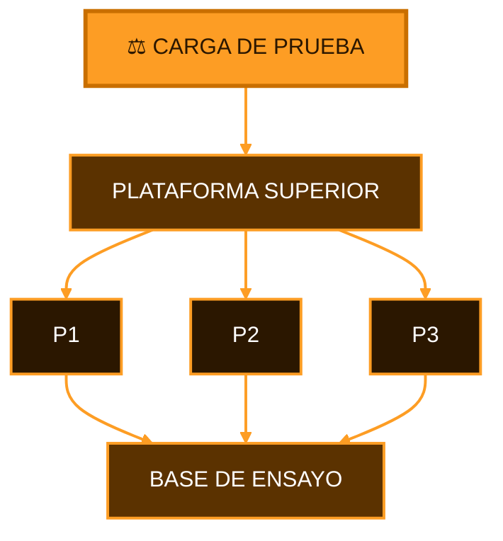

  

  

<h3 align="center">
  Universidad Peruana Cayetano Heredia
</h3>

  <strong>Ingeniería Industrial + Ingeniería Informática</strong>

 

  
  

  
  

  
  
  
  

 

### 🏗️ INGENIERÍA · AUTOMATIZACIÓN · CONTROL · RESILIENCIA

**Una propuesta para transformar un sistema de apuntalamiento convencional  
en un sistema capaz de medir, analizar y responder.**

---

  

---

# 📑 Contenido

- [🌐 Sobre Nosotros](#-sobre-nosotros)
- [📸 Fotografía del Equipo](#-fotografía-del-equipo)
- [👥 Nuestro Equipo](#-nuestro-equipo)
- [🏗️ El Proyecto](#️-el-proyecto)
- [⚠️ El Problema](#️-el-problema)
- [💡 Nuestra Propuesta](#-nuestra-propuesta)
- [✨ ¿Dónde está la innovación?](#-dónde-está-la-innovación)
- [⚙️ Concepto del Sistema](#️-concepto-del-sistema)
- [🎯 ODS 11](#-ods-11)
- [🧪 Prototipo](#-prototipo)
- [🚀 Visión del Proyecto](#-visión-del-proyecto)

---

# 🌐 Sobre Nosotros

Somos el **Equipo 03** del curso **Proyecto Integrador 2026-2** de la **Universidad Peruana Cayetano Heredia**.

Nuestro equipo reúne estudiantes de **Ingeniería Industrial e Ingeniería Informática**, integrando distintas áreas de ingeniería para desarrollar una solución tecnológica aplicada a un problema real.

### ⚙️ Mecánica &nbsp;&nbsp;•&nbsp;&nbsp; 🔌 Electrónica &nbsp;&nbsp;•&nbsp;&nbsp; 💻 Programación &nbsp;&nbsp;•&nbsp;&nbsp; 🧠 Control

 

Nuestro proyecto nace de una pregunta:

## ¿Cómo podemos saber si varios puntales realmente están compartiendo correctamente una carga?

---

# 📸 Fotografía del Equipo

  

  <em>Equipo 03 · Proyecto Integrador 2026-2</em>

---

# 👥 Nuestro Equipo

| Foto | Integrante | Rol |
|:---:|---|---|
|  | **César Alejandro Aarón Apcho Meneses** | 👑 Líder del equipo |
|  | **Paola Andrea Centeno Bazan** | 🔎 Investigación |
|  | **Rodrigo Sebastián Asmat Mendoza** | 🎨 Diseño |
|  | **Juan Vidal Berrocal Ccapcha** | 💻 Programación / Modelado |

---

# 🏗️ El Proyecto

## Sistema Modular de Apuntalamiento Inteligente

### Para estabilización temporal de estructuras dañadas

 

 

Nuestra propuesta consiste en un sistema formado por **tres puntales capaces de trabajar de manera coordinada**.

Cada uno podrá conocer la carga que soporta y transmitir esa información a un controlador.

La idea es que el sistema pueda **identificar diferencias importantes entre los tres apoyos** y responder mediante ajustes controlados.

### 📊 Sensar &nbsp;→&nbsp; 🧠 Analizar &nbsp;→&nbsp; ⚙️ Ajustar &nbsp;→&nbsp; ✅ Verificar

---

# ⚠️ El Problema

Los puntales son utilizados como elementos de soporte temporal durante trabajos de reparación, construcción o estabilización.

Sin embargo, instalar varios puntales no garantiza automáticamente que todos estén soportando la estructura de la misma manera.

Una variación en la estructura puede provocar que:

### ⚠️ Los tres puntales están presentes...

### pero uno podría estar soportando una carga considerablemente mayor.

La dificultad es que este comportamiento **no siempre puede determinarse visualmente**.

---

# 💡 Nuestra Propuesta

En lugar de utilizar tres puntales completamente independientes, proponemos convertirlos en un **sistema coordinado**.

Cada módulo incorpora conceptualmente:

  
  
  
  

El controlador recibe información proveniente de los tres puntales:

y utiliza estas mediciones para conocer el estado general del sistema.

---

# ✨ ¿Dónde está la innovación?

### Apuntalamiento convencional

### Nuestra propuesta

 

La innovación no se encuentra únicamente en el puntal.

Se encuentra en **hacer que tres elementos de soporte trabajen como un sistema**.

Nuestra propuesta integra:

- 📊 Información de carga.
- 🧠 Procesamiento de datos.
- ⚙️ Ajuste controlado.
- 🔒 Seguridad mecánica.
- 🔗 Coordinación entre los tres puntales.

> **Pasamos de elementos pasivos e independientes a módulos instrumentados capaces de compartir información.**

---

# ⚙️ Concepto del Sistema

  

### Tres puntales.

### Tres mediciones.

### Una estrategia coordinada.

---

  

---

# 🎯 ODS 11

## 🏙️ Objetivo de Desarrollo Sostenible 11

### Ciudades y Comunidades Sostenibles

 

### Reducción del impacto de los desastres

 

El proyecto se vincula con esta meta al explorar una tecnología orientada a la **estabilización temporal de estructuras dañadas**.

El sistema busca aportar herramientas tecnológicas aplicables a escenarios relacionados con:

- 🏚️ Daños estructurales.
- 🌎 Situaciones posteriores a desastres.
- 🏗️ Estabilización temporal.
- 🔧 Reparación y recuperación de infraestructura.

> **Tecnología aplicada a estructuras más seguras y resilientes.**

---

# 🧪 Prototipo

## Del concepto a una demostración funcional

El proyecto será representado mediante un **prototipo académico a escala con tres módulos de apuntalamiento**.

Su objetivo será demostrar de forma experimental el principio principal del proyecto:

### detectar diferencias de carga y observar cómo el sistema puede responder ante ellas.

 

  

---

# 🚀 Visión del Proyecto

### Hoy

**Tres puntales instrumentados en un prototipo académico.**

### ↓

### Mañana

**Sistemas de soporte temporal capaces de proporcionar información sobre su propio estado de carga.**

 

El objetivo del proyecto no es reemplazar la evaluación realizada por profesionales especializados.

La propuesta busca explorar cómo la **instrumentación, automatización y control** pueden complementar sistemas utilizados en procesos de estabilización estructural.

---

# SISTEMA MODULAR DE APUNTALAMIENTO INTELIGENTE

### P1 + P2 + P3

 

&nbsp;

&nbsp;

&nbsp;

 
 

  

 

**Equipo 03 · Proyecto Integrador 2026-2**

**Universidad Peruana Cayetano Heredia**

 

  

