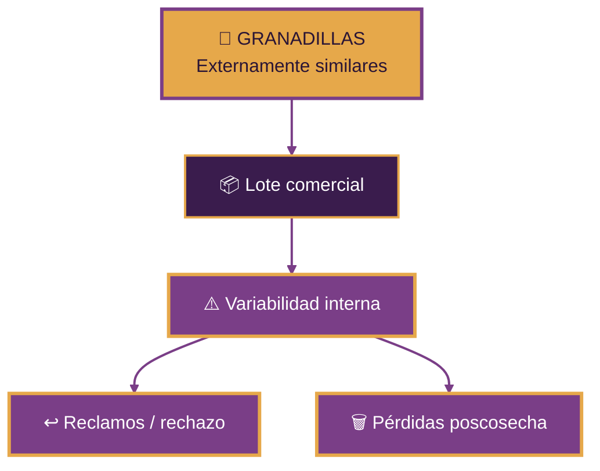
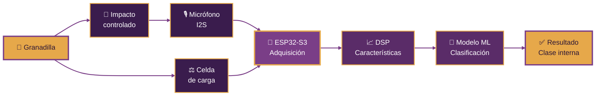
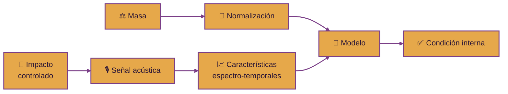
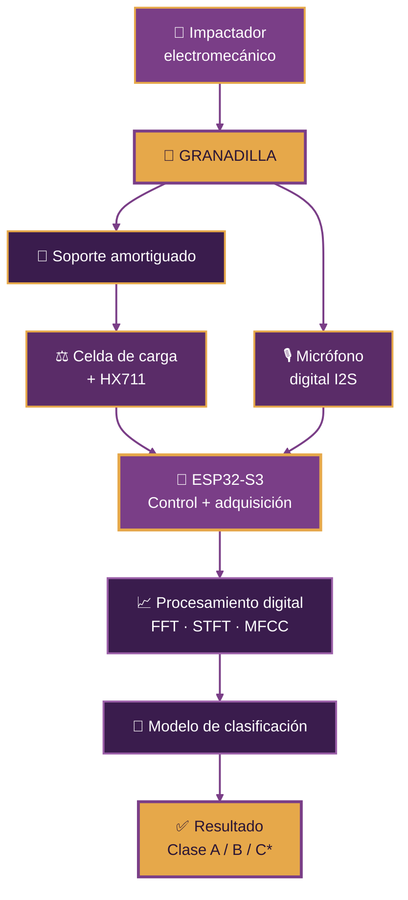
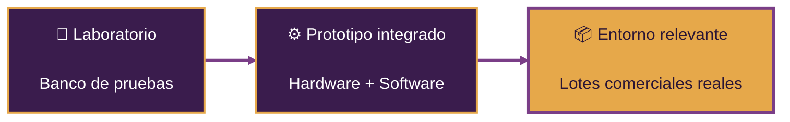
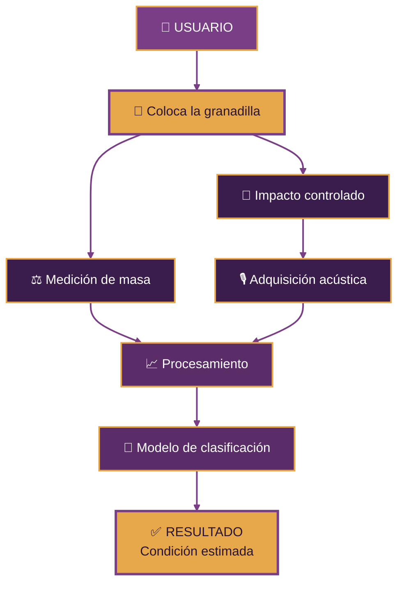

  

  

<h3 align="center">
  Universidad Peruana Cayetano Heredia
</h3>

  <strong>Ingeniería Industrial + Ingeniería Informática</strong>

 

  
  

  
  

  
  
  
  

 

### 🍈 MECATRÓNICA · ACÚSTICA · PROCESAMIENTO DE SEÑALES · MACHINE LEARNING

**Una propuesta para evaluar la condición interna de la granadilla  
sin cortarla, perforarla ni dañarla.**

---

  

---

# 📑 Contenido

- [🌐 Sobre Nosotros](#-sobre-nosotros)
- [📸 Fotografía del Equipo](#-fotografía-del-equipo)
- [👥 Nuestro Equipo](#-nuestro-equipo)
- [🍈 El Proyecto](#-el-proyecto)
- [⚠️ El Problema](#️-el-problema)
- [💡 Nuestra Propuesta](#-nuestra-propuesta)
- [✨ ¿Dónde está la innovación?](#-dónde-está-la-innovación)
- [⚙️ Arquitectura del Sistema](#️-arquitectura-del-sistema)
- [🧠 Software y Procesamiento](#-software-y-procesamiento)
- [🧪 Metodología Experimental](#-metodología-experimental)
- [🎯 ODS 12](#-ods-12)
- [🚀 Objetivo TRL 6](#-objetivo-trl-6)
- [🧩 Prototipo](#-prototipo)

---

# 🌐 Sobre Nosotros

Somos el **Equipo 03** del curso **Proyecto Integrador 2026-2** de la **Universidad Peruana Cayetano Heredia**.

Nuestro equipo reúne estudiantes de **Ingeniería Industrial e Ingeniería Informática**, integrando diseño mecánico, electrónica, programación, análisis de datos y validación experimental para desarrollar una solución tecnológica aplicada a la cadena poscosecha de la granadilla.

### ⚙️ Mecánica &nbsp;&nbsp;•&nbsp;&nbsp; 🔌 Electrónica &nbsp;&nbsp;•&nbsp;&nbsp; 🎙️ Acústica &nbsp;&nbsp;•&nbsp;&nbsp; 💻 Software &nbsp;&nbsp;•&nbsp;&nbsp; 🧠 Machine Learning

 

Nuestro proyecto nace de una pregunta:

## ¿Podemos estimar la condición interna de una granadilla sin abrirla ni dañarla?

---

# 📸 Fotografía del Equipo

  

  <em>Equipo 03 · Proyecto Integrador 2026-2</em>

---

# 👥 Nuestro Equipo

| Foto | Integrante | Rol |
|:---:|---|---|
|  | **César Alejandro Aarón Apcho Meneses** | 👑 Líder del equipo |
|  | **Paola Andrea Centeno Bazan** | 🔎 Investigación y validación |
|  | **Rodrigo Sebastián Asmat Mendoza** | 🎨 Diseño mecánico / prototipo |
|  | **Juan Vidal Berrocal Ccapcha** | 💻 Programación / modelado |

---

# 🍈 El Proyecto

## Sistema Mecatrónico No Destructivo para la Evaluación de Calidad Interna de Granadilla

### Mediante respuesta acústica, medición de masa y aprendizaje automático

 

 

La propuesta consiste en aplicar un **impacto mecánico suave, controlado y repetible** sobre una granadilla. La respuesta acústica generada por el fruto es registrada mediante un micrófono y analizada junto con su masa.

El sistema procesa las señales obtenidas para identificar patrones que puedan estar relacionados con diferencias en la **condición interna del fruto**.

### 🔨 Impactar &nbsp;→&nbsp; 🎙️ Registrar &nbsp;→&nbsp; 📈 Procesar &nbsp;→&nbsp; 🧠 Clasificar

> El objetivo no es prometer una medición directa y exacta de °Brix o pH desde el inicio. Estas variables serán utilizadas como referencia experimental para determinar qué características internas pueden inferirse de manera confiable.

---

# ⚠️ El Problema

La clasificación comercial de la granadilla puede apoyarse en características externas como:

- Color.
- Tamaño.
- Peso.
- Apariencia.
- Daños superficiales.

Sin embargo, una fruta visualmente aceptable no necesariamente presenta la misma **condición interna** que otra de aspecto similar.

Esto puede generar:

### ⚠️ El aspecto exterior no siempre permite conocer la condición interna.

El proyecto busca agregar una **etapa de evaluación no destructiva** que ayude a disminuir la incertidumbre durante la clasificación poscosecha.

---

# 💡 Nuestra Propuesta

El sistema integrará cuatro funciones principales:

  
  
  
  

El flujo conceptual será:

---

# ✨ ¿Dónde está la innovación?

La evaluación acústica de frutas **no es un concepto completamente nuevo**. Por eso, la innovación del proyecto no se plantea como simplemente:

> “Golpear una fruta, grabar el sonido y usar inteligencia artificial”.

Nuestro enfoque busca desarrollar una metodología **específica para la granadilla**, considerando su geometría, masa, estructura de cáscara y distribución interna de pulpa y semillas.

### Enfoque genérico

### Nuestra línea de investigación

La diferenciación potencial puede emerger de la combinación de:

- 🔨 Intensidad de impacto controlada.
- 📍 Posición de impacto definida.
- 🎙️ Respuesta acústica específica de la granadilla.
- ⚖️ Compensación o normalización por masa.
- 📉 Análisis del decaimiento acústico.
- 📊 Relaciones entre múltiples frecuencias resonantes.
- 🧠 Características espectrales y temporales.
- 🧪 Procedimiento de calibración y validación específico para el fruto.

> **La posible innovación debe surgir de los resultados experimentales y no de añadir componentes sin justificación.**

---

# ⚙️ Arquitectura del Sistema

> \* Las clases finales serán definidas a partir de la experimentación y de los criterios de calidad que puedan validarse.

### Hardware base

| Componente | Función |
|---|---|
| **ESP32-S3** | Control del sistema y adquisición de datos |
| **Micrófono digital I2S** | Registro de la respuesta acústica |
| **Impactador electromecánico** | Generar impactos suaves y repetibles |
| **MOSFET / Driver** | Accionamiento del impactador |
| **Celda de carga** | Medición de masa |
| **HX711** | Conversión y lectura de la celda de carga |
| **Soporte amortiguado** | Posicionamiento del fruto y reducción de vibraciones externas |
| **Fuente de alimentación** | Alimentación del conjunto |
| **PC / Laptop** | Desarrollo, entrenamiento y análisis experimental |

---

# 🧠 Software y Procesamiento

Cada impacto produce una señal temporal:

$$
x(t)
$$

A partir de ella se evaluarán características acústicas y espectrales como:

- Frecuencia dominante.
- Frecuencias resonantes.
- Amplitud.
- Energía.
- RMS.
- Zero-Crossing Rate.
- Spectral Centroid.
- Spectral Bandwidth.
- Spectral Rolloff.
- Tiempo de decaimiento.
- FFT.
- STFT.
- MFCC.

El modelo podrá expresarse conceptualmente como:

$$
\hat{y}=f(\text{características acústicas},\,\text{masa})
$$

donde:

- $\hat{y}$ = condición o clase estimada.
- Las características acústicas provienen del impacto registrado.
- La masa funciona como variable auxiliar de compensación.

Durante la etapa experimental se compararán modelos adecuados para datasets pequeños o medianos, como:

- Regresión logística.
- SVM.
- Random Forest.
- Gradient Boosting / XGBoost.
- k-NN.

La selección final dependerá del desempeño obtenido con datos reales.

---

# 🧪 Metodología Experimental

El experimento principal permitirá relacionar la respuesta acústica con mediciones reales del interior de cada fruto.

Después del registro no destructivo, una parte de las muestras será abierta para obtener el **ground truth**.

Entre las variables candidatas se evaluarán:

- °Brix.
- pH / acidez.
- Masa de pulpa.
- Relación pulpa / fruto.
- Condición visual interna.
- Estado de madurez.
- Otras variables que puedan justificarse experimentalmente.

### Hipótesis de trabajo

> **La respuesta acústica producida por un impacto mecánico controlado sobre una granadilla presenta características espectrales y temporales correlacionadas con variables de su condición interna, permitiendo desarrollar un modelo no destructivo de clasificación de calidad.**

---

# 🎯 ODS 12

## ♻️ Objetivo de Desarrollo Sostenible 12

### Producción y Consumo Responsables

 

### Reducción de pérdidas de alimentos en las cadenas de producción y suministro

 

El proyecto se vincula principalmente con la **meta 12.3**, al desarrollar una herramienta orientada a mejorar una decisión poscosecha:

### identificar y clasificar mejor la fruta antes de su comercialización.

La propuesta busca aportar a:

- 🍈 Mayor homogeneidad de lotes.
- 📦 Mejor clasificación del producto.
- 🔎 Evaluación no destructiva.
- ↩️ Reducción de rechazos por calidad inconsistente.
- 🗑️ Disminución potencial de pérdidas poscosecha.
- 💰 Mejor aprovechamiento comercial de la fruta.

Como ODS secundario, el proyecto también se relaciona con el **ODS 9 — Industria, Innovación e Infraestructura**, por la incorporación de tecnología a una cadena agroindustrial.

> **Tecnología para tomar mejores decisiones sobre la fruta antes de que se convierta en pérdida.**

---

# 🚀 Objetivo TRL 6

El proyecto tiene como objetivo alcanzar un **TRL 6: demostración de un prototipo en un entorno relevante**.

La estrategia de desarrollo se divide en tres etapas:

### 1. Laboratorio

Desarrollo de un banco de pruebas formado por:

**Impactador + soporte + micrófono + celda de carga + sistema de adquisición.**

### 2. Prototipo integrado

Construcción de una unidad compacta capaz de ejecutar el proceso de medición y mostrar una clasificación.

### 3. Entorno relevante

Validación utilizando **granadillas provenientes de lotes comerciales reales**, incorporando variabilidad de masa, geometría, estado y procedencia.

---

# 🧩 Prototipo

## Del impacto controlado a una clasificación no destructiva

El primer prototipo no busca ser una seleccionadora industrial completa.

Su objetivo será demostrar experimentalmente el principio central del proyecto:

### registrar una respuesta acústica repetible y utilizarla, junto con la masa, para diferenciar condiciones internas de granadilla.

 

### Fuera del alcance inicial

Para mantener el proyecto controlable y técnicamente validable, la primera versión **no incluirá**:

- Cámara RGB.
- Espectroscopía NIR.
- Raspberry Pi.
- Banda transportadora.
- Clasificación automática por mecanismos industriales.
- Motores de gran potencia.
- Medición química directa garantizada.

  
  

---

# 🎯 Objetivo General

**Diseñar y validar un sistema mecatrónico no destructivo capaz de clasificar la calidad interna de granadillas mediante el análisis de su respuesta acústica ante impactos controlados y técnicas de aprendizaje automático.**

### Objetivos específicos

1. **Caracterizar** la respuesta acústica de granadillas con diferentes condiciones internas.
2. **Diseñar** un mecanismo de impacto controlado que produzca excitaciones reproducibles sin dañar el fruto.
3. **Desarrollar** el sistema electrónico de adquisición de señales acústicas y masa.
4. **Identificar** características acústicas relevantes mediante procesamiento digital de señales.
5. **Desarrollar y validar** un algoritmo de clasificación correlacionándolo con mediciones reales obtenidas experimentalmente.
6. **Integrar hardware y software** en un prototipo funcional.
7. **Validar el sistema en un entorno relevante** utilizando granadillas provenientes de una cadena comercial real.

---

# ⚠️ Riesgos del Proyecto

### Riesgo técnico principal

Que la señal acústica no presente suficiente correlación con las variables internas seleccionadas.

Para reducir este riesgo se controlarán:

- Posición del fruto.
- Intensidad del impacto.
- Punto de impacto.
- Masa del fruto.
- Número de impactos.
- Ruido ambiental.
- Características acústicas utilizadas.
- Calidad del ground truth.

### Riesgo de innovación / patentabilidad

Que el sistema termine siendo únicamente otro dispositivo de tipo:

> **fruit tapper + microphone + machine learning**

Por ello, el proyecto buscará identificar un **fenómeno, procedimiento o combinación de características específica para la granadilla** que pueda diferenciar técnicamente la propuesta.

---

  

 

**Equipo 03 · Proyecto Integrador 2026-2**

**Universidad Peruana Cayetano Heredia**

 

  

