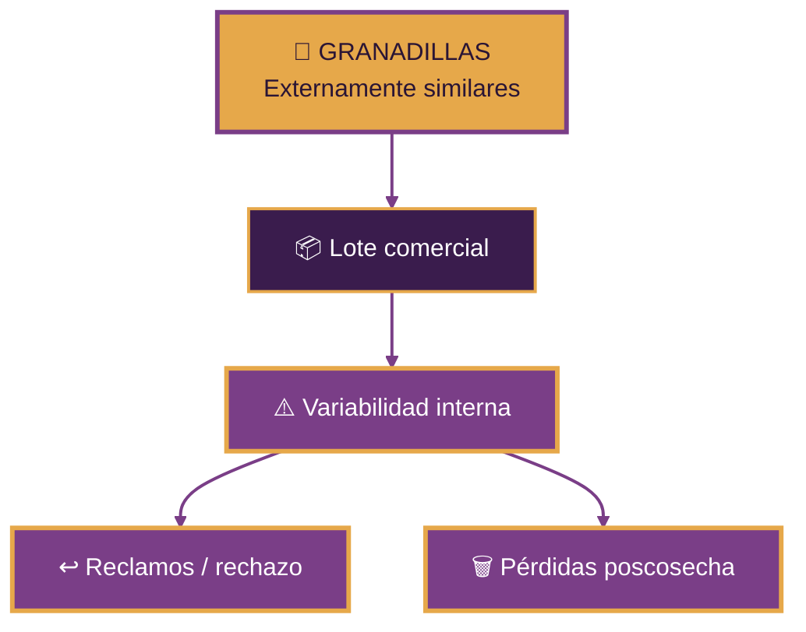

  

  

<h3 align="center">
  Universidad Peruana Cayetano Heredia
</h3>

  <strong>Ingeniería Industrial + Ingeniería Informática</strong>

 

  
  

  
  

  
  
  
  

 

### 🍈 MECATRÓNICA · ACÚSTICA · PROCESAMIENTO DE SEÑALES · MACHINE LEARNING

**Una propuesta para evaluar la condición interna de la granadilla  
sin cortarla, perforarla ni dañarla.**

---

  

---

# 📑 Contenido

- [🌐 Sobre Nosotros](#-sobre-nosotros)
- [📸 Fotografía del Equipo](#-fotografía-del-equipo)
- [👥 Nuestro Equipo](#-nuestro-equipo)
- [🍈 El Proyecto](#-el-proyecto)
- [⚠️ El Problema](#️-el-problema)
- [💡 Nuestra Propuesta](#-nuestra-propuesta)
- [✨ ¿Dónde está la innovación?](#-dónde-está-la-innovación)
- [⚙️ Arquitectura del Sistema](#️-arquitectura-del-sistema)
- [🧠 Software y Procesamiento](#-software-y-procesamiento)
- [🧪 Metodología Experimental](#-metodología-experimental)
- [🎯 ODS 12](#-ods-12)
- [🚀 Objetivo TRL 6](#-objetivo-trl-6)
- [🧩 Prototipo](#-prototipo)

---

# 🌐 Sobre Nosotros

Somos el **Equipo 03** del curso **Proyecto Integrador 2026-2** de la **Universidad Peruana Cayetano Heredia**.

Nuestro equipo reúne estudiantes de **Ingeniería Industrial e Ingeniería Informática**, integrando diseño mecánico, electrónica, programación, análisis de datos y validación experimental para desarrollar una solución tecnológica aplicada a la cadena poscosecha de la granadilla.

### ⚙️ Mecánica &nbsp;&nbsp;•&nbsp;&nbsp; 🔌 Electrónica &nbsp;&nbsp;•&nbsp;&nbsp; 🎙️ Acústica &nbsp;&nbsp;•&nbsp;&nbsp; 💻 Software &nbsp;&nbsp;•&nbsp;&nbsp; 🧠 Machine Learning

 

Nuestro proyecto nace de una pregunta:

## ¿Podemos estimar la condición interna de una granadilla sin abrirla ni dañarla?

---

# 📸 Fotografía del Equipo

  

  <em>Equipo 03 · Proyecto Integrador 2026-2</em>

---

# 👥 Nuestro Equipo

| Foto | Integrante | Rol |
|:---:|---|---|
|  | **César Alejandro Aarón Apcho Meneses** | 👑 Líder del equipo |
|  | **Paola Andrea Centeno Bazan** | 🔎 Investigación y validación |
|  | **Rodrigo Sebastián Asmat Mendoza** | 🎨 Diseño mecánico / prototipo |
|  | **Juan Vidal Berrocal Ccapcha** | 💻 Programación / modelado |

---

# 🍈 El Proyecto

## Sistema Mecatrónico No Destructivo para la Evaluación de Calidad Interna de Granadilla

### Mediante respuesta acústica, medición de masa y aprendizaje automático

 

 

La propuesta consiste en aplicar un **impacto mecánico suave, controlado y repetible** sobre una granadilla. La respuesta acústica generada por el fruto es registrada mediante un micrófono y analizada junto con su masa.

El sistema procesa las señales obtenidas para identificar patrones que puedan estar relacionados con diferencias en la **condición interna del fruto**.

### 🔨 Impactar &nbsp;→&nbsp; 🎙️ Registrar &nbsp;→&nbsp; 📈 Procesar &nbsp;→&nbsp; 🧠 Clasificar

> El objetivo no es prometer una medición directa y exacta de °Brix o pH desde el inicio. Estas variables serán utilizadas como referencia experimental para determinar qué características internas pueden inferirse de manera confiable.

---

# ⚠️ El Problema

La clasificación comercial de la granadilla puede apoyarse en características externas como:

- Color.
- Tamaño.
- Peso.
- Apariencia.
- Daños superficiales.

Sin embargo, una fruta visualmente aceptable no necesariamente presenta la misma **condición interna** que otra de aspecto similar.

Esto puede generar:

### ⚠️ El aspecto exterior no siempre permite conocer la condición interna.

El proyecto busca agregar una **etapa de evaluación no destructiva** que ayude a disminuir la incertidumbre durante la clasificación poscosecha.

---

  

 

**Equipo 03 · Proyecto Integrador 2026-2**

**Universidad Peruana Cayetano Heredia**

 

  

