  

  

<h3 align="center">
  Universidad Peruana Cayetano Heredia
</h3>

  <strong>Ingeniería Industrial + Ingeniería Informática</strong>

 

  
  

  

  
  
  
  

 

🍈 MECATRÓNICA · ACÚSTICA · PROCESAMIENTO DE SEÑALES · MACHINE LEARNING

Una propuesta para evaluar la condición interna de la granadilla
sin cortarla, perforarla ni dañarla.

  

📑 Contenido

🌐 Sobre Nosotros

📸 Fotografía del Equipo

👥 Nuestro Equipo

🍈 El Proyecto

⚠️ El Problema

💡 Nuestra Propuesta

✨ ¿Dónde está la innovación?

🎯 ODS 12

🎯 Objetivo General

🌐 Sobre Nosotros

Somos el Equipo 03 del curso Proyecto Integrador 2026-2 de la Universidad Peruana Cayetano Heredia.

Nuestro equipo reúne estudiantes de Ingeniería Industrial e Ingeniería Informática, integrando diseño mecánico, electrónica, programación, análisis de datos y validación para desarrollar una solución tecnológica aplicada a la cadena poscosecha de la granadilla.

⚙️ Mecánica   •   🔌 Electrónica   •   🎙️ Acústica   •   💻 Software   •   🧠 Machine Learning

 

Nuestro proyecto nace de una pregunta:

¿Podemos estimar la condición interna de una granadilla sin abrirla ni dañarla?

📸 Fotografía del Equipo

  

  <em>Equipo 03 · Proyecto Integrador 2026-2</em>

👥 Nuestro Equipo

Foto

Integrante

Rol

César Alejandro Aarón Apcho Meneses

👑 Líder del equipo

Paola Andrea Centeno Bazan

🔎 Investigación y validación

Rodrigo Sebastián Asmat Mendoza

🎨 Diseño mecánico

Juan Vidal Berrocal Ccapcha

💻 Programación / modelado

🍈 El Proyecto

Sistema Mecatrónico No Destructivo para la Evaluación de Calidad Interna de Granadilla

Mediante excitación vibratoria/acústica, análisis de respuesta y aprendizaje automático

 

 

Nuestra propuesta consiste en desarrollar un sistema capaz de aplicar una excitación vibratoria/acústica controlada y repetible mediante un emisor acoplado a la cáscara de la granadilla.

La respuesta producida por el fruto será registrada mediante un micrófono y analizada para determinar cómo se transmiten, atenúan y modifican las ondas al atravesar su estructura, buscando identificar patrones relacionados con diferencias en su condición interna.

📳 Emitir  →  🎙️ Registrar  →  📈 Analizar  →  🧠 Clasificar

El proyecto busca investigar primero si una señal vibratoria/acústica aplicada de forma controlada puede propagarse por la granadilla y conservar información medible sobre su estructura interna. Solo si las pruebas muestran diferencias reproducibles y útiles se avanzará hacia la clasificación mediante Machine Learning.

Variables como °Brix, pH, inspección interna u otras características podrán utilizarse como referencia durante las pruebas, pero no se asumirá inicialmente que el sistema puede medirlas directamente.

⚙️ ¿Cómo funciona el sistema?

Colocar → Emitir ondas → Registrar respuesta → Analizar → Clasificar

---

⚠️ El Problema

La clasificación comercial de la granadilla suele considerar características observables externamente como:

Color.

Tamaño.

Peso.

Apariencia.

Daños superficiales.

Sin embargo, dos frutos que presentan características externas similares pueden tener diferencias en su condición interna.

Esto puede provocar problemas durante la comercialización:

flowchart TB
    G["🍈 GRANADILLAS Externamente similares"]:::fruit

    C1["📦 Clasificación comercial"]:::process
    C2["⚠️ Variabilidad interna"]:::alert
    C3["↩️ Reclamos o rechazo"]:::alert
    C4["🗑️ Pérdidas poscosecha"]:::alert

    G --> C1
    C1 --> C2
    C2 --> C3
    C2 --> C4

    classDef fruit fill:#E6A84A,color:#2A1535,stroke:#7A3E87,stroke-width:3px;
    classDef process fill:#3A1C4D,color:#FFFFFF,stroke:#E6A84A,stroke-width:2px;
    classDef alert fill:#7A3E87,color:#FFFFFF,stroke:#E6A84A,stroke-width:3px;

    linkStyle default stroke:#7A3E87,stroke-width:2px;

⚠️ El aspecto exterior no siempre permite conocer la condición interna del fruto.

Por ello, se plantea investigar una técnica de evaluación no destructiva que pueda complementar los métodos tradicionales de clasificación.

💡 Nuestra Propuesta

El sistema combinará cuatro elementos principales:

  
  
  
  

El funcionamiento general será:

flowchart LR
    G["🍈 Granadilla"]:::fruit
    I["📳 Excitación controlada"]:::module
    M["🎙️ Registro acústico"]:::module
    P["📡 Propagación de la señal"]:::module
    A["📈 Análisis de datos"]:::software
    ML["🧠 Clasificación"]:::software
    R["✅ Condición estimada"]:::result

    G --> I
    I --> M
    G --> P
    M --> A
    P --> A
    A --> ML
    ML --> R

    classDef fruit fill:#E6A84A,color:#2A1535,stroke:#7A3E87,stroke-width:3px;
    classDef module fill:#3A1C4D,color:#FFFFFF,stroke:#E6A84A,stroke-width:2px;
    classDef software fill:#5A2C68,color:#FFFFFF,stroke:#E6A84A,stroke-width:2px;
    classDef result fill:#E6A84A,color:#2A1535,stroke:#7A3E87,stroke-width:3px;

    linkStyle default stroke:#7A3E87,stroke-width:2px;

La propagación, atenuación y modificación de la señal serán analizadas para determinar si la granadilla produce una respuesta suficientemente diferenciable y reproducible entre distintas condiciones internas.

El propósito será identificar características de la señal que, después de validar experimentalmente su utilidad, permitan realizar una clasificación consistente de la condición interna de la granadilla.

✨ ¿Dónde está la innovación?

El uso de señales acústicas para evaluar frutas cuenta con antecedentes tecnológicos.

Por ello, nuestra propuesta no pretende presentar como innovación únicamente:

Emitir una vibración sobre una fruta, registrar la respuesta y clasificarla.

La investigación se enfocará en desarrollar una solución específica para la granadilla (Passiflora ligularis), considerando las características particulares de este fruto.

La granadilla presenta una estructura formada por:

Cáscara → Mesocarpio → Cavidad interna → Pulpa + Semillas

Esta estructura puede modificar de manera particular la propagación de una excitación vibratoria o acústica aplicada sobre la cáscara.

Nuestra línea de diferenciación considera:

flowchart LR
    I["📳 Emisión controlada"] --> S["🎙️ Respuesta acústica"]

    M["📡 Propagación y atenuación"] --> A["📊 Análisis"]

    S --> A

    A --> P["🔎 Identificación de patrones"]

    P --> C["✅ Clasificación de condición interna"]

    classDef smart fill:#E6A84A,color:#2A1535,stroke:#7A3E87,stroke-width:2px;
    class I,S,M,A,P,C smart;

    linkStyle default stroke:#7A3E87,stroke-width:2px;

Entre los elementos que podrían diferenciar técnicamente el sistema se encuentran:

📳 Excitación vibratoria/acústica controlada.

📍 Posición y acoplamiento definidos entre el emisor y la cáscara.

🎙️ Respuesta acústica particular de la granadilla.

📡 Propagación y atenuación de la señal a través del fruto.

📉 Cambios de amplitud y respuesta en frecuencia.

📊 Relaciones entre la señal emitida y la señal registrada.

🔎 Identificación de patrones asociados a cambios internos.

🍈 Adaptación específica a la estructura de la granadilla.

La innovación potencial deberá surgir de las características particulares que descubramos experimentalmente en la granadilla.

🎯 ODS 12

♻️ Objetivo de Desarrollo Sostenible 12

Producción y Consumo Responsables

 

Reducción de pérdidas de alimentos en las cadenas de producción y suministro

 

El proyecto se relaciona principalmente con la meta 12.3 del ODS 12, orientada a reducir las pérdidas de alimentos a lo largo de las cadenas de producción y suministro, incluidas las pérdidas posteriores a la cosecha.

Nuestro sistema busca contribuir a mejorar una decisión importante durante la etapa poscosecha:

🍈 identificar y clasificar mejor la fruta antes de su comercialización.

Una evaluación adicional de la condición interna podría contribuir a:

🍈 Obtener lotes de calidad más homogénea.

📦 Mejorar la clasificación del producto.

🔎 Evaluar frutos sin destruirlos.

↩️ Disminuir potencialmente rechazos por calidad inconsistente.

🗑️ Reducir pérdidas asociadas a una clasificación inadecuada.

💰 Aprovechar mejor comercialmente la fruta disponible.

Tecnología para mejorar la clasificación y aprovechamiento de la granadilla.

🎯 Objetivo General

Diseñar y validar un sistema mecatrónico no destructivo capaz de evaluar la condición interna de granadillas mediante el análisis de su respuesta ante excitaciones vibratorias/acústicas controladas y técnicas de aprendizaje automático.

Objetivos específicos

Caracterizar la respuesta acústica/vibratoria de granadillas ante señales de excitación controladas.

Diseñar un sistema de emisión de ondas que permita acoplar una excitación reproducible a la cáscara sin dañar el fruto.

Desarrollar un sistema electrónico para generar la señal de excitación y registrar la respuesta acústica de la granadilla.

Evaluar la propagación, atenuación y respuesta en frecuencia para determinar si existen diferencias medibles asociadas a la condición interna del fruto.

Desarrollar y validar un algoritmo de clasificación únicamente a partir de características que demuestren utilidad y repetibilidad experimental.

Integrar hardware y software en un sistema funcional de evaluación no destructiva.

Evaluar el comportamiento del sistema utilizando granadillas provenientes de lotes comerciales.

  

 

Equipo 03 · Proyecto Integrador 2026-2

Universidad Peruana Cayetano Heredia

 

  

