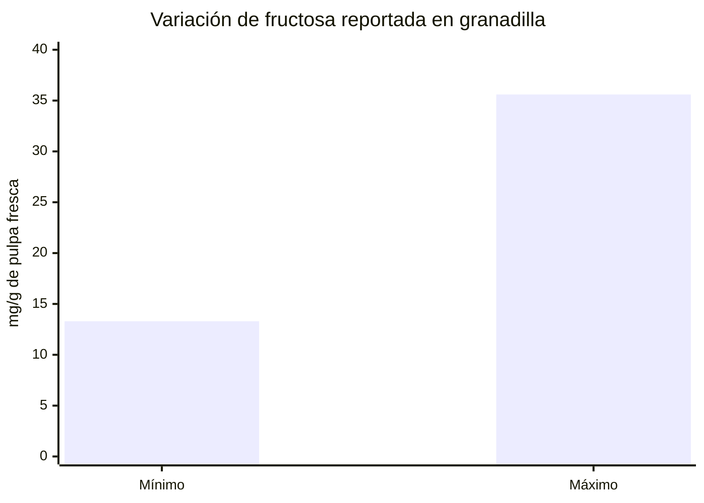
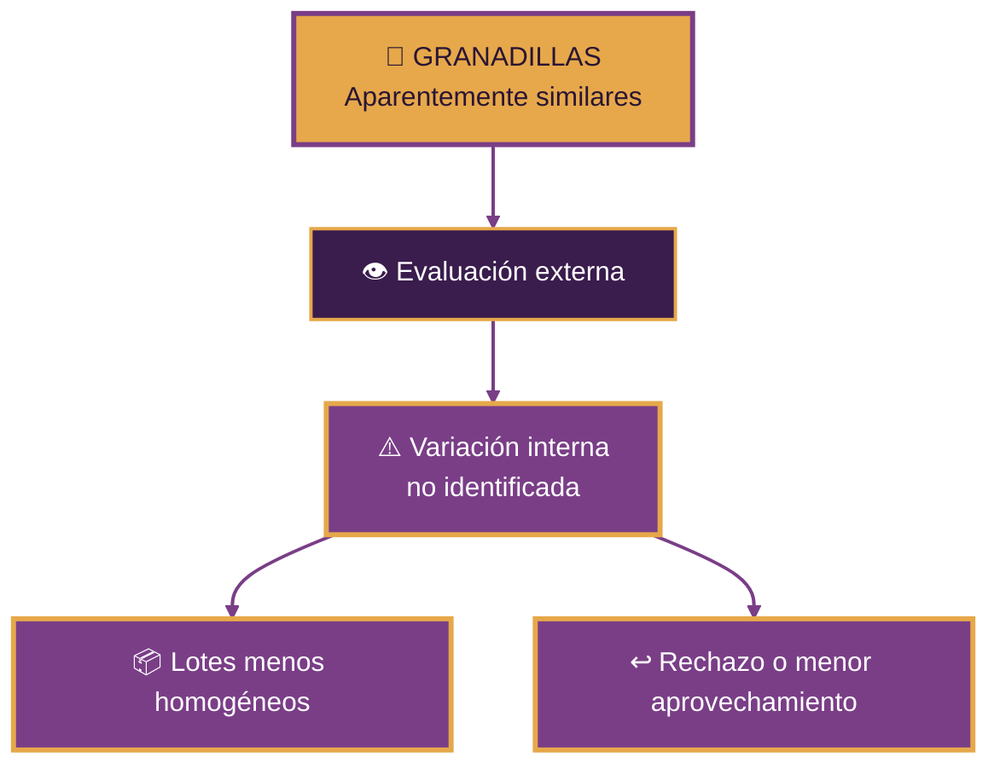
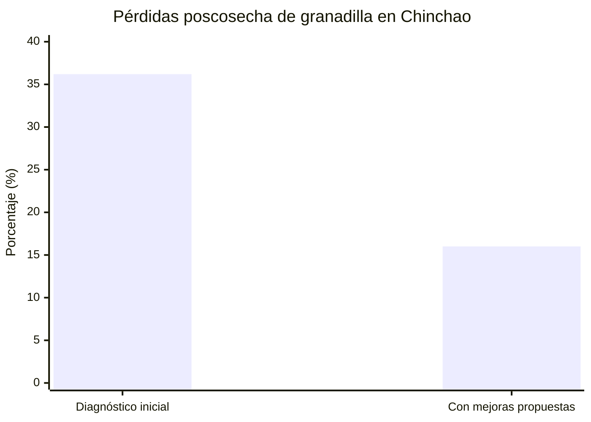
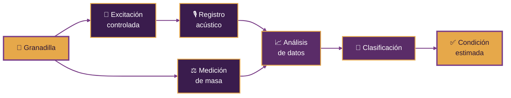
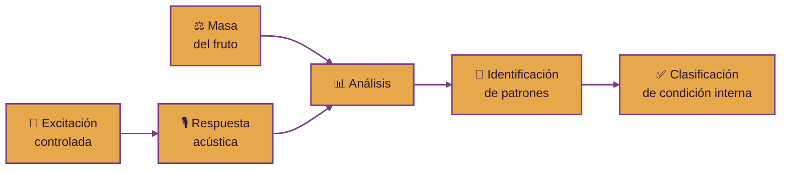

  

  

<h3 align="center">
  Universidad Peruana Cayetano Heredia
</h3>

  <strong>Ingeniería Industrial + Ingeniería Informática</strong>

 

  
  
  
  

  

  
  
  
  

 

### 🍈 MECATRÓNICA · ACÚSTICA · PROCESAMIENTO DE SEÑALES · MACHINE LEARNING

**Una propuesta para evaluar la condición interna de la granadilla
sin cortarla, perforarla ni dañarla.**

---

  

---

# 📑 Contenido

* [🌐 Sobre Nosotros](#-sobre-nosotros)
* [📸 Fotografía del Equipo](#-fotografía-del-equipo)
* [👥 Nuestro Equipo](#-nuestro-equipo)
* [🍈 El Proyecto](#-el-proyecto)
* [⚠️ El Problema](#️-el-problema)
* [📖 Estudios que anteceden](#-estudios-que-anteceden)
* [💡 Nuestra Propuesta](#-nuestra-propuesta)
* [✨ ¿Dónde está la innovación?](#-dónde-está-la-innovación)
* [🎯 ODS 9](#-ods-9)
* [🎯 ODS 12](#-ods-12)
* [🎯 Objetivo General](#-objetivo-general)
* [📚 Referencias](#-referencias)

---

# 🌐 Sobre Nosotros

Somos el **Equipo 03** del curso **Proyecto Integrador 2026-2** de la **Universidad Peruana Cayetano Heredia**.

Nuestro equipo reúne estudiantes de **Ingeniería Industrial e Ingeniería Informática**, integrando diseño mecánico, electrónica, programación, análisis de datos y validación para desarrollar una solución tecnológica aplicada a la cadena poscosecha de la granadilla.

### ⚙️ Mecánica · 🔌 Electrónica · 🎙️ Acústica · 💻 Software · 🧠 Machine Learning

 

Nuestro proyecto nace de una pregunta:

## ¿Podemos estimar la condición interna de una granadilla sin abrirla ni dañarla?

---

# 📸 Fotografía del Equipo

  

  <em>Equipo 03 · Proyecto Integrador 2026-2</em>

---

# 👥 Nuestro Equipo

|                                Foto                               | Integrante                              | Rol                           | Intereses |
| :---------------------------------------------------------------: | --------------------------------------- | ----------------------------- |
|  | **César Alejandro Aarón Apcho Meneses** | 👑 Líder del equipo / Electronica | Hardware y Logica |
|  | **Paola Andrea Centeno Bazan**          | 🔎 Modelado y mecanica | BTS, Diseño gráfico |
|  | **Rodrigo Sebastián Asmat Mendoza**     | 🎨 Documentacion y revision            | Documentacion e informes |
|  | **Juan Vidal Berrocal Ccapcha**         | 💻 Programación / UI    | kyra |

---

# 🍈 El Proyecto

## Sistema Mecatrónico No Destructivo para la Evaluación de Calidad Interna de Granadilla

### Mediante excitación vibratoria/acústica, análisis de respuesta y aprendizaje automático

 

 

Nuestra propuesta consiste en desarrollar un sistema capaz de aplicar una **excitación vibratoria/acústica controlada y repetible** mediante un emisor acoplado a la cáscara de la granadilla.

La respuesta producida por el fruto será registrada mediante un micrófono y analizada para determinar cómo se transmiten, atenúan y modifican las ondas al atravesar su estructura, buscando identificar patrones relacionados con diferencias en su **condición interna**.

### 📳 Emitir → 🎙️ Registrar → 📈 Analizar → 🧠 Clasificar

El proyecto busca investigar primero si una señal vibratoria/acústica aplicada de forma controlada puede propagarse por la granadilla y conservar información medible sobre su estructura interna.

Solo si las pruebas muestran diferencias reproducibles y útiles se avanzará hacia una etapa de clasificación mediante **Machine Learning**.

> Variables como °Brix, pH, inspección interna u otras características podrán utilizarse como referencia durante las pruebas, pero no se asumirá inicialmente que el sistema puede medirlas directamente.

---

⚙️ **¿Cómo funciona el sistema?**

Colocar → Emitir vibración/onda acústica → Registrar respuesta → Analizar → Clasificar

---

# ⚠️ El Problema

La calidad comercial de la granadilla no depende únicamente de lo que puede observarse desde el exterior. La **NTP 012.005:2023 de INACAL** establece que durante la poscosecha deben considerarse parámetros físicos como **peso, longitud y diámetro**, pero también parámetros químicos como **°Brix y pH**, además de características sensoriales como **color, sabor, consistencia y aroma** [1].

### 🍈 Una fruta puede verse correcta externamente y, aun así, presentar diferencias relevantes en su condición interna.

La variabilidad entre frutos también ha sido documentada experimentalmente. En un estudio sobre *Passiflora ligularis* cultivada en diferentes localidades, la zona de producción afectó el **tiempo hasta la madurez comercial** y el contenido final de **azúcares y ácidos**. La fructosa registrada varió desde **13,3 mg/g hasta 35,6 mg/g de pulpa fresca** entre localidades [2].

<em>Dato resumido a partir del rango reportado en el estudio citado [2].</em>

Esto evidencia que frutos de la misma especie pueden presentar composiciones internas diferentes, incluso cuando son comercialmente comparables.

La poscosecha constituye además una etapa relevante para el aprovechamiento del producto. Como referencia local, una investigación realizada en **Chinchao, Huánuco**, reportó pérdidas poscosecha de **36,2 %** en el diagnóstico inicial y una reducción hasta **16 %** después de proponer y aplicar mejores técnicas de manejo [3]. Esta cifra corresponde a ese caso de estudio y **no representa una tasa nacional de pérdidas de granadilla**.

<em>Caso de estudio local en Chinchao, Huánuco [3].</em>

> **Problema central:** actualmente existe la necesidad de obtener información adicional sobre la condición interna de la granadilla de manera rápida y no destructiva, que complemente la clasificación externa y permita formar lotes más consistentes sin abrir ni dañar el fruto.

Por ello, el proyecto investiga si la **respuesta ante una excitación vibratoria/acústica controlada**, complementada con la masa del fruto y procesamiento digital de señales, contiene patrones reproducibles que permitan diferenciar condiciones internas.

---

# 📖 Estudios que anteceden

La propuesta no parte desde cero. Existen antecedentes científicos que muestran que las **señales acústicas y vibracionales** pueden contener información útil sobre la condición interna de distintas frutas [4].

| Estudio | Aporte principal | Relación con nuestro proyecto |
| --- | --- | --- |
| **Dubey et al. (2026)** [4] | Revisan principios, técnicas acústicas y vibracionales y avances recientes con inteligencia artificial para evaluación no destructiva de frutas. | Sustenta el enfoque general de combinar respuesta acústica, procesamiento de señales y aprendizaje automático. |
| **Diezma-Iglesias et al. (2004)** [5] | Detectaron defectos internos en **sandía sin semillas** mediante la **respuesta acústica al impacto**. | Demuestra que una excitación controlada puede revelar diferencias internas sin destruir el fruto. |
| **Tian et al. (2022)** [6] | Desarrollaron un sistema para medir la **firmeza del kiwi** con tecnología de vibración acústica y un mecanismo calibrado de **12,03 ± 0,71 N**. | Sustenta la necesidad de una excitación **repetible y controlada**. |
| **Diezma Iglesias & Ruiz-Altisent (2004)** [7] | Explican que la **masa** y la geometría del fruto influyen en sus frecuencias naturales e índices de firmeza. | Justifica incluir una **celda de carga** como variable auxiliar. |
| **Puyana-Romero et al. (2026)** [8] | Estudiaron la **cáscara de granadilla**, mostrando una estructura heterogénea con propiedades acústicas particulares. | Refuerza que la **granadilla** merece una evaluación específica y no una simple extrapolación desde otras frutas. |

> **Conclusión de los antecedentes:** existe base científica para estudiar la granadilla mediante respuesta vibratoria/acústica, pero todavía queda por demostrar qué patrones específicos de este fruto pueden aprovecharse para clasificar su condición interna.

---

# 💡 Nuestra Propuesta

El sistema combinará cuatro elementos principales:

  
  
  
  

El funcionamiento general será:

La masa será considerada como una variable auxiliar, ya que las diferencias de tamaño y peso pueden influir en la respuesta vibratoria/acústica registrada.

El propósito será encontrar una combinación de características que permita realizar una clasificación más consistente de la condición interna de la granadilla.

---

# ✨ ¿Dónde está la innovación?

El uso de señales acústicas para evaluar frutas cuenta con antecedentes tecnológicos [4]–[7].

Por ello, nuestra propuesta no pretende presentar como innovación únicamente:

> **Excitar una fruta, registrar su respuesta y clasificarla.**

La investigación se enfocará en desarrollar una solución **específica para la granadilla (*Passiflora ligularis*)**, considerando las características particulares de este fruto.

La granadilla presenta una estructura formada por:

### Cáscara → Mesocarpio → Cavidad interna → Pulpa + Semillas

Esta estructura puede generar una respuesta vibratoria particular ante una excitación controlada. Además, el estudio de Puyana-Romero et al. [8] muestra que la cáscara de *Passiflora ligularis* posee propiedades acústicas que justifican investigar experimentalmente su comportamiento.

Nuestra línea de diferenciación considera:

Entre los elementos que podrían diferenciar técnicamente el sistema se encuentran:

* 📳 Excitación vibratoria/acústica controlada.
* 📍 Punto de acoplamiento definido.
* 🎙️ Respuesta acústica particular de la granadilla.
* ⚖️ Consideración de la masa del fruto.
* 📉 Comportamiento del decaimiento acústico.
* 📊 Relaciones entre diferentes componentes de la señal.
* 🔎 Identificación de patrones asociados a cambios internos.
* 🍈 Adaptación específica a la estructura de la granadilla.

> **La innovación potencial deberá surgir de las características particulares que descubramos experimentalmente en la granadilla.**

---

# 🎯 ODS 9

## 🏭 Objetivo de Desarrollo Sostenible 9

### Industria, Innovación e Infraestructura

 

### Fortalecer la investigación científica y mejorar las capacidades tecnológicas

 

El proyecto se relaciona con el **ODS 9: Industria, Innovación e Infraestructura**, orientado a construir infraestructuras resilientes, promover una industrialización inclusiva y sostenible y fomentar la innovación [9].

De manera específica, se relaciona con la **Meta 9.5**, que busca **aumentar la investigación científica, mejorar las capacidades tecnológicas de los sectores industriales y fomentar la innovación**, entre otros aspectos [9].

La relación con esta meta se plantea a través del desarrollo e integración de:

* 🔬 Investigación experimental aplicada a la evaluación no destructiva de frutas.
* ⚙️ Diseño de un sistema mecatrónico de medición.
* 🎙️ Adquisición y procesamiento digital de señales.
* 💻 Desarrollo de software para análisis de datos.
* 🧠 Aplicación de Machine Learning para clasificación.
* 🧪 Validación experimental de una solución tecnológica específica para granadilla.

> **El aporte al ODS 9 se encuentra en transformar una necesidad de control de calidad poscosecha en una oportunidad de investigación, desarrollo tecnológico e innovación aplicada.**

---

# 🎯 ODS 12

## ♻️ Objetivo de Desarrollo Sostenible 12

### Producción y Consumo Responsables

 

### Reducción de pérdidas de alimentos en las cadenas de producción y suministro

 

El proyecto se relaciona principalmente con la **Meta 12.3 del ODS 12**, que plantea reducir las pérdidas de alimentos a lo largo de las cadenas de producción y suministro, incluidas las pérdidas posteriores a la cosecha [10].

La magnitud del problema es relevante a escala global: Naciones Unidas estima que en **2023 se perdió aproximadamente el 13,3 % de los alimentos después de la cosecha**, considerando etapas como producción, transporte, almacenamiento, venta mayorista y procesamiento [10].

Nuestro sistema busca contribuir a mejorar una decisión importante durante la etapa poscosecha:

### 🍈 identificar y clasificar mejor la fruta antes de su comercialización.

Una evaluación adicional de la condición interna podría contribuir a:

* 🍈 Obtener lotes de calidad más homogénea.
* 📦 Mejorar la clasificación del producto.
* 🔎 Evaluar frutos sin destruirlos.
* ↩️ Disminuir potencialmente rechazos por calidad inconsistente.
* 🗑️ Reducir pérdidas asociadas a una clasificación inadecuada.
* 💰 Aprovechar mejor comercialmente la fruta disponible.

> **Tecnología para mejorar la clasificación y aprovechamiento de la granadilla.**

---

# 🎯 Objetivo General

**Diseñar y validar un sistema mecatrónico no destructivo capaz de clasificar la calidad interna de granadillas mediante el análisis de su respuesta ante una excitación vibratoria/acústica controlada y técnicas de aprendizaje automático.**

## Objetivos específicos

1. **Caracterizar** la respuesta acústica de granadillas con diferentes condiciones internas.

2. **Diseñar** un sistema de excitación vibratoria/acústica controlada que produzca señales reproducibles sin dañar el fruto.

3. **Desarrollar** un sistema electrónico para registrar la respuesta acústica y la masa de la granadilla.

4. **Identificar** características de la señal acústica que puedan estar relacionadas con diferencias internas del fruto.

5. **Desarrollar y validar** un algoritmo de clasificación utilizando las mediciones obtenidas.

6. **Integrar hardware y software** en un sistema funcional de evaluación no destructiva.

7. **Evaluar** el comportamiento del sistema utilizando granadillas provenientes de lotes comerciales.

---

# 📚 Referencias

[1] Instituto Nacional de Calidad (INACAL), “INACAL brinda requisitos de calidad de la granadilla para mejorar su productividad,” 2024. [Online]. Available: https://www.gob.pe/institucion/inacal/noticias/931172-inacal-brinda-requisitos-de-calidad-de-la-granadilla-para-mejorar-su-productividad. [Accessed: Sep. 8, 2026].

[2] M. Mayorga et al., “Physiological and biochemical characterization of sweet granadilla (*Passiflora ligularis* Juss) at different locations,” *Acta Horticulturae*, vol. 1194, 2018. [Online]. Available: https://www.actahort.org/books/1194/1194_204.htm. [Accessed: Sep. 8, 2026].

[3] Universidad Nacional Hermilio Valdizán, “Propuesta de mejoramiento de manejo post cosecha de la granadilla (*Passiflora ligularis* Juss) en el distrito de Chinchao 2016,” ALICIA-CONCYTEC. [Online]. Available: https://alicia.concytec.gob.pe/vufind/index.php/Record/UNHE_d0258224dd43802ae6ec250a8ca97d8f. [Accessed: Sep. 8, 2026].

[4] A. Dubey, R. Zalpouri, Chandni, and S. Mann, “Acoustic and vibrational non-destructive quality evaluation of fruits: Principles, techniques, and recent AI-driven advances,” *Food Research International: Reports*, Art. no. 100020, 2026, doi: 10.1016/j.frinr.2026.100020.

[5] B. Diezma-Iglesias, M. Ruiz-Altisent, and P. Barreiro, “Detection of internal quality in seedless watermelon by acoustic impulse response,” *Biosystems Engineering*, vol. 88, no. 2, pp. 221–230, 2004, doi: 10.1016/j.biosystemseng.2004.03.007.

[6] S. Tian, J. Wang, and H. Xu, “Firmness measurement of kiwifruit using a self-designed device based on acoustic vibration technology,” *Postharvest Biology and Technology*, vol. 187, Art. no. 111851, 2022, doi: 10.1016/j.postharvbio.2022.111851.

[7] B. Diezma Iglesias and M. Ruiz-Altisent, “Propiedades acústicas aplicadas a la determinación de parámetros de calidad interna de productos hortofrutícolas,” *Revista de Acústica*, vol. 35, nos. 3–4, pp. 20–25, 2004. [Online]. Available: https://oa.upm.es/6419/. [Accessed: Sep. 8, 2026].

[8] V. Puyana-Romero, A. Debut, K. Vizuete, and G. Ciaburro, “Exploring *Passiflora ligularis* Juss. peel as a natural sound-absorbing and insulating material,” *Scientific Reports*, vol. 16, Art. no. 18208, 2026, doi: 10.1038/s41598-026-48916-2.

[9] United Nations, “Goal 9: Industry, innovation and infrastructure,” *Sustainable Development Goals*. [Online]. Available: https://sdgs.un.org/goals/goal9. [Accessed: Sep. 8, 2026].

[10] United Nations, “Goal 12: Responsible consumption and production,” *Sustainable Development Goals*. [Online]. Available: https://sdgs.un.org/goals/goal12. [Accessed: Sep. 8, 2026].

---

  

 

**Equipo 03 · Proyecto Integrador 2026-2**

**Universidad Peruana Cayetano Heredia**

 

  

